# Headlines as networked language
> A study of content and audience across 73 million news article links on Twitter

## Introduction

Imagine that someone showed you a headline from a news article, but in complete isolation, stripped of all context -- just a sequence of words. All they told you is that the headline came from either the New York Times or Fox, and asked you to guess which one. In some cases, this might be fairly easy. For example, if it's a recipe -- we might remember that The New York Times has a large cooking section:

> Chicken Thighs With Cumin, Cayenne and Citrus

Or, if it's about (both) New York baseball teams:

> In Early Going, the Yankees Steal the Mets' Thunder

(Though, of course, Fox also does plenty of sports reporting.) Meanwhile, we might associate a story about MS 13 with Fox, to the extent that right-leaning outlets have focused attention on immigration and crime:

> East Coast MS 13 gang leader admits racketeering conspiracy

But, other things might be significantly harder. For example -- one of these headlines came from Fox, the other from The New York Times:

> Zambia's 1st female fighter pilot says she 'doesn't feel like a woman' in her job

> 4 freed from Thailand cave, but rescuers face 'war with water and time' to get to others

Here, to my eye, there aren't obvious "tells" -- there are small things that might push me in one direction or the other, but it's not clear. (The answer -- NYT, Fox.) In trying to guess where the headline came from, we'd have to bring to bear a wide set of intuitions about what might be thought of as the "voice" of the outlet -- the set of issues, locations, people that the outlet tends to focus on. And, beyond the raw content of what's being -- *how* it's being covered, the style, intonation, attitude, affect. Trying to guess the outlet, in other words, would force us to formalize a kind of mental model about precisely how the two outlets are similar or different.

It also, indirectly, gives a way to reason about the *degree* to which they're similar or different. Now, imagine that instead of just doing this once, we did it for 100 headlines, and counted up the number of correct guesses. We'd likely do better than random -- but how much better? 60%, 70%, 95%? How differentiable are NYT and Fox? To put this into context -- what if we then swapped out the outlets -- pulled headlines from NYT and CNN, instead of NYT and Fox, for example -- and repeated the experiment. We might guess that NYT and CNN are more similar, harder to tell apart. But, how true is this, exactly? Say we got 80 headlines right for the NYT vs. Fox comparison -- would we get 70, 60, 55 right for NYT vs. CNN? In a rough sense, we could start to reason about the relative proximities between different pairs of outlets.

Of course, doing this manually, it would be hard to scale beyond a few outlets and a couple hundred headlines. But -- what if we could do this at a much larger scale, across dozens of different media organizations and millions of headlines? This thesis explores this question as a *language engineering task*, working with a corpus of 73,198,274 tweets harvested from the Decahose over an 18 month period -- to what degree is it possible to train machine learning models to differentiate between headlines produced by different news outlets? Unlike other studies that have explored the tractability of language inference tasks on news data, though, goal here isn't to solve a applied engineering task (flagging "clickbait" headlines, optimizing click-through rates) -- instead, we use the predictive models as a descriptive and interpretive tool. By training models to differentiate between content from different sources, we can then crack open the hood and examine the representations that are induced by the models; which then makes it possible to "map" headlines as a kind of conceptual space.

Most fundamentally, beyond this ability to "read" headlines at a scale that would otherwise be impossible -- these models make it possible to start filling in a kind of ground-truthed understanding of the degree to which different outlets are similar and different, where we might otherwise have to rely on intuition and anecdote. Modeling a complete matrix of pairwise similarities across 15 major media organizations, we can construct a kind of "content graph," a fully-connected representation how, and to what degree, outlets produce (dis)similar headlines:

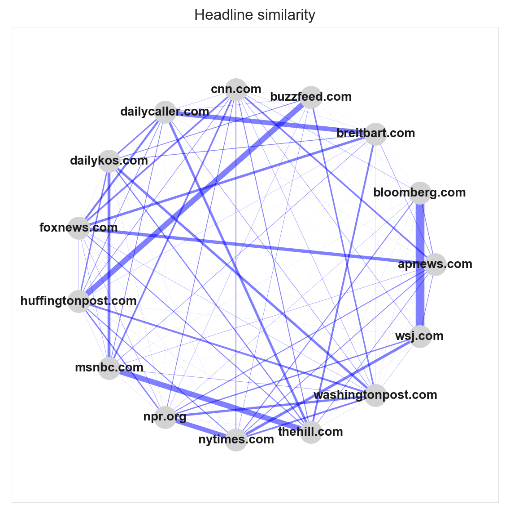

Once we have this empirical view of the linguistic proximities among the outlets, though, there's a way in which this immediately just generates a new set of questions. Most of which, really, are some version of just one -- where is this graph *not what we would expect*? To return to the analogy of voice -- are there outlets that are "speaking" in ways that don't map onto assumptions about the role that they play in a broader political, commercial, historical context?

The second half of the thesis takes up this question, and explores the degree to which these linguistic relationships correspond (and don't correspond) to two different backdrops. First -- we explore the degree to which these similarities at the level of content align with similarities at the level of audience. Parallel to the "content graph" defined by the headline similarities, can imagine an "audience graph" that represents similarities at the level of the people who read and distribute content from each pair of outlets.

This question of the interaction between content and audience cuts to the core of a wide range of recent discussions about processes of fragmentation and polarization in the news ecosystem. For example, the widely popularized notions of "filter bubbles" and "echo chambers," where the concern is that these two graphs are tightly connected in a self-reinforcing (and socially problematic) way -- media sources that are highly differentiated at the level of content allow people with different perspectives to self-select into highly differentiated information ecosystems, which, in a vicious circle, then aggravates the underlying social and ideological fragmentation. Stark divisions at the level of content get mirrored by stark differences in audience, which in turn incentivize even more differentiated content, etc.

The graph above, though, suggests there might be places where this alignment between content and audience breaks down. For example, it looks like headlines from Fox are about as similar to headlines from AP as from Breitbart; whereas, we might guess that the audience overlap between Fox and Breitbart would be significantly higher. This suggests a rich set of questions -- are there outlets that "sound" similar to one another, but that have highly non-overlapping audiences? Or, zooming back to the complete ecosystem of media organizations, can we identify outlets that act as "mediators" or "bridges" between different subsets of audiences? For example -- are there outlets that produce content that "sounds like" content produced by left-leaning outlets, but that have relatively high audience overlap with right-leaning outlets -- that is, outlets that produce content that has the effect of exposing right-leaning readers to content that's more typical of left-leaning news feeds? Or vice versa?

These incongruities, misalignments, places where the language graph doesn't map easily onto the underlying social graph -- do they exist at all? If so -- what do they look like? What kind of content does this? Looking beyond this study, which is fundamentally descriptive -- if we're interested in exploring the degree to which different topics, styles, idioms, and ways of speaking might have the effect of working against patterns of fragmentation in media consumption habits, these sites of mismatch could be of particular interest. They would represent, in a sense, naturally-occurring short-circuits between otherwise entrenched associations between particular audiences and particular types of content, places where audiences move (or get moved) out of their typical "lanes."

Second, and last -- building on this question of movement or change, we explore the degree to which the matrix of linguistic similarities has evolved over historical time -- the degree to which it does and doesn't correspond to previous versions of itself. Instead of rolling up the entire 18-month window of data into a single, synchronic unit, we analyze the set of 73 million links as a chronological sequence, covering roughly the first two years of the Trump presidency. Are the linguistic similarities between outlets basically stable, or have there been significant changes over this period? Do outlets drift away from each other, towards each other, back and forth? How fixed or flexible are the major organizations in the media landscape, both in terms of the type of content that they produce and the audiences that read it? And, in the same way that we could explore the overall correlation (and lack thereof) between content and audience -- to what extent do changes in content correspond to changes in audience, when spooled out over historical time? If Huffington Post starts producing headlines that sound more like The Hill -- do the audiences also start to converge?

In summary -- first we quantify the level of similarity between headlines produced by different outlets, and then attempt to contextualize these differences by exploring (1) the degree to which they have evolved over time and (2) the degree to which they align with the composition of the audiences that interact with the content. We find:

1. Modeled as a text classification task, headlines from 15 major US media sources highly differentiable, even after an aggressive cleaning process that strips out any kind of "paratext" in the headline that directly or indirectly reveals the source. (For example, "... -- CNN Video" or "AP Breaking News: ...") The strongest model is a bidirectional LSTM, which gets to 40% accuracy in a 15-label model, where random would be 7%. Though, standard non-neural baselines also perform very well -- SVM and logistic regression models over ngram count features are competitive at 35-36% accuracy (and beat the weaker neural models), suggesting that a majority of the differentiability among outlets comes from which words and phrases are being used -- roughly, what might be thought of as "topic" or "content" -- and less from the composition or sequencing of words, which can be modeled with more power by the recurrent models.

1. Pulling sentence embeddings out of the top layer of the LSTM, we can explore the structure of the linguistic space in terms of the high-dimensional representations learned by the model, both in terms of the relationships among different outlets are the internal structure of the headlines within the outlets themselves. This reveals significant differences in what might be thought of as the "shape" of different outlets in the high-dimensional space. Specifically, we focus on what we call the "diameter" of the embedding family for each outlet -- the average cosine distance between randomly sampled pairs of headlines -- which, we argue, roughly captures the degree to which outlets are narrowly focused (low diameter) or more broad and varied (high diameter). Second, we also explore the clustering structure of headlines within outlets, the degree to which content from an outlet can be cleanly decomposed into a set of categories, verticals, or "desks." On both metrics, we find significant variation, with BuzzFeed, Bloomberg, and Daily Kos registering the lowest "diameters" and smallest cluster counts (most focused), and CNN, The Washington Post, and Fox showing the highest diameters / largest cluster counts (most broad, varied, diverse).

1. Aggregating over the full set of individual articles in each outlet, we can use the classifiers to model a complete "content graph" among the 15 organizations, a fully-connected graph of pairwise similarity scores, which are extracted from the behavior of the classifiers in a collection of different ways -- pairwise accuracy scores, probability mass correlations in multi-label models, and confusion counts. With this content graph in hand, we then compare to the underlying "audience graph," derived from correlations in the users who tweet links from each pair of outlets. From these two graphs, for each outlet we can construct two normalized rankings of similarity with all other outlets, one based on headline similarity, and the other based on audience similarity. We then explore the correlation of these two rankings on a per-outlet level -- that is, the degree to which an outlets edge weights in the "content graph" are similar to its edge weights in the "audience graph." In general, we find that these two sets of weights tend to be positively correlated, often highly so -- in general, outlet A "sounds like" outlet B, it also has a high level of audience overlap. But, there is a wide range in the strength of this correlation, and there are two very strong exceptions -- The Hill and AP both have *negatively* correlated weights in the content / audience graphs. Though the specifics are different, in both cases this is broadly because AP and The Hill produce content that resembles, at a linguistic level, content produced by right-leaning outlets; but, the audiences overlap strongly with left-leaning outlets, suggesting that AP and The Hill act as what might be thought of as "one-way bridges" that expose left-leaning audiences to regions of the headline space that are typically focused on by right-leaning outlets. There do no appear to be outlets that perform this function in the opposite direction.

1. We then explore the evolution of these relationships over historical time -- instead of treating the corpora as monolithic bundles of data, the 2-year data window is broken into 100 temporal bins, and a 10-bin rolling window is moved across this space, producing 91 10-bin windows. In each of these windows, we train fully independent A-versus-B models on each unique pair of outlets, and then track changes in these accuracies over time. This reveals significant changes in the structure of the "content graph" in the last two years. First, a cohort of politically-focused outlets have become significantly more similar -- Huffington Post, The Hill, The Daily Kos, and CNN -- suggesting a tendency towards convergence in political coverage since a high-water mark of differentiability in the spring of 2017, in the first months of the Trump administration. Huffington Post in particular has shown the most dramatic shift, moving strongly in the direction of political reporting at the expense of a BuzzFeed-style "listicle" genre that was commonly produced in 2017. Second -- Fox has very consistently moved *away* from almost all other outlets, including other right-leaning outlets like Breitbart and The Daily Caller; it has become much more highly differentiated *individually*, compared to everything else. By examining headlines that typify the overall movement of Fox in the high-dimensional linguistic space modeled by the neural classifier, it appears that this shift is driven by a move in the direction of a highly sensationalized, tabloid style of headline, many of which involve murder or other violent crime.

1. Finally, we also unroll the audience graph over these temporal windows, and explore the degree to which changes in the content graph correlate with changes in the audience graph -- as two outlets produce increasingly similar content, do their audiences also become more overlapping? Overall, we find a positive correlation here, though the relationships for individual pairs of outlets are interestingly varied. In some cases, the content / audience similarities for a pair of outlets move in almost perfect lockstep, sometimes even at the scale of months or weeks -- for example, AP / Huffington Post, Huffington Post / MSNBC, Bloomberg / Fox. But, in other cases, content and audience appear to have an almost perfectly *negative* correlation. For instance, over the last two years, Breitbart and Fox have become very consistently less similar in terms of content, but consistently *more* similar in terms of audience. Or, Breitbart and CNN have had a fluctuating level of similarity at the level of content, and an almost perfectly inverse fluctuation of audience similarity -- when content is similar, audience is dissimilar, and vice versa. These differences suggest that the underlying causal relationships between changes in content and changes in audience are complex, and likely different for different combinations of media organizations.

## Headlines on Twitter

To explore this interaction between content and audience, we need what might be thought of as a "networked" corpus -- a collection of individual pieces of content that can be linked directly to specific patterns of engagement and distribution. With this goal in mind, this study built around a very particular data set -- posts on Twitter that contain links to news articles, which we extract from the Decahose, a 10% sample of all activity on Twitter. For example, if someone posts a tweet with a link to a New York Times article, Twitter identifies the link and provides structured information about it in the JSON payload that appears in the Decahose:

```json
"urls": [
    {
       "url": "https://t.co/MOZgWRzhRK",
       "expanded_url": "https://www.nytimes.com/2017/09/27/us/politics/navy-orders-safety-operational-standards.html",
       "display_url": "nytimes.com/2017/09/27/us/…",
       "indices": [66, 89]
    }
 ],
```

We can then parse the raw URL string and extract the registered domain -- here, `nytimes.com` -- which makes it possible to associated URLs with different media organizations.

Critically, though, our lab also has access to the "Enhanced URLs" add-on product available through Gnip, the vendor that distributes data from Twitter. The "Enhanced URLs" metadata provides two pieces of information that are essential to this study -- first, the "expanded" URL, which is formed by following redirects from the raw URL that appears on Twitter. This valuable here because a sizable percentage of links on Twitter are shortened by services like `bit.ly`, meaning that they have to be "unrolled" in order to identify out the real domain -- for example, `nytimes.com` instead of `bit.ly`. In theory, we could do this ourselves; but, especially when working with data that's more than a few weeks old, this can be difficult. Many shorteners like bit.ly automatically expire the links, meaning that, for example, if we tried to expand a link from spring of 2017, it would likely fail.

Second, and most important, "Enhanced URLs" also provides scraped copies of the [Open Graph](http://ogp.me/) `title` and `description` tags of the page that the link points to. At a product level, Twitter uses the title and description in the link "preview boxes" for the article that automatically get displayed with tweets that contain links.

```json
"gnip": {
  "urls": [
     {
        "url": "https://t.co/MOZgWRzhRK",
        "expanded_url": "https://www.nytimes.com/2017/09/27/us/politics/navy-orders-safety-operational-standards.html",
        "expanded_status": 200,
        "expanded_url_title": "Navy Returns to Compasses and Pencils to Help Avoid Collisions at Sea",
        "expanded_url_description": "A top officer issued new orders to sailors worldwide as the Navy scrambled to make priorities of safety and maintenance after two deadly collisions in recent months."
     }
  ]
},
```

In a sense, the headlines themselves aren't terribly hard to come by -- Twitter is just scraping them off the public web, and there's nothing to stop anyone from doing this independently. But, beyond just the convenience of it having them pre-scraped for tens of millions of pages, there are actually a number of interesting advantages to collecting this corpus "through" the Decahose, as it were, instead of trying to harvest it independently.

First, Twitter provides an automatic signal for the "footprint" of the article. In the most minimal sense, just the fact that the article appears in the 10% sample from the Decahose is evidence that it got some minimal level of circulation; and, we can also precisely measure the size of this circulation by counting the number of times it was tweeted, or, better, adding up the follower counts of all the users who tweeted the link -- the "impressions" count. This makes it possible to consistently model a sort of "effective footprint" of a media outlet, the body of content that is actually getting meaningful circulation.

Second -- historical archives of Twitter data make it possible to collect consistent data at the scale of years, without having to maintain labor-intensive scrapers.

And, last but not least -- headlines on Twitter are directly associated with unique user identifiers, which makes it possible to directly associate individual pieces of content at specific moments in time with specific audiences. This type of data would be almost impossible to assemble from the open web.

Of course, there are also some downsides to the filter provided by Twitter, which, in a number of well-documented ways, is idiosyncratic and non-representative of broader patterns of media consumption. There's a tradeoff -- from Twitter we get a very consistent and very "deep" sample of news production and consumption; but at the cost of it being fairly "narrow."

## 5.6 billion links

So -- tweets with links, and links that point to headlines. Before diving into the headlines themselves -- what does that data look like in its native environment on Twitter? In this study, we work with an archive of the Decahose that was collected by Cortico, a non-profit organization affiliated with the Laboratory for Social Machines. Specifically, we focus on a 625-day window of data running from January 1, 2017 through September 17, 2018. Over that period, the Decahose emitted 21,219,935,342 total tweets. Of these, 5,243,960,217 (24.7%) include at least one link.

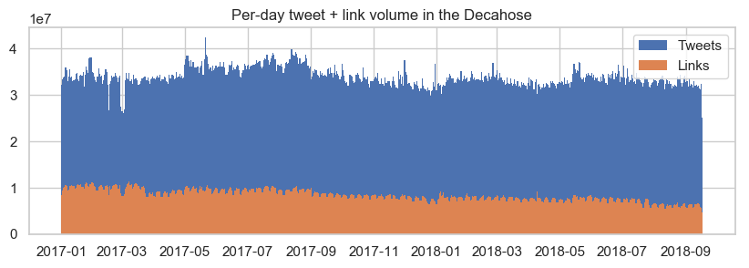

Though, interestingly, this ratio has actually fallen over time -- breaking out just the links, we can see that the volume has actually declined by ~40% over this time period, falling from ~10M per day at the beginning of 2017 to ~6M in fall of 2018, even while the overall tweet volume has stayed mostly stable:

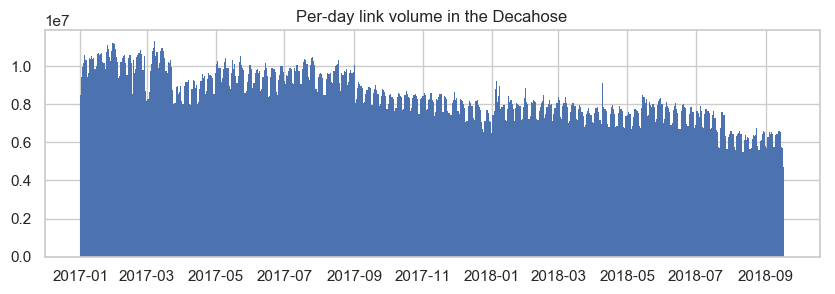

Where do these links point? As an first step, we can parse the raw URL strings into component parts (protocol, subdomain, registered domain, path, etc.) and then count the total number of links to each registered domain. These are the 100 most frequently-occurring domains, before any filtering is applied:

> twitter.com, youtube.com, du3a.org, facebook.com, instagram.com, d3waapp.org, google.com, curiouscat.me, tistory.com, ghared.com, naver.com, zad-muslim.com, showroom-live.com, twittascope.com, ebay.com, fllwrs.com, vine.co, amazon.com, 7asnat.com, apple.com, channel.or.jp, blogspot.com, twitcom.com.br, soundcloud.com, nytimes.com, yahoo.co.jp, cnn.com, nicovideo.jp, pscp.tv, swarmapp.com, spotify.com, ameblo.jp, 7asnh.com, tumblr.com, line.me, wordpress.com, daum.net, washingtonpost.com, twitch.tv, twitcasting.tv, insurancepremium-wd.com, seesaa.net, shindanmaker.com, amazon.co.jp, dmm.co.jp, thehill.com, theguardian.com, etsy.com, imgur.com, bbc.co.uk, paper.li, foxnews.com, fc2.com, rakuten.co.jp, careerarc.com, gleam.io, reddit.com, ask.fm, monster-strike.com, quran.to, lawson.co.jp, reuters.com, staticflickr.com, globo.com, peing.net, billboard.com, soompi.com, grandesmedios.com, medium.com, hotpepper.jp, crowdfireapp.com, nhk.or.jp, twimg.com, vlive.tv, breitbart.com, alathkar.org, tuitutil.net, sinaimg.cn, huffingtonpost.com, go.com, buzzfeed.com, dailymail.co.uk, elpais.com, livedoor.com, change.org, utabami.com, livedoor.jp, vonvon.me, pixiv.net, rt.com, bbc.com, politico.com, daumcdn.net, yahoo.com, independent.co.uk, asahi.com, linkedin.com, naver.jp, nbcnews.com

A majority of these, of course, don't represent "news" sources in a meaningful sense. Though, this isn't always clear-cut -- for example, links to Facebook might often point to content from news organizations that has been shared on Facebook. But, bracketing this, and just operating at the level of individual media brands -- if we take the 2,000 domains with overall largest link counts and then manually filter this list, we can pull out a long list of 87 major media organizations. Of course, "major" is somewhat subjective; here, we took all outlets that meet a minimum standard of name recognition and produce either "general-interest" news or political reporting / commentary; but not specialized outlets that focus on topics other than politics -- ESPN, TechCrunch, Rolling Stone, etc. Here are these 87, ordered here by the total number of links:

> nytimes.com, cnn.com, washingtonpost.com, thehill.com, theguardian.com, foxnews.com, bbc.co.uk, reuters.com, breitbart.com, huffingtonpost.com, buzzfeed.com, politico.com, rt.com, independent.co.uk, yahoo.com, nbcnews.com, bloomberg.com, forbes.com, wsj.com, thegatewaypundit.com, businessinsider.com, usatoday.com, cbsnews.com, apnews.com, dailycaller.com, rawstory.com, vice.com, npr.org, truepundit.com, thedailybeast.com, time.com, cnbc.com, telegraph.co.uk, newsweek.com, nypost.com, sputniknews.com, nydailynews.com, washingtonexaminer.com, cbc.ca, vox.com, thinkprogress.org, theatlantic.com, newyorker.com, msn.com, ft.com, slate.com, theroot.com, variety.com, inc.com, dailykos.com, judicialwatch.org, msnbc.com, motherjones.com, aljazeera.com, economist.com, washingtontimes.com, dailywire.com, infowars.com, theintercept.com, axios.com, theonion.com, politicususa.com, thetimes.co.uk, nymag.com, salon.com, qz.com, nationalreview.com, palmerreport.com, townhall.com, thefederalist.com, hbr.org, hannity.com, talkingpointsmemo.com, fortune.com, thenation.com, propublica.org, foreignpolicy.com, theblaze.com, pbs.org, foxbusiness.com, theconversation.com, conservativereview.com, fivethirtyeight.com, crooksandliars.com, jezebel.com, newrepublic.com, realclearpolitics.com

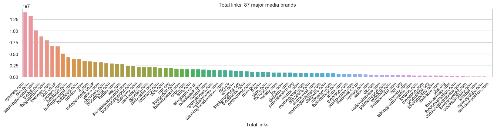

Which, collectively, account for 73,198,274 million individual links in the data. The total number of links, though, is very different from the number of *unique articles* -- a single article might produce tens or hundreds of thousands of individual tweets linking to the same piece of content, each of which are counted separately here. One simple way to roll up the individual occurrences of the domains by article is just to group on the exact text of the URL. But, this is somewhat brittle, since it's not uncommon for links to get passed around with superfluous GET parameters added onto them (eg, trackers that flag the source of a click). This can cause the same "base" URL to appear in many different configurations, if just treated as a raw string, all of which in fact point to the same article.

Instead, we group links into articles by combining three pieces of information -- the registered domain, the "path" component of the URL, and the cleaned tokens in the Open Graph title, as provided by Gnip. (This cleaning process is somewhat intricate, detailed below.) The URL path is taken into consideration since there are times when the same outlet will produce multiple articles with identical titles. For example, if The New York Times produces an article every week called "Your Monday morning roundup" -- by including the URL path as part of the grouping key, we can correctly identify these as legitimately separate pieces of content.

Grouping links on these three pieces of information, we can count the number of unique articles (and, by extension, headlines) associated with each domain. Which, in this context, is the more salient number, since the headline is the basic unit of analysis. The largest outlets have produced many hundreds of thousands of individual articles in the last two years, though the volume falls off fairly quickly outside the top ~20:

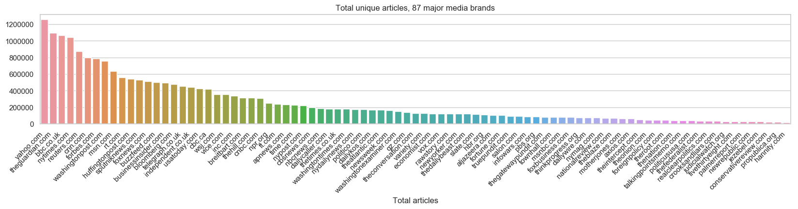

Beyond these rolled-up link and article counts, we can also easily get a high-level sense of how the footprint of different outlets on Twitter has evolved over the 2-year data window. Using the `postedTime` timestamps on each tweet, we can group links from an outlet by day, for instance, and look at the historical volume trend. For The New York Times:

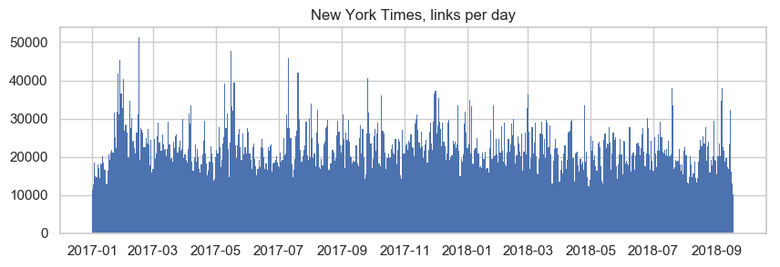

Or, rollup up links by article, the total number of unique NYT articles that appeared by day:

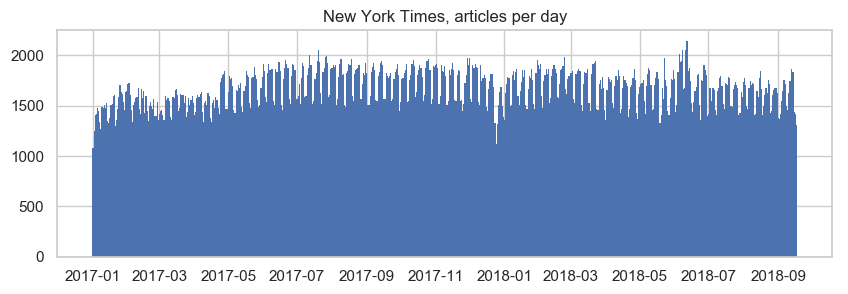

Finally, digging deeper into the metadata provided by Twitter -- for each tweet, we also have information about the user account that posted the tweet, including the follower count of the user at the time the tweet was posted. This is very useful information, since follower counts vary significantly -- a link posted from an account with 1M followers will have vastly more reach than a link posted from an account with 100 followers. In a crude sense, we can use the follower count of the user account as a proxy for "impressions," the total number of times that the tweet was seen by individual twitter users. (Of course, this isn't literally true -- when a user posts a tweet, the percentage of her followers who actually see it is probably fairly low, since many of them won't be logged on, etc. But, if we assume that this percentage is roughly similar across the platform, the follower count can give a (relative) signal of the real-world "reach" of the tweet.)

Taking the total impressions produced by all tweets with links to The New York Times, and grouping by day:

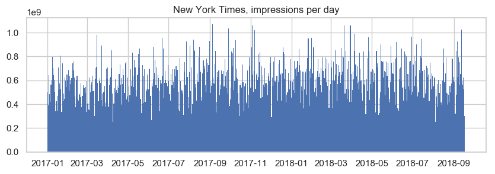

Some of which, interestingly, show very significant changes over the 2-year data window. Modeling this as a linear trend, here are the 10 domains with the most significant decreases, in terms of links, articles, and impressions:

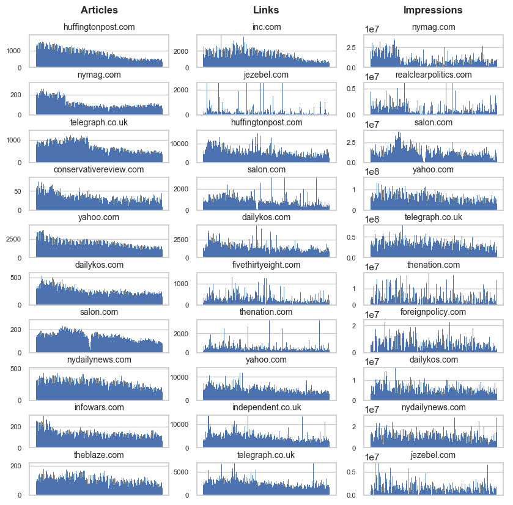

So, the number of unique articles from Huffington Post, on a per-day basis, has fallen by more than 50%. In the other direction, domains with the strongest increases in volume:

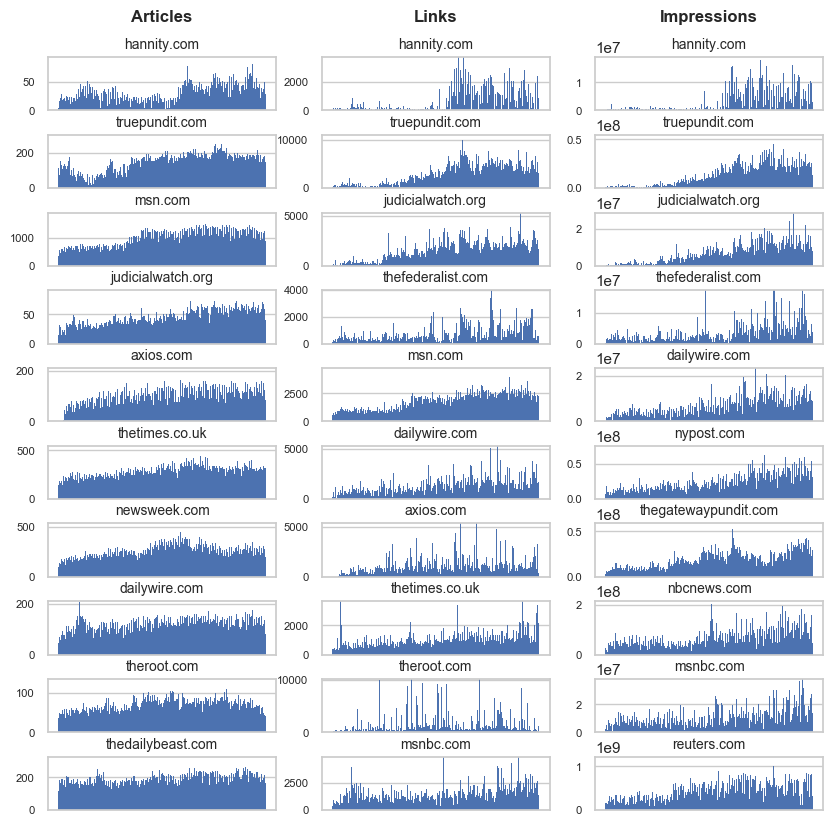

Which has a striking partisan tilt: all of the four domains at the top of the three lists -- `hannity.com`, `truepundit.com`, `judicialwatch.com`, `thefederalist.com` -- represent (far) right-leaning political perspectives.

Of course, we don't really care about the "performance" of the headlines per-se -- our focus here is on the structure of the linguistic relationships among outlets. But, these overall volume trends have important methodological implications, especially for the historical questions that emerge in the second half of the project. Namely, if we're interested in exploring changes in relative similarity between outlets over time, it's clear that we need to explicitly standardize for these changes in volume, to prevent them from getting artificially proxied by other measurements. For example, if we use classification accuracy as a measurement for similarity, a model trained on HuffPo data from 2018 will almost certainly be lower-performing than a model trained on 2017 data, just because the 2018 model will see far less evidence -- even though the actual coverage might not have changed in any meaningful way, just the quantity of coverage.

But, there's only so much we can learn by just counting links, articles, users, impressions; what we really want is a meaningful understanding of the relationships among the outlets -- how similar are the headlines? How similar are the audiences? Where they differ -- how, exactly?

## Modeling similarity via classification

From the Decahose, then, we can extract a set of unique article headlines that have appeared in the Decahose over a ~2-year period from a set of 87 major US media brands, aggregated from a complete set of 73 million individual links posted on Twitter.

Given just the raw headline strings pulled from the `og:title` tags -- how can we reason about the relative similarities and differences between the headlines from different outlets? For example, say we have 300k unique headlines from NYT, 200k from CNN, 50k from Daily Caller -- how similar or different, in a precise sense, is each pair of outlets? Or, considered as a group -- what does the overall matrix of similarities look like? What clusters with what? Which topics, styles, entities, textual features drive these similarities and differences? If we think of the full set of 1.1 million unique headlines as representing a kind of linguistically-instantiated landscape -- what's the shape of this space, what's the linguistic "topography" of headlines on Twitter?

There are various we could model this. Here, though, we follow Underwood et al. in framing the question as a *predictive* task -- we explore the structure of the data by studying the degree to which we can train models to learn accurate mappings between headlines and outlets. That is -- if we have headlines from outlets A and B, we can train a lexical classifier to predict whether a given headline was produced by A or B? If the model achieves a high accuracy on test data -- if it is able to learn significant structure across the two classes and perform well on unseen data -- then this can be interpreted as a signal that the two sets of headlines are highly "separable" or "distinctive," given the representational capability of the model. And, conversely, if the model achieves poor accuracy -- if it has a hard time telling the difference between A and B -- then we can interpret this as a signal that the headlines are relatively similar. At the extreme edges -- if the model achieves 100% accuracy, then we can interpret this as being the maximum possible "distance" between outlets -- they are completely differentiable. And, if the model achieves 50% accuracy, no better than random, then we can interpret this as the smallest possible distance between outlets, a distance of 0 -- they are effectively indistinguishable.

(To the model at least; with interpretive projects like this, where we're trying to model "meaning" in text, in some way, we always have to keep in mind that there's a mismatch between what a machine learning model sees in a piece of text and what a real person would see. Sometimes the model will fail to pick up on something that would be obvious to a real reader; other times the model will latch onto details that might seem insignificant to us. But, if we're willing to accept this quotient of interpretive slippage -- computation makes it possible to "read" these kinds of large corpora with a level of scale and comprehensiveness that would otherwise be impossible.)

There are various other ways we could go about this, but, there two big advantages to formulating the question as a predictive task. First, it provides a number of natural ways to extract a very simple and interpretable *metric* that captures relative differences in similarity. For example, when predicting whether a headline comes from AP News or BuzzFeed, the model might get to 85% accuracy; but just 60% accuracy when comparing Bloomberg and WSJ.

Second, in the context of modern neural architectures, the classification task provides a natural training objective for learning high-quality, corpus-specific *representations* of the headlines. If we train custom deep learning models to predict an outlet given a headline, it's easy to then extract the underlying sentence embeddings that are induced by the model -- high dimensional vectors that represent the "meaning" of the headline, as operationalized by the classifier.

These embeddings give a remarkable interpretive power -- they can be treated, essentially, as a set of coordinates that position each headline in a high dimensional space, and we can then study the "shape" of the linguistic landscape defined the headlines, both within individual outlets and among them. And, at a more pragmatic level -- the embeddings also make it possible to systematically find individual examples that are typical, in various ways, of salient changes that are observed at the level of corpus averages. For example -- if we identify some kind of smooth, gradual change in the similarity between two outlets over time, we can query the individual headline embeddings in various way to try to find examples that "mark" or "define" the conceptual essence of this movement. The embeddings open the door to a very rich mode of "distant reading," to borrow from Franco Moretti -- the ability to reason in nuanced ways about the meanings contained in very large corpora of text.

## Headline differentiability

We take classification, then, as a *modeling paradigm*; to understand the headlines, we explore the degree to which we train models that map from headline to outlet. Which, in turn, provides a natural way to precisely measure the similarity between outlets, as well as a training objective that we can use to induce high-quality representations of the headlines.

So -- how differentiable are headlines? Through a lens of statistical inference -- how "learnable" is the relationship between a news organization and the headlines it produces? Ideally, we could explore this question across the full set of 87 media organizations that were culled from the list of the 2,000 most frequently-appearing domains on Twitter. But, because of the fast falloff in the total number of articles associated with each outlet, it's not feasible to analyze all of them. Especially since, in this context, we generally have to downsample everything to the size of the *smallest* outlet -- eg, if we want to compare the accuracy of a model on headlines from outlet A vs outlet B, we have to make sure that the model sees exactly the same amount of "evidence" for each, or otherwise the comparison is unfair. So, if we have ~300,000 headlines from NYT, but only ~3,000 from Judicial Watch, we'd have to downsample NYT by two orders of magnitude -- which seems like a waste, and also starts to feel like something of an apples-to-oranges comparison.

Instead, we pull out a hand-picked set of 15 major outlets, which were selected in an effort to get broad coverage across the largest US media brands and also diversity at the level of political orientation (left-leaning, right-leaning, centrist) and business model (cable news networks, print-and-web newspapers, web-only publications):

1. AP News
1. Bloomberg
1. Breitbart
1. BuzzFeed
1. CNN
1. The Daily Caller
1. The Daily Kos
1. Fox News
1. The Hill
1. The Huffington Post
1. MSNBC
1. The New York Times
1. NPR
1. The Wall Street Journal
1. The Washington Post

Second, after filtering on these outlets, we also just take articles that received at least 10,000 "impressions," as measured by the sum of the follower counts of the users who posted links to the article. (As mentioned before, this ensures a certain minimum "footprint" for the article, and protects from certain types of sample imbalance that could arise from automated activity on Twitter.) After filtering by domain and applying this minimum impressions threshold, this gives a working corpus of 1,081,790 unique articles, where the largest outlet in terms of volume is The Washington Post, with 122,197 articles, and smallest is MSNBC, with 18,808.

As a first step, we train a series of multiclass models, in which the classifier is presented with headlines drawn from all 15 outlets and trained to predict which outlet produced the headline. To ensure exact comparability across the different architectures, for these benchmarks we freeze off a single downsampled training corpus that is used for all training runs -- 18,808 headlines are sampled from each outlet at the start, and then each model is trained on this frozen sub-corpus of 282,120 headlines.

We compare seven models. First, two non-neural baselines, using standard implementations from the `sklearn` Python package:

- **Logistic regression** -- Standard logistic regression under L2 regularization, fit on TFIDF-scaled ngram count features (order 1-3). In the multiclass case, we use the `sag` solver.

- **Linear SVC** -- A standard SVM, fit on the same features.

Then, we explore five different neural architectures. All of these models share a common token embedding pipeline, and then implement different line encoders on top of the token embeddings. Tokens are encoded first with a CNN over individual characters -- characters are mapped to 15d embeddings, and then encoded with a CNN with six filter maps of widths 1-6, each with 25 units per character of width and with max-pooling over the feature maps, which produces a 525d embedding for each individual token. This character-level representation is then concatenated with a standard 300d pre-trained GloVe embedding for the token, where one is available, resulting in a composite 825d embedding for each token. then, these token sequences are handed to one of five different line encoders, with increasing levels of complexity:

- **CBOW** - Simply the unweighted, dimension-wise mean of all token embeddings in the headline.

- **CNN** - A standard CNN for sentence classification as described by Kim et al. Though, we use a larger set of filter widths (1-5), each with 500-unit feature maps.

- **LSTM** - A standard bidirectional LSTM, using a single 512-unit hidden layer for each direction. The top layers of the forward and backward pass are concatenated together to form a single 1024-unit embedding for the line.

- **LSTM + attention** - Standard attention over the LSTM states, using a separate, two-hidden-layer FFNN to produce scores over the states. As described by Banadhu et al, these weights are interpreted as a probability distribution, which is then use to produce a weighted linear combination across the states, which is then concatenated with the final LSTM output to form a combined 2048-unit encoding.

- **LSTM + CNN** - Similar to attention, but instead of using a linear combination over the states, the states are instead treated as higher-order token embeddings and passed through the same convolutional layers used in the standard CNN encoder. Like with the attention network, the output of the CNN is concatenated with the regular LSTM output.

All models are all trained under a standard cross-entropy loss, using the Adam optimizer with a learning rate of `1e-4` and a batch size of 50. The implementation is in Pytorch, and models are trained on a single NVIDIA V100 GPU, running on a `p3.2xlarge` node on EC2.

### Headline cleaning

Before comparing across the full set of seven models, though -- how difficult is the task? What kind of performance should we expect? As an initial smoke test -- if we apply a standard tokenization to the raw headline strings that come through the Decahose, and then fit the vanilla logistic regression, we get 50% accuracy on the full 15-class model:

```
                    precision    recall  f1-score   support

        apnews.com       0.47      0.48      0.47      1909
     bloomberg.com       0.51      0.58      0.54      1942
     breitbart.com       0.77      0.75      0.76      1910
      buzzfeed.com       0.57      0.79      0.67      1949
           cnn.com       0.69      0.26      0.37      1854
   dailycaller.com       1.00      0.86      0.92      1959
      dailykos.com       0.47      0.69      0.56      1990
       foxnews.com       0.35      0.37      0.36      1822
huffingtonpost.com       0.35      0.30      0.32      1802
         msnbc.com       0.46      0.57      0.51      1833
           npr.org       0.38      0.37      0.37      1874
       nytimes.com       0.45      0.34      0.39      1923
       thehill.com       0.42      0.56      0.48      1884
washingtonpost.com       0.59      0.45      0.51      1835
           wsj.com       0.44      0.33      0.37      1879

         micro avg       0.52      0.52      0.52     28365
         macro avg       0.53      0.51      0.51     28365
      weighted avg       0.53      0.52      0.51     28365
```

Where, for a some outlets, the model is almost perfect -- 100% precision for The Daily Caller. Which, in a sense, almost seems *too* good. It could be that The Daily Caller is just that distinctive, but, more likely, this suggests that there is some kind of unambiguous lexical signal in the headlines that's making the task trivial in some cases.

To get a sense of which features are doing the heavy lifting, we can skim off ngrams with strongest chi-squared statistic for each outlet:

- **cnn.com** - the bell, know before the, : live, before the bell, premarket :, premarket, : live updates, fast facts, trump - cnn, - cnn.com, cnn.com, ? -, ' - cnn, ? - cnn, -, video, cnn, cnn video, - cnn video, - cnn

- **dailycaller.com** - ? via dailycaller, - the daily, ' [ video, caller, ' [, the daily caller, daily caller, ' via, ' via dailycaller, video ] via, [ video, video ], [ video ], ] via, ] via dailycaller, ], [, via, dailycaller, via dailycaller

- **breitbart.com** - illegal, - ', nolte, illegal aliens, delingpole :, amnesty, delingpole, report :, : ', cartel, |, ', ' |, ' | breitbart, ' -, ' - breitbart, -, | breitbart, - breitbart, breitbart

- **dailykos.com** - for night, round up :, night owls, for night owls, open thread for, thread for night, thread for, daily kos elections, kos elections, pundit, thread, cartoon :, abbreviated pundit, open thread, abbreviated, trumpcare, digest :, daily kos, kos, digest

- **npr.org** - top stories, top stories :, on mountain, on mountain stage, mountain stage, listen :, first listen :, first listen, npr, on world, cafe, on world cafe, world cafe, listen, now :, listen now, 🔊 listen now, 🔊 listen, 🔊, listen now :

- **msnbc.com** - rep., ..., round up ,, 's campaign round, campaign round, campaign round up, report ,, joe :, lawrence, 's mini, 's mini report, mini report ,, mini report, lawrence :, mueller, matthews, matthews :, trump, fmr ., fmr

- **bloomberg.com** - start your, bloomberg, know to, to know to, oil, five things you, to start your, know to start, start your day, stocks, billion, markets, wrap, said to,  , : markets, markets wrap, : markets wrap, brexit, u.k.

- **nytimes.com** - in nyc this, nyc this, g.o.p., new york today, york today, york today :, california today, california today :, , dies at, , dies, evening briefing, review : ', recipe, opinion | the, briefing, today :, review :, : your, opinion, opinion |

- **washingtonpost.com** - review |, opinion | the, | trump 's, | why, opinion | trump, d.c., 202 :, 202, analysis | trump, | trump, analysis | the, | the, ., perspective, opinion, perspective |, opinion |, analysis, |, analysis |

- **wsj.com** - download :, the morning download, china, the morning risk, morning risk, morning risk report, risk report :, risk report, fed 's, ecb, opinion journal, opinion journal :, ', eurozone, ' review, ' review :, the morning, investors, fed, u.s.

- **buzzfeed.com** - that will, make you, your, we 'll reveal, 'll reveal, 19, you ?, tell you, are you ?, 'll tell you, 'll tell, are you, we 'll tell, which, we 'll, 'll, and we, and we 'll, you, "

- **apnews.com** - 1st, check : trump, us, things to know, for today, apnewsbreak :, apnewsbreak, know for today, ap fact, ap fact check, 10 things, latest : trump, 10 things to, know for, to know for, ap, latest, the latest, the latest :, latest :

- **huffingtonpost.com** - via dailycaller, marketing, from women this, tweets from women, 20 funniest tweets, 20 funniest, the 20 funniest, funniest, from parents this, parents this week, parents this, tweets from, tweets from parents, email :, 's morning email, morning email, morning email :, lgbtq, funniest tweets, funniest tweets from

- **thehill.com** - dem :, dem senator :, memo :, : trump, ', :, dem lawmaker, gop senator, trump, healthcare, poll, the memo :, senator :, dem senator, gop, poll :, dems, report, dem, : report

- **foxnews.com** - eric shawn, , reports say, via, dailycaller, via dailycaller, police, napolitano :, tucker, gingrich, report says, gutfeld :, , report says, gutfeld on, gingrich :, tucker :, , police, police say, , police say, gutfeld, hannity :

Which clearly shows the problem -- many headlines include "paratext," of different types, that correlates very strongly with a particular outlet, but doesn't have any meaningful connection to the substance of the headline, in the sense that we care about. For example, in the most clear-cut case -- some outlets add "call signs" to the outlets that literally just identify the outlet:

- Cost of war on Syrian children 's mental health **- CNN Video**
- **APNewsBreak :** US yanks funds from unbuilt windmill farm
- Trump Just Named Five New Possible Supreme Court Nominees **Via dailycaller**
- **WSJ :** Trump ignored advice to confront Putin over indictments

Or, more indirect -- some outlets add prefixes or suffixes to headlines that mark the "category" or "vertical" that the article belongs to:

- **OPINION |** Trump 's strategic incoherence is a recipe for war
- **ANALYSIS :** Michael Wolff Makes the Argument for Removing Trump Under 25th Amendment

Or, similarly, a number of outlets have independently named "blogs" or "series." Eg, the "Perspective" from The Washington Post, the "Morning Risk Report" from WSJ:

- **Perspective |** What Google and Facebook must do about one of their biggest problems
- **The Morning Risk Report :** Huawei Looks to Avoid ZTE 's Fate

Author names can also an issue, if they get systematically included with headlines. Eg, Breitbart has a habit of writing headlines of the format `[NAME]: ...`. For example, James Deligpole shows up in about 100 headlines:

- **Delingpole :** Trump Pulls out of Paris; Internet Shrieks that End Is Nigh
- **Delingpole :** When Comedians Stop Being Funny

With these, the outlet isn't directly identified, but, if the bigram `Perspective |` appears in hundreds of WaPo headlines and nowhere else, then the model is able to make a classification decision just on the basis of what is essentially a formatting decision. Of course -- the classifier can't be blamed for this. Its only objective is to minimize the cross-entropy loss over the output distribution. But from an interpretive standpoint, to the extent that we want to use the classifier as a modeling paradigm, as a means to the end of inducing intellectually useful representations of the content -- this is bad, since it essentially lets the model off the hook from having to produce a good representation of the "meaning" of the headline.

We're in the funny position, then, of essentially wanting to make the model less accurate but more interesting -- we need to snip out these "giveaway" features, and force the model to only operate on the substance of the headline.

It's worth noting, though, that beyond clear-cut cases like `- CNN Video`, there's also a longer tail of more subtle textual features that might be thought of as elements of "house style," for lack of a better phrase -- a set of stylistic "ticks" that tend to mark particular outlets, but (debatably) don't really contribute in a meaningful way to the substance of the headline. For example, some outlets produce a number of headlines that include very short quotes -- often just a single word -- wrapped inside of quotation marks and inlined directly into the middle of an otherwise normal headline. Eg, from Fox:

- Police say remains are **'consistent'** with missing Iowa boy
- Pakistani airline investigates **'extra passengers'** flown on fully booked plane
- **'Lost'** asteroid the size of the Statue of Liberty to buzz by Earth Tuesday

(This kind of pattern, incidentally, is precisely the kind of pattern that a strong, character-level neural model is very good at learning, which in turn can have a strong effect on the final representation produced by the encoder.)

Are the quotes meaningful? Arguably not really, since they're generally being used as a functional part of an otherwise regular headline written by a reporter or editor at Fox. But, this is debatable. For example -- an argument could be made that the presence of the quotes changes the "positioning" of the headline -- by including the quote, the journalist somewhat disassociates herself from the phrasing of the quote. The quote holds the headline at arms length, in a sense; ownership is shifted away from the headline writer and towards the person being quoted.

Another interesting case: a handful of outlets sometimes use a distinctive lexicon of slang words -- for example, The Hill, which often uses "dem" instead of "democrat."

- GOP sees omens of a **Dem** wave in Wisconsin
- House **Dem** calls for bipartisan talks to fund children's health care

In theory we could hide this from the model by unrolling "dem" into "democrat." But, this feels iffy; "dem," arguably, has a meaning that's distinct from "democrat" in a substantive way -- it implies a kind of professional perspective on politics, and inside-the-beltway sophistication.

So -- how to clean the headlines, how to cut out the "paratext" without dipping too far into the meaningful "text" that we care about? For the purposes of this study, we take a simple, hands-off approach that errs in the direction of removing too much information instead of too little. First, tokens are cleaned to standardize over formatting differences at the level of capitalization and punctuation. Then, lines are split into segments marked by any kind of "break" character -- periods, semicolons, colons, question marks, exclamation marks, and things like `|` or `~`. Then, we identify segments that have very strong statistical associations with one or more outlets -- pieces of headlines like `CNN Video` and `via @dailycaller` that are exactly repeated across thousands of headlines for a subset of outlets. These segments are removed, and the classifiers are just shown the (cleaned) tokens that remain. In detail:

1. Standardize non-ASCII characters like curly quotes and em-dashes, to ensure consistent tokenization.

1. Clean the tokens - downcase, strip punctuation. Keep `$` and `%`, but replace `[0-9]+` digits with a single `#` character, since different outlets have different conventions for how numbers are reported / formatted.

1. Break on any kind "separator" character that could mark a logical break between sections of a headline -- `:`, `|`, `-`, `~`, etc. As a special case, also break on the word "via," which is used by some outlets to identify the source ("... via @dailycaller"). This breaks each headline into a set of cleaned segments -- for example,

    ```python
    'Catching waves with top-ranked African surfer - CNN Video'
    ```

    gets split into

    ```python
    ('catching waves with top ranked african surfer', 'cnn video')
    ```

1. Treating these segments as higher-order "tokens," in effect -- take the chi-squared statistic between each segment and the response variable defined by the outlet labels. This makes it possible to identify the segments that have the strongest associations with some subset of outlets. For example, the 50 segments with the highest scores:

    ```
    dailycaller, breitbart, cnn video, the daily caller, listen now, analysis, video, opinion, perspective, the latest, report, ap news, cnn, cnncom, cartoon, the huffington post, d, markets wrap, exclusive, open thread for night owls, morning digest, matthews, abbreviated pundit round up, midday open thread, watch, review, joe, poll, cnnpolitics, lawrence, first listen, episode #, delingpole, bloomberg, trump, bloomberg professional services, r, sign the petition, breaking, tiny desk concert, the morning download, top stories, chart, slideshow, police, the morning risk report, abbreviated pundit roundup, paid program, add your name, ap fact check
    ```

1. Skim off segments where the p-value under the chi-squared test is under `0.0001`, which gives set of 1,719 spans with (very) strong associations with one or more outlets. Remove  these from all headlines.

This produces a highly standardized representation of each headline that basically consists of a stream of ASCII lexemes. For example, using some examples from before, with the original headline first, cleaned tokens second:

```
Cost of war on Syrian children 's mental health - CNN Video
cost of war on syrian children s mental health

Delingpole : Trump Pulls out of Paris ; Internet Shrieks that End Is Nigh
trump pulls out of paris internet shrieks that end is nigh

Police say remains are ' consistent ' with missing Iowa boy
police say remains are consistent with missing iowa boy

Perspective | What Google and Facebook must do about one of their biggest problems
what google and facebook must do about one of their biggest problems
```

### (Cleaned) differentiability

Now that we've scrubbed out these "giveaway" features, which would otherwise give a distorted sense of the distinctiveness of the headlines -- let's return to the basic question of how "learnable" the relationship is between headlines and outlets.

As a first experiment, we train each of the seven architectures on the same class-balanced subset of headlines, breaking the corpus into 80/10/10% train/dev/test splits. For the logistic regression and SVC, the dev set is ignored, and the model is simply fit on the training split and evaluated on test. For the neural models, we evaluate the performance on the dev set after every 100,000 training pairs, and implement an early-stopping rule that stops the training run when the loss on the dev set fails to improve over a 5-step window. The models achieve these accuracies, over 15 classes:

- LSTM + attention: 41.35%
- LSTM + CNN: 40.95%
- LSTM: 40.35%
- Linear SVC: 38.60%
- Logistic regression: 36.58%
- CNN: 34.85%
- CBOW: 33.59%

So, even after aggressively cleaning the headlines, the models are able to learn a large amount of structure across the 15 outlets -- a random baseline here would get 7%. The strongest models are the enhanced LSTMs, though the improvement over the vanilla LSTM is minor, just about 1%. (Which isn't surprising here, since the the headlines are relatively short -- about 8 words on average -- and these kinds of additions tend to help most with longer sequences.) Also notable is the quite strong performance of the non-neural baselines, which are just 4 points off the strong neural models, and better than the weakest two neural architectures. (And, it's worth noting, they also fit two orders of magnitude faster, on CPUs, than it takes to train the neural models on a GPU.) This suggests that a majority of the learnable structure across the outlets is a function of which words and phrases are being used -- information that can be captured in the bag-of-words ngram features exposed to the logistic regression and SVC -- and that syntagmatic structure of the headlines -- the sequence of combination, which can be modeled by the recurrent neural models -- is comparatively less important. To borrow categories from Jakobson -- the salient differences are largely in the axis of "selection" -- which words and phrases are being included -- and less in the axis of "combination," the patterns with which they are strung together into left-to-right sequences.

Moving beyond the overall accuracy score -- we can also unroll the individual F1 scores for each of the outlets, which starts to give crude evidence that there could be interesting differences in the "structure" or "profile" of the content across the 15 outlets. Taking results from the LSTM with attention -- the precision and recall scores vary considerably. For example, the model is able to correctly identify 73% of all BuzzFeed headlines; but just 23% of CNN headlines, and 26% of Fox:

```
                    precision    recall  f1-score   support

        apnews.com       0.42      0.59      0.49      1909
     bloomberg.com       0.49      0.64      0.56      1942
     breitbart.com       0.46      0.44      0.45      1910
      buzzfeed.com       0.63      0.73      0.68      1949
           cnn.com       0.26      0.23      0.24      1854
   dailycaller.com       0.35      0.28      0.31      1959
      dailykos.com       0.56      0.57      0.57      1990
       foxnews.com       0.31      0.26      0.29      1822
huffingtonpost.com       0.39      0.23      0.29      1802
         msnbc.com       0.38      0.58      0.46      1833
           npr.org       0.36      0.28      0.31      1874
       nytimes.com       0.35      0.31      0.33      1923
       thehill.com       0.35      0.41      0.37      1884
washingtonpost.com       0.34      0.26      0.30      1835
           wsj.com       0.40      0.35      0.37      1879

         micro avg       0.41      0.41      0.41     28365
         macro avg       0.40      0.41      0.40     28365
      weighted avg       0.41      0.41      0.40     28365
```

Why? What does this correspond to, in the underlying content? Before we tackle the question of *proximity* between outlets -- trying to assign precise measurements for the degree to which outlets are similar and different, which will open the door to the comparison with the underlying audience graph -- how to get a birds-eye view of what the content from different outlets actually consists of? If we imagine that the 18k headlines from each outlet constitute a kind of linguistic "footprint" or "signature" -- how can we characterize these footprints? What do they consist of, how are they organized, how do they differ from outlet to outlet? How to "read" 200k headlines, without actually reading 200k headlines?

## Mapping the "shape" of the headline space

Digging a bit deeper into the differences in "distinctiveness" that seem to rise to the surface in the F1 scores -- to get a better view of this, one very simple way to characterize the "shape" of each outlet is to look at the *distribution over the weights that the model assigns to the correct class*. So, for a given headline, if the true label is `wsj.com`, we just record the probability mass that the model put on `wsj.com`; and then plot out the distribution over these weights. Here's what this looks like for the whole test set, with everything rolled together:

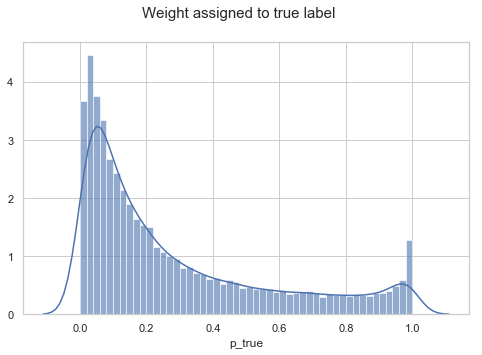

This gives a view of the degree to which the model "committed" to the correct answer, essentially. To put this in context -- if the model were perfect, and always put 100% of its mass on the right label, we'd just see a single vertical bar at 1.0. So, in the modal case, the model just doesn't really know, and spreads an even ~0.06 of weight on each of the 15 classes. But, we can think of all of the mass to the right of 0.06 as representing meaningful structure learned by the classifier.

Interestingly, though, this varies significantly for individual outlets. Here, the same data, but faceted out for each label:

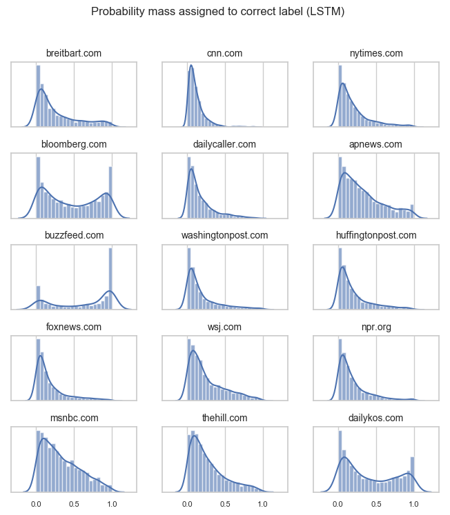

Where, we can see two basic groups. Bloomberg, BuzzFeed, and Daily Kos all have a spike of very easily-identifiable headlines where the model put ~100% of its weight on the correct answer. BuzzFeed is the huge outlier -- the model is completely positive a majority of the time.

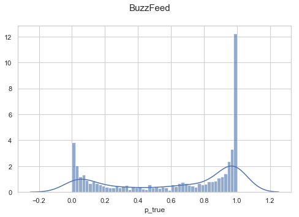

To get a sense of what these headlines actually are, we can query out the 10 headlines for each where the model gave the highest weight to the true label:

**TODO**: [Top headlines for each label, by p-true]

Whereas, for CNN -- the model almost never gives more than 0.5 weight to the true label. There are almost no headlines, in other words, that are *obviously* from CNN, in the eyes of the model.

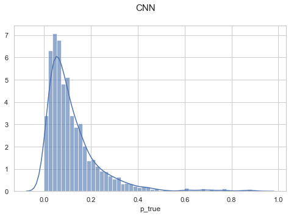

But, beyond the performance of the model -- how can we get a birds-eye view of the *representations* learned by the model -- the content of the actual headlines themselves? An easy first step is to project the sentence embeddings down to 2 dimensions, which can be plotted out visually. Under the hood, the raw sentence embeddings produced by the model are 512-dimension vectors. Here, we use UMAP to transform these into a 2-dimensional embedding, in a way that tries to preserve the relative proximities among the headlines.

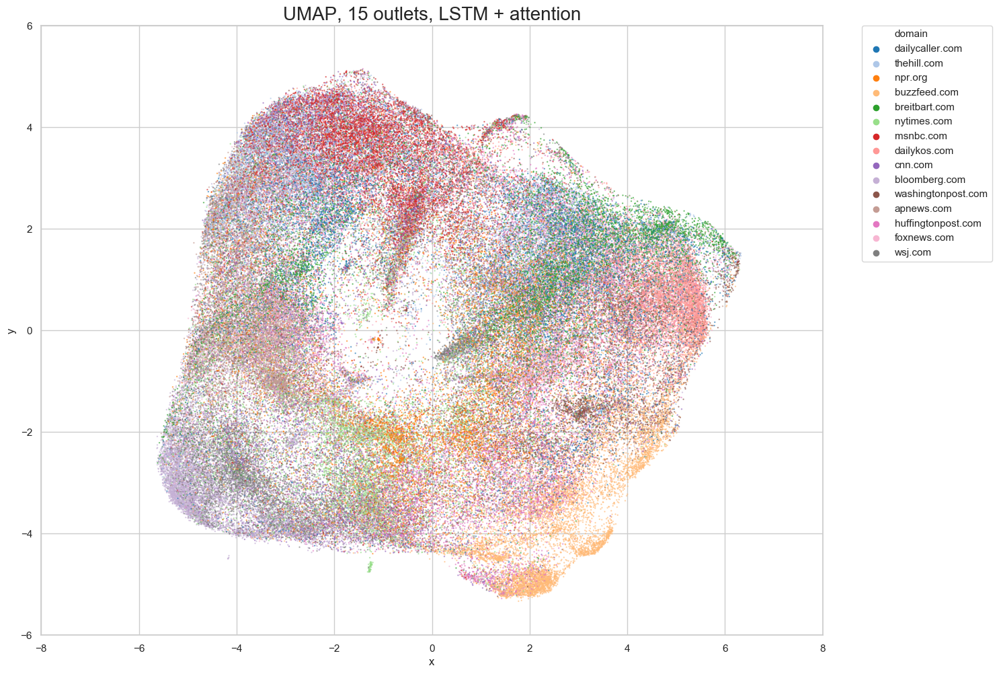

With everything together, this is a bit hard to make sense of. Foregrounding each outlet individually, we can start to pick out what seem to be coherent "regions" in the projected space:

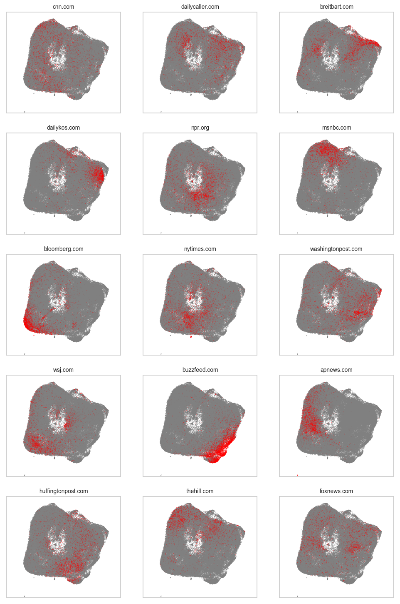

Though it's important not to read too much into these types of visualizations, at a high level this suggests that there could be significant differences in the basic "shape" of the embedding space across the different outlets. For example, compare BuzzFeed -- which looks very focused, tightly-packed -- to CNN -- which looks much more scattered and evenly diffused. Or, compare NPR, which, in this projection, seems to have ~2 salient "clusters," to Fox, which has perhaps has 3-4.

There seem to be fairly large differences, in other words, in what might be thought of as the "breadth" or "diameter" of the embeddings in different outlets -- the degree to which the headlines tend to concentrate in a particular region of the linguistic space, or scatter across a larger and more diverse set of topics and styles.

How to be more precise about this? One simple way to measure this is just to look at the *distribution over pairwise cosine distances* for each outlet. At an intuitive level -- if we randomly select two headlines from CNN -- how far apart would we expect them to be? And, how does this compare to the typical distance for The New York Times, Breitbart, BuzzFeed, and so on? Here, we randomly sample (with replacement) 1 million pairs from each outlet, and then build up the distributions over the set of cosine distances between each pair:

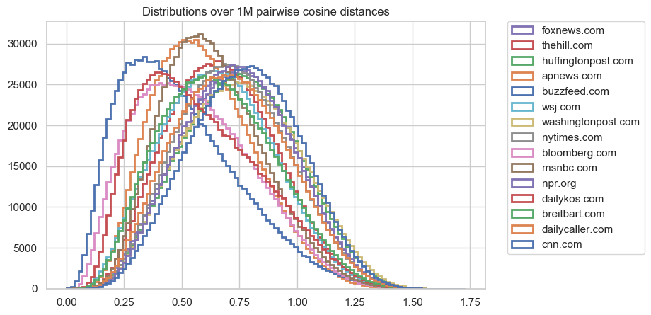

Or, broken out vertically by outlet:

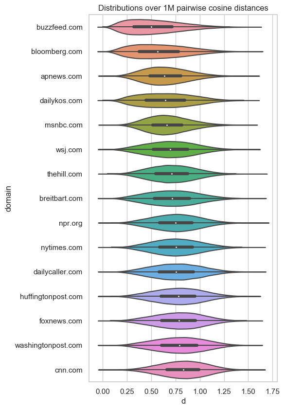

We can see differences, then, along two axes. First, the modal value of these distributions varies significantly across the 15 outlets -- smallest for BuzzFeed, at ~0.3, and largest for CNN, at just shy of 0.9. Other very "narrow" outlets include Bloomberg and the Daily Kos, which seems fairly easy to make sense of (Bloomberg is heavy on business and financial reporting; Daily Kos on left-leaning politics); Maybe most surprising is AP, which lands as the third most-focused outlet. (The reasons for this become clearer below, when digging into the internal geometries of the embeddings for each outlet -- basically, AP stories broadly cluster into two nearby clusters, which basically map onto a domestic / international divide.)

Meanwhile, at the other end of the spectrum, along with CNN are Fox, The Washington Post, and NPR are the "widest" or "broadest" outlets. Where, the interpretation is fairly straightforward -- these outlets produce more wide-ranging and diverse headlines; they have less of a "lane," and, at different times, produce content that resembles a number of other outlets.

Another related (though also somewhat different) way of thinking about this is to say that different outlets have different numbers of *clusters*. Looking at the per-outlet UMAP visualizations, again -- we might say, roughly, that BuzzFeed has 1 cluster; Breitbart has 2-3, depending on how you squint at it; Fox has two groups, one fairly focused and the other more diffuse; CNN is just scattered all over the place.

Can we formalize this? Clustering, especially in high dimensions, is kind of a dark art, and it's hard to really produce a definitive result; so all of this should be taken with a grain of salt. But, as an experiment -- here, we do a basic agglomerative cluster over the embeddings based on pairwise cosine distances, using an "average" linkage rule when deciding whether to join groups. The one hyperparameter here is the cluster merging threshold -- the cosine distance at which, if two (groups of) embeddings are farther apart than this value, they get broken out as flat clusters in the final result. For this value, we simply use the modal value of the complete distribution over pairwise distances, across all outlets (0.72).

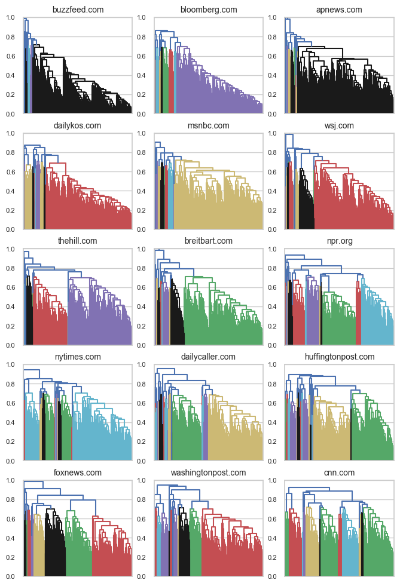

These clusters, then, can give a kind of triangulated view onto internal structure of the content produced by each outlet.

**TODO**: Dig into BuzzFeed / AP / CNN / Fox, example cluster headlines

## Modeling the headline graph

So, from digging into the embeddings produced by the neural models, we can get a high-level conceptual "map" of the types of headlines produced by the 15 outlets. But, if the ultimate goal here is to explore the degree to which this structure at the level of language / style / content corresponds (or doesn't) to the underlying audience graph, we need to explicitly model *proximity* or *similarity* -- which outlets are most similar, which are most dissimilar? Or, more precisely -- given a pair of outlets, how can we assign a score that represents the similarity of the headlines from those two outlets, in a way that allows us to compare across the full set of 120 unique pairs of outlets?

Just eyeballing things on the UMAP projection -- some outlets clearly seem to occupy roughly similar regions of the reduced 2d space. For example, Bloomberg and WSJ -- both of which generate a lot of business and financial coverage -- both occupy a significant amount of space in the bottom left of the UMAP projection, around (-6,-4):

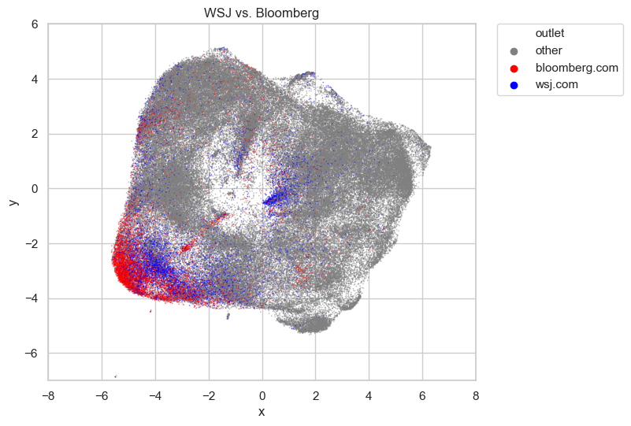

How to add precision to this? How can we convert the behavior of the classifiers into a single "score"? Maybe the simplest and most natural way to model similarity, in a predictive setting, is just to look at the confusion matrix -- that is, for each permutation of outlets A and B, the number of headlines from A that the model incorrectly assigns to B. The higher this number, the more "confusable" the two outlets. Using test-set predictions from the LSTM:

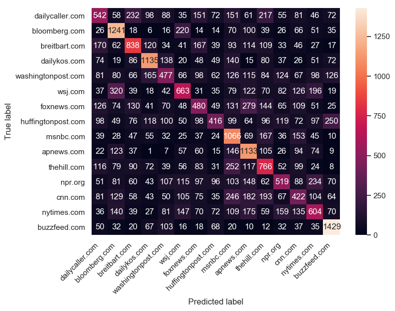

Since the class sizes are balanced across the 15 outlets, these counts are directly comparable. So, ignoring the diagonal (where the model is correct), the two most frequently "confused" headlines are from WSJ -> Bloomberg, where the model makes 353 mistakes; and the two least confused are from AP -> BuzzFeed, where the model only makes 7 mistakes. (Important to note that the confusion counts are *asymmetric* -- eg, the model might misclassify 50 headlines from A as belonging to B, but only 10 headlines from B as belonging to A. So, in building up the set of similarities among the outlets, we need to keep track of the full set of ordered permutations of all pairs.)

This can also be directly interpreted as a graph -- just treat the confusion matrix as an adjacency matrix, and the confusion counts as weights on directed edges. For example, just rendering the outlets in a circular layout, where the ordering in the circle is arbitrary, we can get a quick sense of what's similar to what, and how different subsets of outlets cluster together into cohorts. (Thicker edges correspond to high confusion counts.)

**TODO**: [Confusion matrix as radial graph]

But, this is just one way to do this among many others. For example, instead of counting literal misclassification -- places where the model actually makes an incorrect prediction -- a somewhat more relaxed version of this would be to look at correlations in the assignments of probability mass by the model. For example, if we're comparing WSJ and Bloomberg, we would take the ordered list of probability masses assigned to WSJ for all headlines:

```
[0.00619, 0.17596, 0.03041, 0.01991, 0.00007, 0.01776, 0.01682, 0.00010, 0.00626, 0.09664 ...]
```

And the the probability masses assigned to Bloomberg for the same headlines, keeping order constant:

```
[0.00279, 0.49098, 0.00894, 0.00222, 0.00005, 0.00449, 0.00378, 0.00012, 0.00284, 0.02261 ...]
```

And then just calculate the level or correlation between these two sets of weights -- that is, when the model puts more weight on WSJ, does it also tend to put more weight on Bloomberg? Just taking the Pearson correlation:

**TODO**: [Radial graph of Pearson correlations between weights]

Or also, also plausible, the Spearman or Kendall-Tau:

**TODO**: [Spearman + KT radials]

Which, at first glance, look broadly similar to the confusion counts. But, how true is this? We can't directly compare the two types scores, since the units are fundamentally different -- probability masses vs raw counts. But, to get around this, we can simply normalize them -- subtract out the mean, scale to unit variance -- and then directly compare these adjusted scores. Here, sorting by the scaled confusion counts, we can see that they generally agree. (To be precise, we can then take take the spearman correlation over these rankings, which is XX):

**TODO**: [Confusion counts vs pcorr, grouped bars]

Though, the correlation also isn't perfect -- eg, for X and Y, high confusion count, but comparatively low probability mass correlation; and by a fairly large margin, which is a bit troubling.

Why the difference? Is one more "true" or "real"? This is debatable, but probably the least wrong thing is to say that they operationalize different types of similarity. For example, thinking about the classifier graphically, as a decision boundary in a 2-dimensional space -- the high confusion counts mean that there are a large number of headlines (relative to other pairs) that sit very close to (and just on the wrong side of) this boundary. But, this doesn't tell us anything about the rest of the headlines. For example, it could be that a large majority of headlines from both outlets are very far from the decision boundary -- the outlets are generally very distinctive -- but that there is a particular subset of headlines, maybe about one particular topic, that happen to be very difficult for the model to tell apart. In which case, the probability correlation might seem like a better metric -- it might capture the fact that, overall, the outlets focus on significantly different types of coverage, and not get swayed as much by the minority of headlines that look very similar.

But, in other cases, the probability correlation might seem misleading. For example, it's conceivable that there could be a pair of outlets could have a very high level of linear correlation in assigned probability mass in the context of a multiclass model -- when A seems more likely, so does B, in general -- but that, on a head-to-head basis, the model almost never actually confuses them for each other.

The point being -- for almost any metric, we can imagine both ideal and pathalogical cases, situations where that particular formulation of similarity seems either very good or very bad. "Similarity" is fundamentally complex, especially in a case like this where the things being compared are actually large, heterogeneous aggregations over individual headlines.

Yet another approach to this -- so far, we've been training models under a multiclass objective -- the model is handed a headline, and makes a prediction across all 15 outlets. But, we could also formulate this as a large battery of completely independent, A-vs-B comparisons -- NYT vs WSJ, NYT vs. Bloomberg, NYT vs. Breitbart, and all other 117 unique combinations that can be formed from the 15 outlets. As long as the training samples are size-balanced across all pairs, so that they always see exactly the same number of headlines from each outlet -- we can directly compare the classification accuracies from these binary models. Because of resource constraints, it's not feasible to re-train the strongest neural models on pairwise samples (which are very slow without GPUs, and we don't currently have access to massively parallel GPU compute). But, the non-neural baselines, which are only a few percentage points off the neural models in the multi-class benchmark, can be fit very efficiently on standard CPUs, which makes it possible to parallelize these models across thousands or even millions of separate comparisons using commodity cloud hardware.

For example, using the linear SVC, the stronger of the two non-neural baselines -- we can take all 120 unique pairwise combinations from the 15 outlets, and, for each pair, fit 100 models on randomly sampled headlines for that pair. For example, for the first comparison -- say, NYT vs. WSJ -- we would sample 18k headlines from NYT, 18k from WSJ, break these 36k headlines on an 80/20 train-test split, fit a model, and evaluate the accuracy on the test set. And then, do this 99 more times for NYT vs. WSJ, each time sampling a new random subset of 18k/18k headlines. For all 120 pairs, this gives a total of 12,000 independent model fits, all of which are totally independent of each other, and can be easily parallelized -- here, using Spark, on a 320-core cluster on AWS, which can run this in about an hour. We can then use these 12,000 accuracy scores to form very tight confidence interval over the pairwise accuracies for each comparison:

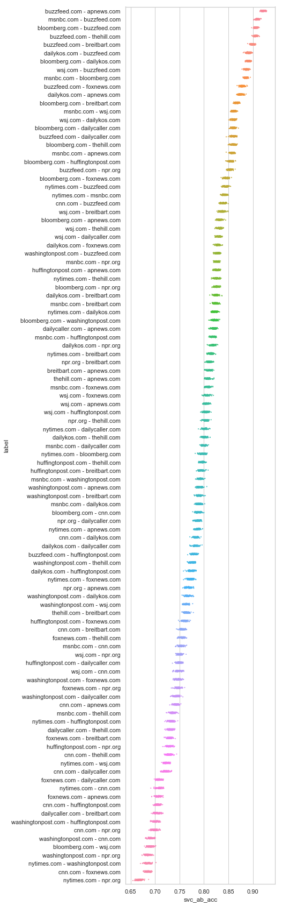

These per-pair scores can simply be averaged, to get a set of 120 scores, which can then be scaled to zero-mean-unit-variance and plugged in with the previously developed scores:

**TODO**: [A-B accuracies with confusion counts + probability corrs, grouped bars]

(With the classification accuracies, to make them comparable with the confusion counts and mass correlations, we simply flip the signs on the scaled scores, since a high accuracy corresponds to low similarity.)

Which, we can see, are broadly converging. By taking a battery of different similarity metrics, we can triangulate across a wide range of different modeling decisions and be sure that the final results are durable, regardless of which of these different measuring tapes we use.

So, what does the full set of available metrics look like? There's a kind of combinatorial explosion of possibilities, but, for the purposes of this analysis, we use:

- Confusion counts and probability correlations (Pearson, Spearman, Kendall-Tau) for the three major neural architectures -- LSTM, CNN, and CBOW.
- Confusion counts and classification accuracies from pairwise SVC and logistic models.

Which gives a total of 16 different representations of headline similarity for each pair of outlets. Then, joining all of these together and applying standard scaling, we can represent the similarity between each pair of outlets as a collection over these 16 independently calculated scores:

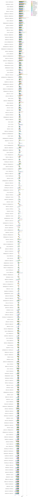

And, averaging over the metrics, and converting into a literal graph -- here, for visual clarity, collapsing the bidirectional edges into a single undirected edge, averaging over the two scores:

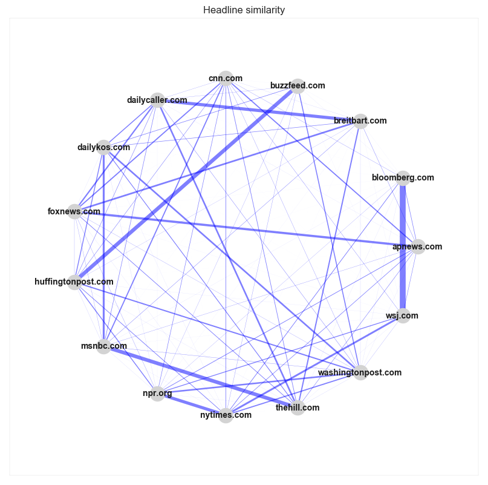

So -- WSJ / Bloomberg take the cake for the single strongest link, followed by HuffPo / Buzzfeed, Daily Caller / Breitbart, MSNBC / The Hill, and NYT / NPR.

Under the hood -- what's actually going on with these? Many of them are intuitive -- for example, Daily Caller and Breitbart -- but others seem to somewhat work against expectations. For example, something like AP / Fox, which is the 6th strongest similarity out of all 120, when averaging over the scores. What's driving this similarity? What kinds of headlines, in particular, sit at the overlap of Fox and AP?

**TODO**: Confusion headlines for Fox / AP, HuffPo / BuzzFeed.

Meanwhile, at the other extreme -- out of idle curiosity, can we find *any* meaningful overlap between AP and BuzzFeed?

**TODO**: Confusion headlines for AP / BuzzFeed.

## Modeling the audience graph

So, from the classifiers -- a fully connected graph out news outlets, where the edge weights represent the degree to which headlines from each pair of outlets are similar or different. To return to original question -- how does this graph compare to the underlying audience graph, the social graph of users on Twitter who distribute the content? For example, to WSJ and Bloomberg also have the highest correlation at the level of audience, from among all the pairs of outlets?

Measuring similarity between the outlets at the level of the headlines was relatively complex. But, in many ways, measuring the audience similarity is more straightforward, especially in the context of social media platform like from Twitter, where every individual tweet is associated with a stable user id. From these, we can trivially assemble the set of unique users who has ever tweeted a link to a `nytimes.com` URL, a `wsj.com URL`, aa `breitbart.com` URL, etc.

And, unlike with the headlines, where we had to do quite a lot of work before we could say that a headline from outlet A is "confusable" for a headline from B -- with the social graph on Twitter, users have literal multiple-membership relationships with the different outlets, baked natively into the raw data. A single user can be unambiguously associated with more than one outlet -- by tweeting a link, following an account, etc -- whereas, with the headlines, a single headline can only "belong" to a single outlet, and we needed to develop an elaborate machinery from scratch to measure similarity (the classifiers).

Again, there are various ways to do this, but we stick with something simple -- just calculate correlations in link counts across the 15 domains at the level of individual user accounts. For example, imagine we just had 3 outlets -- NYT, NPR, and CNN -- and two users, 1 and 2. If user 1 has tweeted 10 links to NYT, 5 to NPR, and 3 to CNN, we'd represent this as:

`[10, 5, 3]`

And, if user B has tweeted 2 links to NYT, 20 to NPR, and 5 to CNN, we'd have:

`[2, 20, 5]`

These count vectors can be assembled for all 8M users who have ever tweeted at least one link to any of the 15 analysis domains. Then, from these, we can calculate correlations between the counts for all unique pairs of domains -- which gives, for each pair, the degree to which users tend to share links from both of them. Thinking of it as a huge actor / count matrix, just take correlations over all pairs of columns, each of which represents one of the outlets. Here, like before, we tabulate the Pearson, Spearman, and Kendall-Tau correlations for each pair of outlets. Here, sorting by the Kendall-Tau correlation:

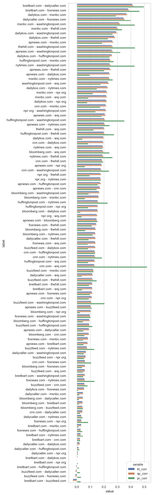

Overall these paint a fairly consistent picture, with Breitbart and Daily Caller as the most highly audience-correlated outlets under all three metrics. Though, there are places where the Pearson correlation diverges significantly from the Spearman and Kendall-Tau -- especially with CNN / WSJ, where the Pearson correlation is extremely high, but Spearman and Kendall-Tau are middling. This is a function of the fact that Spearman and Kendall-Tau are based on the rank-ordering of the counts, whereas Pearson operates on the actual counts; and, here, there's clearly a small set of users (or even just a single user) that have posted an *extremely* large number of links from both CNN and WSJ, which has the effect of cranking up the overall Person correlation.

Indeed, looking more closely at the number of links posted by each user, we can see that this distribution is highly skewed -- out of 8.1 million users, 5.5 million (68%) have only posted a single link. And, a handful of users have posted a *massive* number of links -- 23 users have over 10,000 links. (These are likely organizational accounts or bots.)

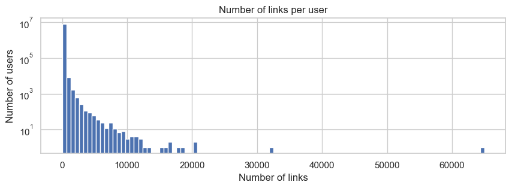

To be sure that these two extremes -- "undersampled" accounts that only appear a handful of times, and "oversampled" accounts that are incredibly prolific -- aren't skewing the relationships in problematic ways, we can calculate a second set of correlations for each pair of outlets, but this time just considering users who appear between 10 and 100 times in the dataset. Here, the same set of 3 correlation metrics:

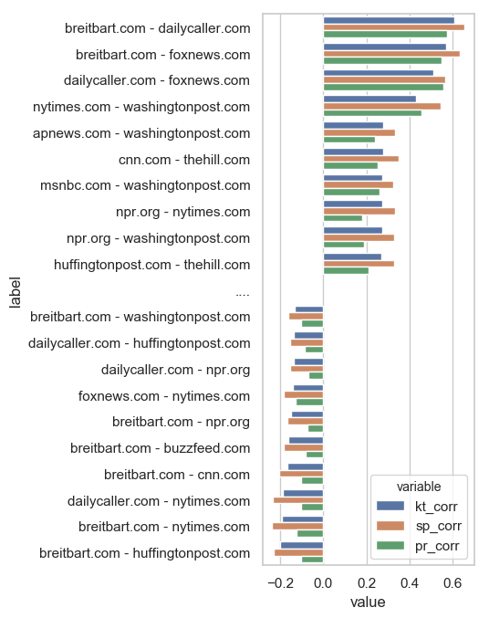

Like with the headlines, the idea here is to pull out a "grid" of measurements using different techniques and hyperparameters, to be sure that we don't over-interpret a noisy or idiosyncratic result from a single type of measurement. Here, all six scores for each outlet pair:

**TODO**: [All correlations, grouped bars]

Or as a literal graph, with the edge weights based on the modal score for each pair:

**TODO**: [Radial graph]

## Headlines vs. audience

At this point, we've got all the raw ingredients in place to start to explore the question of how similarities at the level of content correspond (or don't correspond) to similarities at the level of audience. To recap -- we've induced two sets of weights over the 15 outlets, one representing similarity at the level of headlines, and the other representing correlations in the set of users who tweet the content:


**TODO**: [Audience radial graph]

Zooming down to the level of an individual outlet, for example, The New York Times -- we can represent the full linguistic "signature" of NYT as a set of pairwise scores with all other outlets, where each score is actually a family of individual metrics that represent different ways of modeling the linguistic similarity. So, for example, for the LSTM Kendall-Tau probability correlations (lstm_pcorr_kt), we get 14 values, each representing the linguistic similarity between NYT and one of the other outlets. These 14 scores are then normalized to zero-mean and unit-variance, which makes it possible to compare across measurements with different units. So, here, we can see that NYT is most similar to NPR, when averaged across all metrics, and least similar to The Hill:

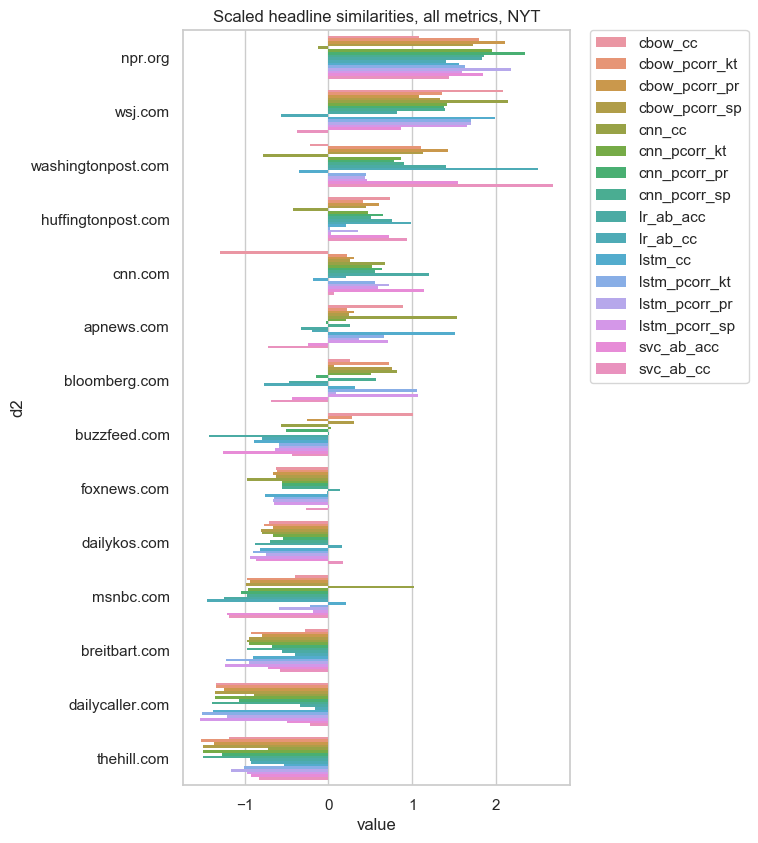

Meanwhile, parallel to this -- for the headline graph, we get a second set of pairwise similarities at the level of audience. So, the NYT audience correlates most closely with The Washington Post, and least closely with Breitbart:

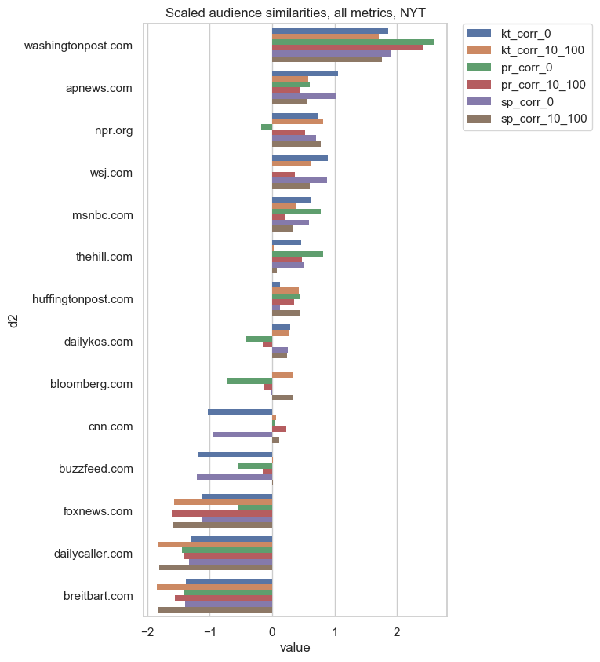

With these two sets of similarities in place, we can now simply ask -- to what extent do these two sets of weights correlate with each other? For example, when NYT is similar to NPR in terms of the content of headlines -- is it also similar at the level of audience, is there also a high level of correlation between the set of users who tweet links to NYT and users who tweet links to NPR?

To make the comparison clearer, we can stack the two sets of weights on top of each other. Here, the headline similarity metrics for each (NYT, other) pair are rolled together into the blue bars, and the audience similarities are averaged into the orange bar. Then, we sort by headline similarity:

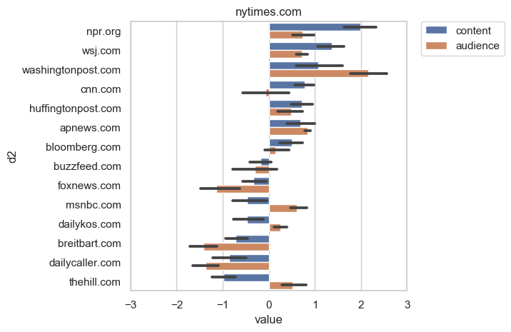

Which makes it possible to see the overall level of alignment between the two sets of weights. Generally, the correlation between headlines and audience is fairly tight; though, we can see a couple of places where this breaks down. Namely, NYT has very low headline overlap with The Hill -- in fact, the *lowest* out of all 14 of the other outlets -- but a relatively high overlap at the level of audience. Also notable is the fairly large disconnect with NPR -- NYT is closer-than-average to NPR for both content and audience, but by a significantly larger margin for audience than for content -- NYT headlines "sound" very similar to NPR headlines; but the audience correlation is just a bit above average for the NYT.

So, for NYT -- overall, an alignment between content and audience, though with a couple of wrinkles. How can we quantify this? Under the hood, for each combination of `(NYT, other outlet)`, we've got 16 different headline similarity scores and 6 different audience similarity scores. From these, we can take each unique pairing of headline metric and audience metric and simply calculate the correlation of these scores, across each of the other 14 outlets. This gives, then a *distribution* over correlations that represent the degree to which the NYT headline graph matches up with the NYT audience graph:

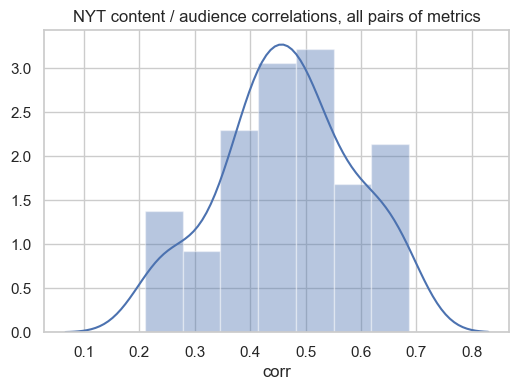

So, a modal value of ~0.45, though with quite a bit of variation. (This is where all of the different measurements of similarity come in handy -- by aggregating over all of them, we can get a much more densely-sampled view on these relationships.) We can then do this for each of the 15 outlets, and compare these distributions over correlations, which surfaces some very significant differences:

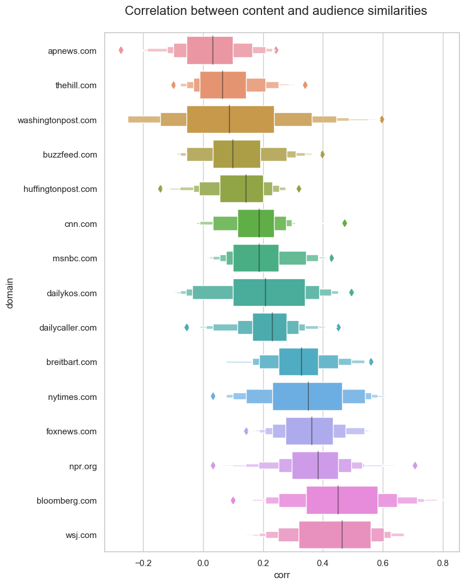

So -- Bloomberg, Breitbart, and WSJ occupy very similar "locations" in the headline and audience graphs -- when Bloomberg "sounds like" another outlet, it generally also has a very high level of audience overlap with the outlet. To get a sense of what this looks like -- here are the broken-out content / audience similarities for these three:

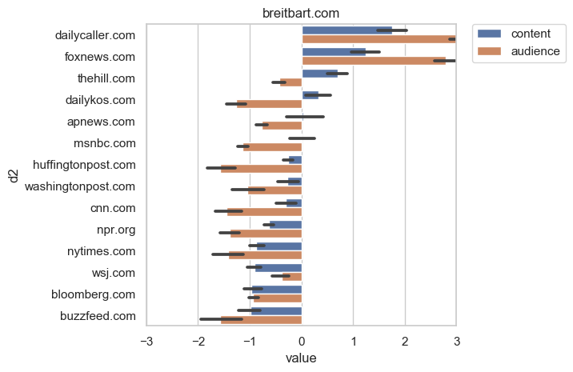

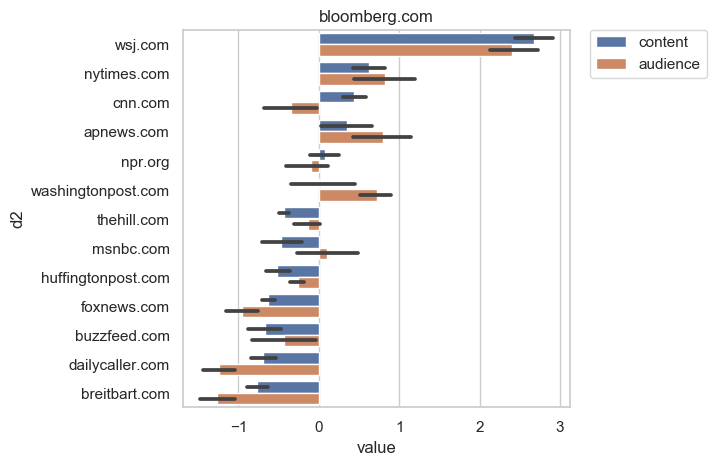

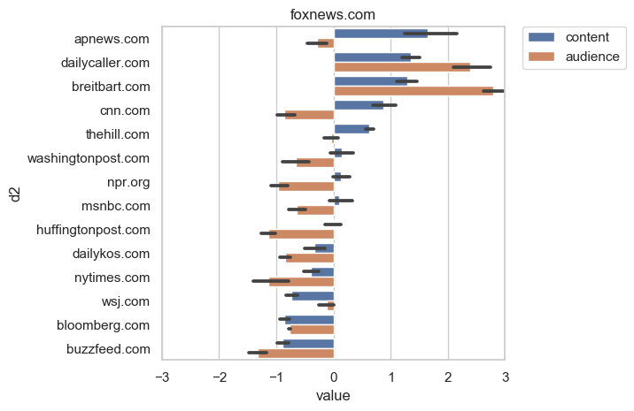

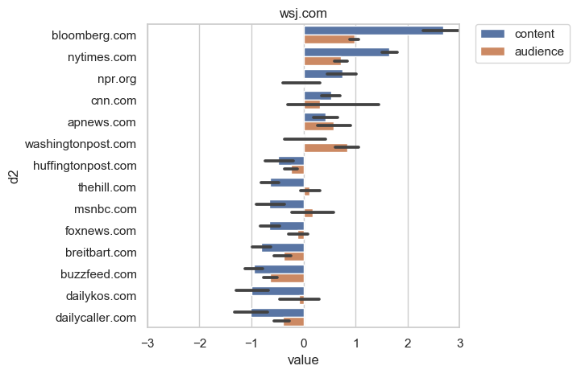

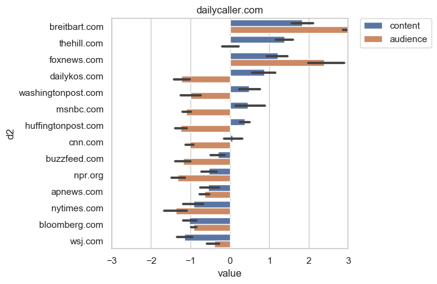

Meanwhile, at the other end of the spectrum -- AP, The Hill, and Huffington Post have significantly "misaligned" headline / audience graphs -- there are (many) places, in other words, where they produce headlines that sound very similar to another outlet, but the audience overlap between the two is low; or vice versa. Here are the broken-out similarities:

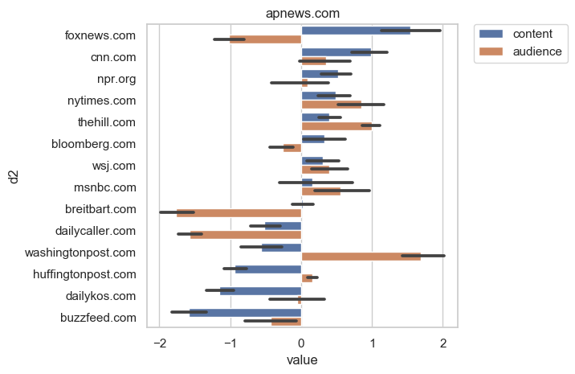

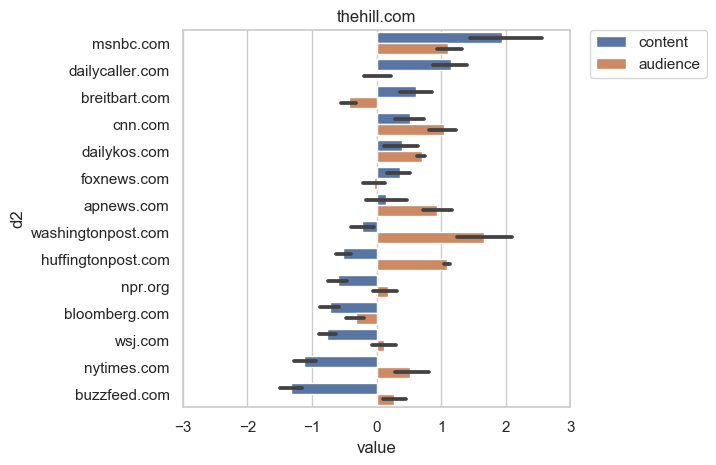

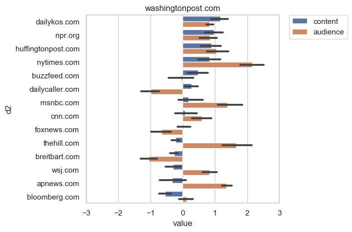

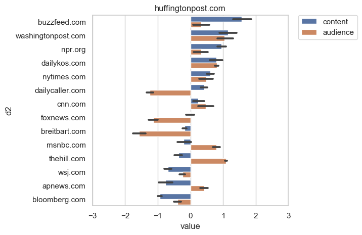

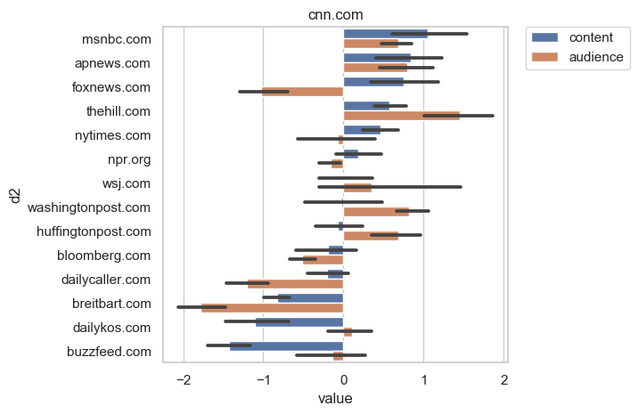

So, what's actually going on with these? Though the specifics are different, one interpretation is to say -- in each case, there is a high level of headline overlap with right-leaning outlets, but a high level of audience overlap with left-leaning outlets. For example, with AP -- the headlines sound most similar to Fox, by a large margin, but the audience overlap with Fox is very low; and, the highest audience overlaps are with WaPo, The Hill, and NYT. Likewise, with The Hill -- the headlines sound (comparatively) similar to The Daily Caller and Breitbart, but the higher audience overlaps are with WaPo, HuffPo, and CNN.

Meanwhile, with HuffPo, the misalignment plays out a bit differently. Here, again, the discrepancy is with right-leaning outlets -- low audience correlation with The Daily Caller, Fox, and Breitbart, but higher headline similarity. But, it's not really that HuffPo sounds significantly similar to these outlets, relative to the whole field, but that -- it sounds much *less dissimilar* to them than we might expect, given the extreme negative correlations in audience. The audience overlap between HuffPo and Daily Caller / Fox / Breitbart is very low; but headline similarity is sort of middling.

Stepping back -- with these 15 outlets, it seems that when content and audience misalign, the discrepancies represent a kind of one-way short circuit in the underlying audience graph -- outlets with generally left-leaning audiences are producing headlines that sound more typical of headlines produced by right-leaning outlets. Or -- AP and The Hill are exposing left-leaning readers to issues, stories, topics, or styles that are generally more typical of right-leaning news feeds. But, this seems to only happen in one direction, from left to right; there don't appear to be outlets, in this set of 15, that perform this bridging function in the other direction.

- disaggregated pair deltas.
- under the hood -- what's actually going on here? eg, when AP sounds like Fox, or DK like DC, what does that mean? what is/isn't the clf picking up?
- how to find examples of "confusable" hls? not totally obvious -- can take hls from A that sound most like hls from B, but this will generally just tell something about most B-ish hls, not the specific A/B overlap.
- instead -- like before, when measuring "diameter" of embedding families -- sample N hls from A, N from B, take pw cosine distances, then skim off N closest pairs; or, the matched A/B pairs that are closest in the high-dimensional space. by looking at these, can get a sense of why the model considers A/B to be similar.
- mixed results
- Fox/AP, Fox/CNN -- shared attention + shared viewpoint (crime, international)
- DailyCaller/DailyKos, Breitbart/DailyKos -- shared attention, but different viewpoints
- Hill/DailyCaller -- shared attention + *neutral* viewpoint -- (relatively) down-the-middle political reporting

## Headlines as a temporal process

- So -- content and audience generally do align quite closely. But not always, and when they don't, evidence that there's a one-directional aspect to misalignments, left -> right
- to return to initial question of how to *contextualize* the raw proximity scores that can be pulled out of the classifiers -- this fills in a first point of reference for this. close hls of BB/DC are "expected" given the audience graph; "Fox/AP" aren't as much.
- in a sense though, this is a beginning, not an end. can think of this as a single triangulation on the overall headline-level proximities. but, one among many possible ways.
- how else could we explore this?

So far, we've been treating everything as completely synchronic data -- we're rolling up the ~18-month data window into a single vertical slice. This is useful as a starting point, to get an baseline representation of the content / audience proximities.

But, what could be learned from studying these proximities as historical processes -- from adding back in the `postedTime` timestamps on the original tweets? This opens the door to an intriguing set of questions. Instead of just modeling the overall structure of the content/audience relations among outlets -- could we track the evolution or "drift" of these relations over time? How stable are they? Do they change at all? And if they do -- how? Are there pairs (or groups) of outlets that have become significantly more or less similar over time, at the level of the headline? Would it be possible to identify high-level patterns of convergence or divergence in the news media -- subsets of outlets that have drifted, over time, into higher or lower levels of "shared attention"? We can imagine a kind of "plate tectonics" of the media landscape --

This suggests one final question. In the same way that we explored the synchronic relationship between content and audience, could we also explore the degree to which there is a diachronic relationship between content and audience? That is -- if the headlines from two news organizations become more or less similar over time, do their audiences also tend to converge or diverge in parallel?

In short -- we find that there have been significant changes in the structures of both the content and audience graphs over the course of the last two years. And, that the correlation between these changes is highly variable -- sometimes, content and audience move in extremely close lockstep, with higher similarity of headlines corresponding to higher audience similarity, even at the level of months / weeks. But, in other cases, a rise or fall in content similarity doesn't correlate significantly with a change in audience; and in a number of other cases, content and audience are highly negatively correlated -- as content becomes more similar, audience becomes less similar; and vice versa.

First, though -- how to model changes in the headline graph over time? One approach would be to simply take the outputs from models trained on synchronic data and introduce timestamps post-hoc during analysis. For example, we could take test-set predictions from the LSTM -- which is trained simultaneously on all data from across the full window of data -- and look at changes in the structure of the predictions according to the timestamps on the underlying tweets.

But, there could be a number of pitfalls with this, both at fairly pragmatic levels of corpus composition, and possibly also at more a fundamental, information-theoretic level. First -- as we saw at the beginning with the historical volume trends, some outlets have undergone significant changes in the raw quantity of content that they have produced over the time window in question. For example, counting individual articles, HuffPo produced about 50% as much content in summer of 2018 than in spring of 2017. In the synchronic context, where we're rolling up outlets into monolithic bundles of data, this doesn't matter -- our interest is in modeling the "complete" or "aggregate" linguistic footprint of the outlet over the whole data window, so we just merge everything together and then downsample the headlines from each outlet to a fixed size to a fair comparison across all outlets.

But, in a diachronic context, these underlying changes in volume over time become very important. In the same way that we need to equalize the headline counts across outlets before fitting classifiers in order to make the similarity scores fully comparable, these changes in volume will fundamental affect classification accuracy; which, in turn, could appear to be changes in the similarity of content, when really they just proxy changes in volume.

In an extreme case -- imagine that outlet A produced 100k articles in 2017, but then just 20k articles in 2018. This gives a classifier far more "evidence" about the headlines from 2017 than 2018, and so, where the goal is simply to reduce the overall training loss, the model will, by default, learn a function that is more tailored to 2017 data than 2018 data, simply because there is more 2017 data in the training corpus. Then, if we compare the accuracy of the model over time, it might be that the model is significantly less accurate on headlines from 2017, which, all else held constant, we could interpret at meaning that the outlet had become less distinctive or differentiated in 2017; but, really, it just was producing less content. (which is also noteworthy, but in a different way.)

One approach would be to control for this explicitly in the training data -- eg, split the data into a set of N buckets, and downsample inside of each window to ensure that every `(outlet, bucket)` count is identical. This would address the issue of per-outlet changes in volume over time. But, beyond this, there are other potential problems. For example, Ted Underwood notes that topic models, when fit on corpora that span across long time periods, can produce misleading "banding" effects at the edges when the individual documents are analyzed as a chronological series. For instance, here, to get a signal for the "speed" at which a corpus of novels is changing over time, at each point on the X-axis the cosine distance is taken between the topic distributions for all texts in the previous two years paired with all texts in the next two years; the higher this value, the larger the "displacement," in the topic space, at that point in time.

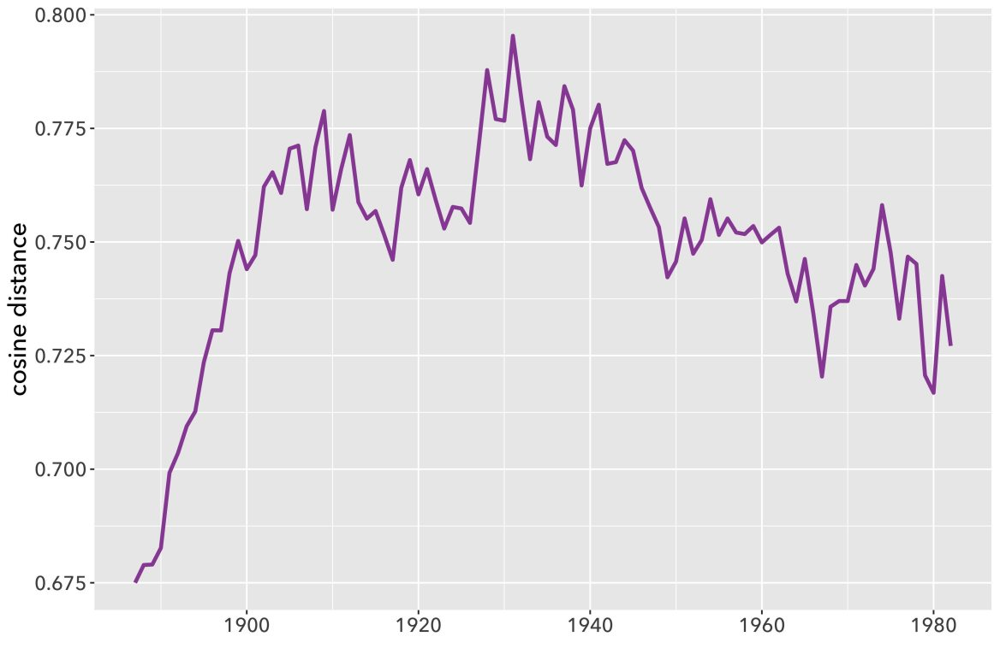

From this plot, it appears that the corpus changes very quickly at first, and then the rate levels off and starts to fall. But, Underwood notes, if you re-fit the model on data from different time spans that partially overlap -- for example, if you add or remove 25 years of data to the start of the corpus -- it turns out that this arc-shaped pattern crops up again and again, in a way that contradicts the results from the other slices of data. Clearly, this is some kind of modeling artifact -- all of these can't be true:

 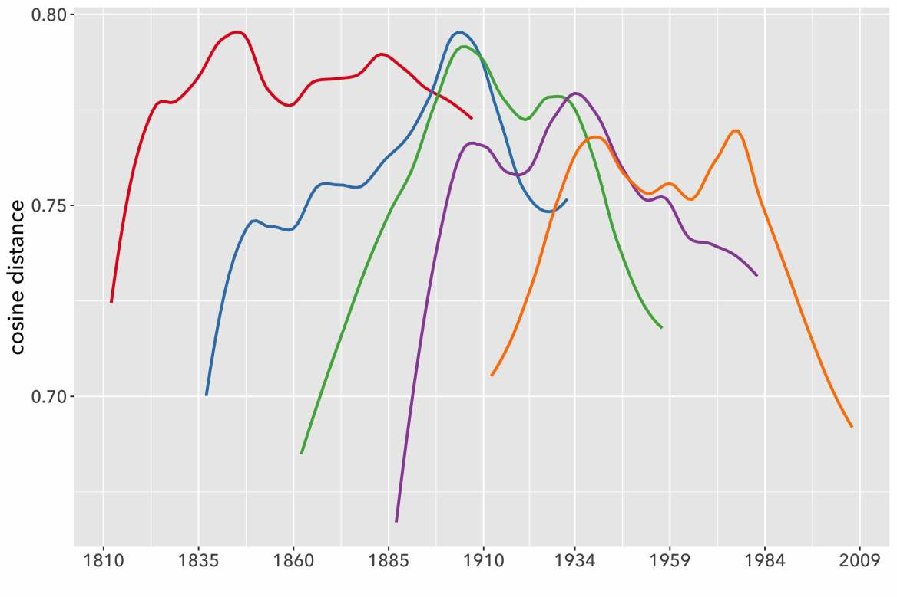

Underwood doesn't pin down a definitive cause for this. But, broadly, the interpretation is that this is largely similar to the problems that arise from changes in volume over time, though in a more subtle and fundamental way -- the topic model is optimizing around the "middle" of the historical window in the data, where, by definition, the majority of the data lies. If we imagine there to be a kind of underlying process of historical change that takes place across the window of data, then the model has more information about the "state" of this process in the middle than at the edges, where the left- or right-hand side is missing; and so the model, when fit on the complete data set, tends to optimize over data in the middle of the window.

The point being, though -- there are various methodological pitfalls associated with training models on synchronic data, and then unroll the learned representations over historical time post-hoc -- there's a risk that what might look like meaningful historical change is really just an artifact of how the model is solving some kind of optimization problem.

How can we avoid this? An easy route, which we take here, is just to train a very large battery of completely independent models on different historical slices of the data. The downside to this, of course, is that this become much more computationally expensive than just training a single model on all of the data at once. But, like before with the A-vs-B comparisons between individual pairs of outlets, if we forgo the neural models and fall back to the non-neural baselines, these training runs can be easily parallelized on cheap commodity hardware, which makes it feasible to train a very large number of independent comparisons.

Which particular model and similarity metric should we use for these comparisons? The linear SVC is particularly attractive in that (a) it's the strongest non-neural baseline, just 3.5% off the LSTM, and (b) it fits very fast, making it feasible to train hundreds of thousands or even millions of individual models. But -- how "trustworthy" are the similarity scores produced by the SVC? Conveniently, building on the large grid of similarity scores explored in section XX, we can quantify this by simply taking the mean squared error between the accuracy scores produced by the SVC and the mean value for all metrics, and then compare this to the equivalent error for all metrics. Sorting from lowest to highest error, we find that the SVC pairwise accuracy is close to the top of the list -- the similarity measured by the SVC is generally very close to the average score derived from all metrics. This gives confidence that we can use the SVC as an accurate (and, importantly, highly efficient) representation of similarity.

So, using the SVC classification accuracy as a canonical signal for similarity -- how to measure historical changes in proximity across the 15 outlets? If we had an indefinite amount of data, we could simply split the data into a large number of non-overlapping buckets, and then fit models on data from each bucket independently. But, in this case, we're limited by the size of the dataset from the lowest-volume outlet, which defines the size of the data samples we pull from each outlet, since these always need to be held constant to ensure that the similarity scores are comparable. (Here, again, this is MSNBC, with 18k headlines in total.) If we split this over, say, 100 buckets, this falls to just ~180 headlines per bucket, which is very small. We could just split over fewer buckets -- say, 10 -- which would make it possible to train on 1800 headlines per outlet per bucket. This is better, but, 10 buckets also gives a much more blocky, discretized view of the historical interval, which, depending on where the bin boundaries happen to fall, might somewhat obscure interesting trends.

To get a somewhat continuous approach, while still maintaining a decent quantity of data in each time slice, we take this approach -- first, split the data into 100 equally-sized bins, and then slide a 10-bin rolling window across these bins. So, the first window would include bins 1-10; the second, bins 2-11; the third, bins 3-12; and so on. This gives a total of 91 partially-overlapping windows across the data, each individually covering 10% of the total temporal interval.

As initial smoke test -- considering all outlets, has the overall "differentiability" across the 15 outlets changed over time? Here, we fit all-versus-all multiclass models on 100 random size-balanced samples across each of the 91 windows. In each window, we randomly sample 18k headlines from each outlet, split this sample of 270k headlines into standard 80/20 train-test splits, fit a SVC classifier on the training data, and then evaluate accuracy on the test set. And then repeat this sampling process 100 times for each window, giving a total of 9,100 all-vs-all accuracy scores:

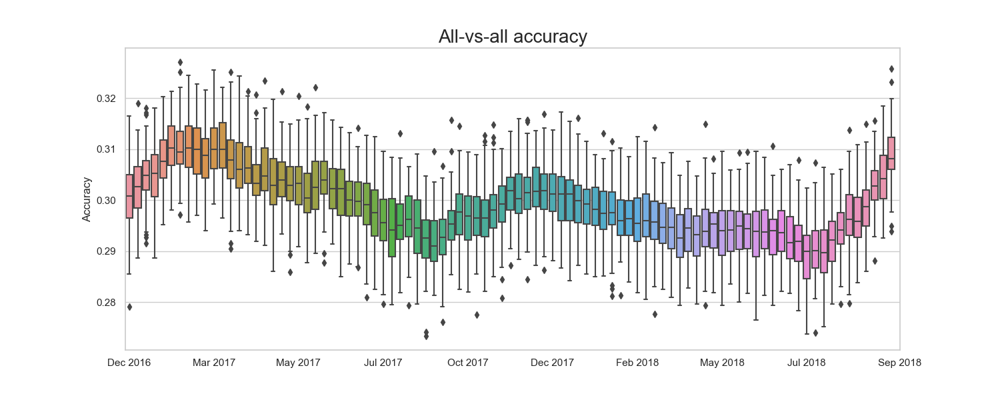

Where, again, high classification accuracy can be interpreted as low similarity (the outlets are easier to tell apart) and low accuracy can be interpreted as high similarity (outlets are more difficult to distinguish).

So, there seems to be some trend, though the error bands are fairly large here -- an early high-water mark of differentiability in the winter and spring of 2017 (immediately following Trump's inauguration), and then a fairly consistent falloff over the course of the next 18 months, and then a sudden spike in the summer and fall of 2018. But, this is a somewhat constrained view, since it's hard to make sense of what might be driving the change. When the accuracy suddenly spikes at the end of the window -- is that because all of the outlets are simultaneously becoming more differentiated from each other? Or, are these changes driven just by a smaller subset of outlets that become more distinguishable to the model, but which has the effect of pushing up the overall accuracy score?

To get a clearer view of this, broken out by individual outlets -- we can do the same thing again, but this time training "one-vs-all" models for each outlet in each window. So, for example, for the New York Times in window 10 -- we first sample 18k random headlines from all outlets, like before; but then, holding out the 18k headlines from the New York Times -- the "foregrounded" outlet -- we randomly sample 18k headlines from across all of the other 14 outlets. This gives two sets of 18k headlines -- the "foreground" set, for the New York Times, and the "background" set, evenly sampled from everything else. We can then fit a regular binary model on these two splits, which will give a measurement for the degree to which that individual outlet is distinguishable with respect to all others at that particular moment in time. Like before, this is repeated on 100 random samples for each outlet in each window, giving a total of 136,500 accuracy scores, which can then be grouped by outlet. Here, sorted by the slope of a linear fit, sorted from most increasing to most decreasing:

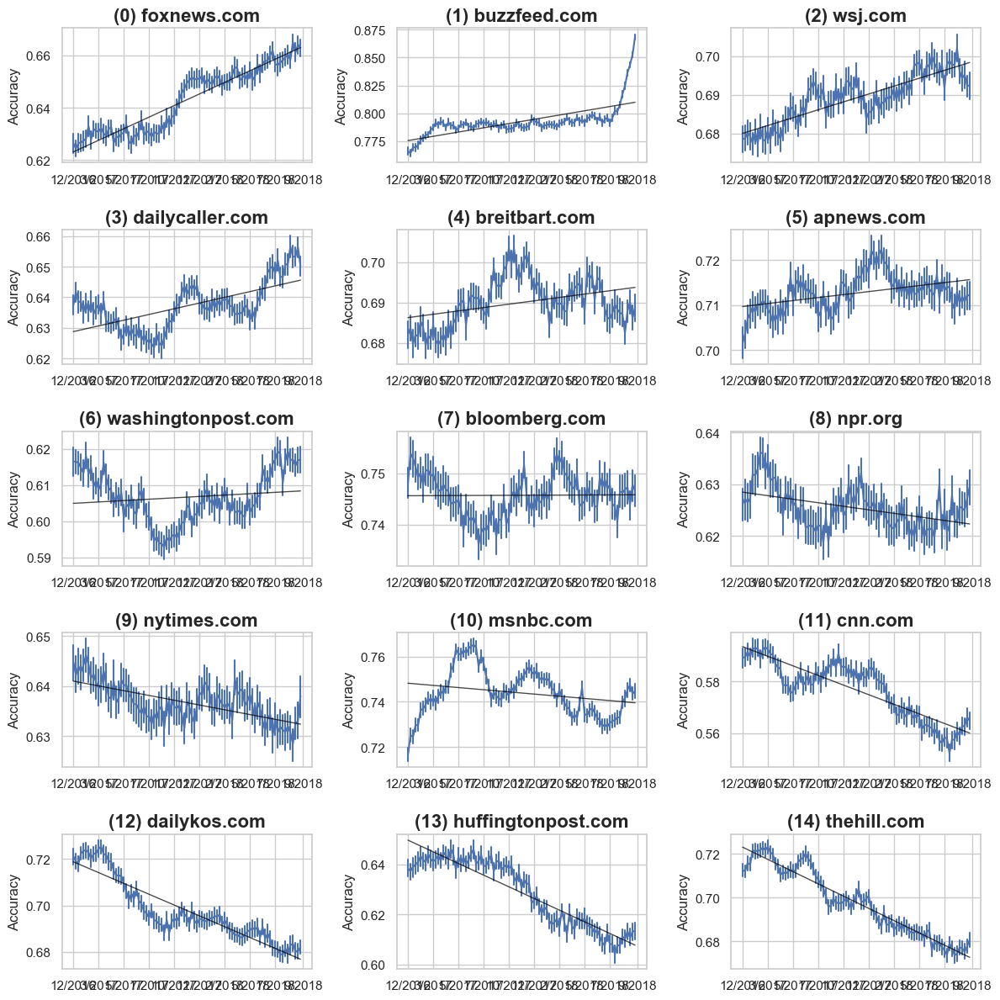

Now, the shape of things starts to come into closer focus -- the sudden rise in accuracy at the end that was visible in the all-vs-all accuracies is clearly driven almost entirely by BuzzFeed, which becomes rapidly and dramatically more distinctive at the very end of the data window, the accuracy jumping by almost 10% in just a couple of months. Fox, meanwhile, has the strongest overall linear trend, becoming consistently more differentiated over the 18-month window, maybe with something of a phase shift at the end of 2017. Meanwhile, at the other end of the spectrum, four outlets show consistent falloffs in differentiability -- The Hill, The Daily Kos, Huffington Post, and CNN.

But -- falloffs relative to what? These trends make it possible to pick out the outlets that are driving the overall trend, but it's not clear how the individual changes relate to each other. For example, when The Hill falls from 72% to 68% accuracy, it's becoming more "confusable" with some combination of other outlets. But, which outlets? With everything else rolled into a single "other" category, it's hard to make sense of why this is happening. What we need, again, is to model the complete matrix of relationships among all outlets -- but here, the relationships represent the degree to which every outlet has become more or less similar over time, not just the overall similarity.

To get at this -- in the same way that we could train a battery of individual A-vs-B models to get pairwise similarity scores when modeling the structure of the (synchronic) content graph, we can do the same thing again, but here broken out across each of the 91 temporal windows. For each of the 120 unique pairs over the 15 outlets, and in each of 91 windows, we sample 18k headlines from outlet A, 18k for outlet B, and then fit a binary model; and then repeat this 100 times, to get a distribution over 100 sampled classification accuracies for each pair of outlets in each window -- a total of 955,500 model fits.

With this, we can break out a historical similarity trend for each individual pair. Again, sorting by the slope of a standard linear fit, here are the 10 pairs with the strongest increases in accuracy, pairs that have moved away from each other most significantly over the last 2 years:

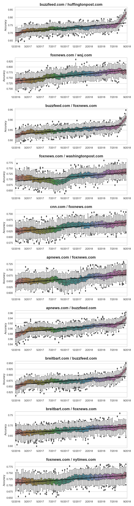

Most of these pairs include either BuzzFeed or Fox, paired with a number of different outlets, suggesting that these two outlets are becoming consistently more differentiated from a fairly wide range of other sources -- they drifting off into increasingly isolated, individually distinctive linguistic spaces. Meanwhile, in the other direction -- here are the 10 pairs with the strongest linear decreases in classification accuracy -- outlets that *converged* most significantly over time:

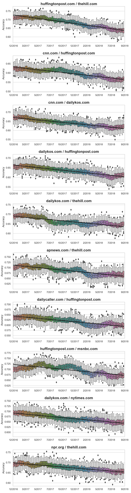

Here, again, we can spot a handful of outlets that crop up in a number of different pairs -- Huffington Post (in particular, present in each of the top three), The Daily Kos, and The Hill.

Moving beyond just the 10 strongest trends in each direction -- from the full set of 120 pairwise relationships, we can assemble the fully connected graph for all 15 outlets. Here, we treat the slopes of the regression fits as signed edge weights between the outlets. The width of the edge represents the absolute magnitude of the slope -- the degree to which the relationship between the pair has changed over time -- and the color represents the direction -- blue for negative slopes, where outlets have become more similar over time (lower classification accuracies), and red for positive slopes, where outlets have become more dissimilar (higher classification accuracies).

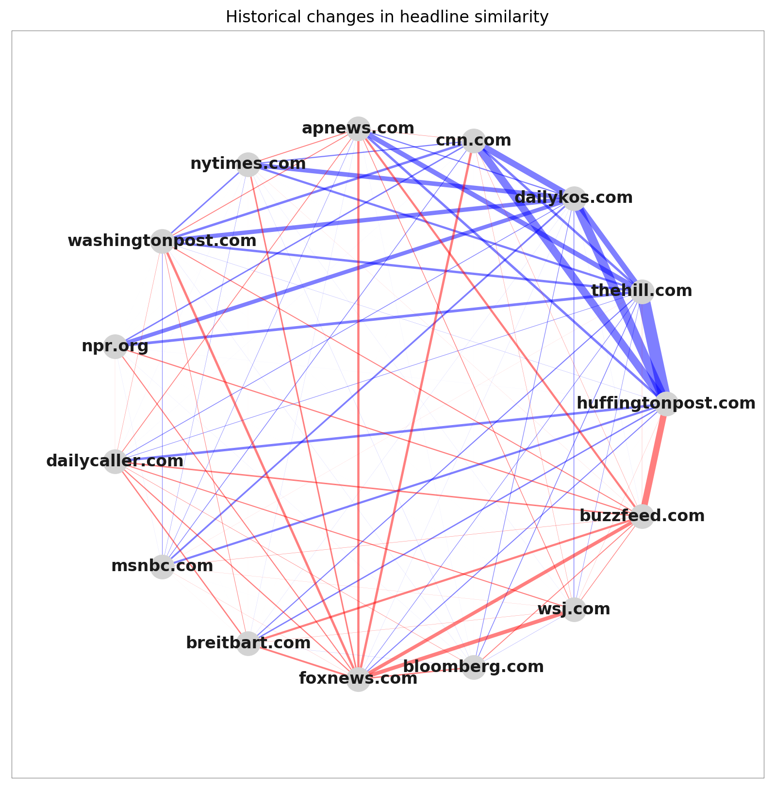

From this, a number of clear trends start to fall out. First, there seems to be a core group of four outlets that have undergone a significant convergence over the last two years -- Huffington Post, The Hill, Daily Kos, CNN. (All left-of-center, politically-oriented outlets.) And, to a lesser extent, AP, The Washington Post, The New York Times and NPR have all become more confusable with some combination of these four, though in a somewhat more patchy and inconsistent way (Daily Kos, in particular, has become more confusable with WaPo, NYT, and NPR). Meanwhile, BuzzFeed and Fox have become more differentiated from *almost every single other outlet*. (And, notably, Fox has diverged significantly from WSJ, second only to the movement away from BuzzFeed.) Finally, of all outlets, Huffington Post has maybe the most mixed and extreme pattern of movements -- it diverges strongly  from BuzzFeed and converges with CNN, DK, and The Hill; but it also converges with the (right-leaning) Daily Caller.

This makes it easier to reason about the full structure of all 120 pairwise accuracy changes, but, there's still one piece of information missing here. We're being somewhat imprecise, really, when we say that outlets are "converging" or "diverging," which implies that both are moving towards or away from each other. When really, the edges here are *undirected* -- all they tell us is that, for example, The Huffington Post and The Hill are harder for the classifier to tell apart in fall of 2018 than in spring of 2017. But, this doesn't us anything about the relative degree to which each outlet has changed of the change -- has Huffington Post moved towards the The Hill, or vice versa? Or, a bit of both? In theory, any combination is possible.

- direction on graph edges.

So, the classifiers tell us that these shifts in proximity have taken place. But, what do they actually consist of? If BuzzFeed and Fox are significantly more recognizable to the models in the fall of 2018 than in winter of 2017 -- what's changed?

This is a big question, and there are a few of ways we could start to block in different views on an answer. We could treat it as a purely descriptive corpus-linguistic question, and find words or phrases that rise or fall most significantly over the time period. Or, we could just take the headlines from winter of 2017 where the model is most confident in the correct class -- the most "distinctive" headlines -- and compare to the most distinctive headlines in fall of 2018.

For example, for BuzzFeed -- here are the 10 headlines from the first 10 temporal windows that look most BuzzFeed-y to the model:

```
19 Weird AF Tumblr Questions That Actually Kinda Make Sense
Which Cinderella Character Are You ?
16 Times Tumblr Was Fucking Funny About History
Which Celesbian Is Your Soulmate ?
Which Legion Character Are You ?
Literally Just 100 Hilarious Memes About Disney
Which " Shadowhunters " Character Are You ?
Which Potato Food Are You ?
Literally Just 22 Memes That 'll Make Any Australian Crack The Fuck Up
31 Period Jokes That Are Just Really Fucking Funny
```

And, from the last 10 windows:

```
Which Underrated Disney Character Are You ?
Which " SpongeBob " Meme Are You ?
Which " Friends " Character Are You ?
Which Marvel Movie Character Are You ?
Which Zodiac Goddess Are You ?
19 Times Tumblr Was Fucking Funny About Periods
Which Iconic Teen Movie Character Are You ?
Which " Stranger Things " Character Are You Actually ?
Which ACOTAR Character Are You ?
33 Ridiculously Cute Products That Will 100 % Melt Your Heart
```

So -- all clickbait, pretty much, maybe with a bit more preference for the "Which ..." format in 2018. But, this might not actually be what we care about, in this setting. It's possible, for example, that there's a core body of very BuzzFeed-specific content that hasn't changed much over the last two years -- but that there could be significant changes in the content that sits "below" this, which wouldn't show up here.

To get at this -- let's turn back to the embeddings learned by the neural models, and find the headlines that most specifically mark the difference -- in a literal, geometric sense -- between headlines at the beginning and end of the time period. We can do this -- take the embeddings for all BuzzFeed headlines in the first 10 windows, and take the dimension-wise mean; and then do the same for headlines in the last 10 windows. This gives two group-level averages. Then, if we subtract the first-10 average from the last-10 average, we get a "delta" vector that represents the aggregate movement in the vector space between the two groups. Then, we can find headlines that have the lowest angular distance from this delta vector -- the headlines, in a sense, that most precisely "typify" the group-level differences between the two time periods.

Here are headlines closest to `(buzzfeed 2018) - (buzzfeed 2017)` -- things that are most typical of the end of the time window:

```
Build A Trendy Hipster Meal And We 'll Tell You Which YA Heroine You Are
Write A Love Letter And We 'll Tell You Which " To All The Boys " Character You 're Compatible With
Eat A Bunch Of Food And We 'll Tell You Which " SpongeBob " Character You Are
Rate These Movie Theater Snacks And We 'll Reveal If You 'd Survive In A Slasher Film
Make A Break Up Playlist And We 'll Tell You Which Marvel Superhero You 're Most Compatible With
Pick Some Colored Shirts And We 'll Reveal Which " The Breakfast Club " Character You 're Most Like
Make A Breakup Playlist And We 'll Tell You Which Marvel Superhero You 're Most Compatible With
Pick Your First Day Of School Outfit And We 'll Tell You If You 're A Freshman , Sophomore , Junior , Or Senior
Order Some McDonald 's , And We 'll Reveal Whether Your Soulmate Is More Like Jamey Or Peter Kavinsky
Choose Between These Gucci Items And We 'll Tell You Which Disney Princess You Are
See A Movie At The Premiere And We 'll Tell You If You 're More Drake Or Josh
Plan A Movie Night And We 'll Tell You Which Character From " The Incredibles " You 're Most Like
Eat Your Way Through A Picky Eaters Buffet And We 'll Guess Your Actual And Emotional Ages
Tick Off The Instagram Influencers You Know And We 'll Tell You How Instagram Obsessed You Are
Go Back To School Shopping And We Will Tell You Which BTS Member Is Your Soulmate
Eat At Taco Bell And We 'll Tell You Which Avenger Would Be Your Best Friend
Plan A Netflix Marathon , And We 'll Reveal Why Your Crush Has n't Noticed You Yet
Choose Your Favorite TV Shows And We 'll Tell You Which Fandom You Should Join
Pick Random Things From The ' 90s And We 'll Tell You Who Your " Everything Sucks ! " BFF Is
Fill Up Your ASOS Cart And We 'll Tell You Which Female Celeb You Belong With
```

So, still clickbait, but a more particular type, of the form "[Do a quiz], and [we'll tell you something about yourself]." Going in the other direction, though, gives a clearer sense of the overall shift. Here's `(buzzfeed 2017) - (buzzfeed 2018)`, things that mark the beginning of the corpus as compared to the end:

```
Dakota Access Pipeline Challengers Race To Court To Block Construction
Trump Vineyard Seeks More Foreign Workers
Trump Begins Rolling Back Major Obama Water Pollution Rule
Trump Wrote Iraq WMDs Were Threat Year Before Bush Took Office
Trump Winery Seeks Even More Foreign Workers
Alongside Trump , Intel Reannounces Arizona Factory
Trump Moves To Challenge Vaccine Science
Trump Gets Anonymity After Dissing Anonymous Sources
With Tough Re Elections Looming , Democrats Plot Confirmation Hearing Strategy
EPA 's Science Panel Might Soon Be Stacked With Polluters
Tom Steyer Moves Beyond Climate
Guardian Ditches Move To Kushner Building After Newsroom Revolt
NAACP Leaders : Romney Ca n't Connect With Black Audiences
Pentagon " Presenting Options " For Military Action In Syria
20th Century Fox Optioned Bill O'Reilly WWII Book Months Before His Exit
Employers Abuse Foreign Workers . U.S. Says , By All Means , Hire More .
Trump Says Post Crisis Financial Rules Will Be Cut Back
Democrats Confront Lefty Fake News
US Intelligence Officials : Latest WikiLeaks Drop " Worse Than Snowden " Docs
Lawyers Descend On Washington To Aid Trump Protesters
```

So -- in aggregate, BuzzFeed's ratio of political-coverage-to-listicles has gone down; it seems as if the sudden surge in distinguishability in the summer of 2018 is caused by the quizzes, or other similar articles.

- huffpo is the opposite of BF - moves away from listicle / advice headlines, towards political reporting, similar to hill, DK, CNN

What about Fox? Moving in chronological order, this time -- here are the 20 headlines that mark Fox in winter of 2017 relative to fall of 2018:

```
Trump : No plans to fill ' unnecessary ' appointed positions
Teachers Unions In A Panic Over School Choice
Best job search websites
' Bikepacking ' adds a dose of fun to backpacking
Fox News Poll : Fewer fret over , more focus on politics
Eurozone growth edging higher at the start of second quarter
Is health care a right ?
Five reasons not to observe Lent
Governor of Puerto Rico on debt crisis , push to become state
North Korea : A rare look inside an insulated yet menacing country
Mosquitoes and ticks are coming for us all this summer
Is whiskey becoming less popular ?
CEO gives job applicants a ' snowflake test '
Reformist head of Ukraine 's central bank resigns
Is Zika still a concern ?
OPINION : One Way or Another , Confirm Judge Gorsuch
Trump Starts Over With Tax Plan : Report
Who runs the world ?
Stock it or skip it ? How to cut grocery costs
Agriculture nominee will distance himself from businesses
```

Quite a bit of general political news -- often with an economic angle -- and international stories. In the other direction -- stories that mark 2018, compared to 2017:

```
Florida female felon 's bloody mugshot the result of her head on crash while fleeing cops , officials say
SC woman allegedly told cops she 's a ' clean , thoroughbred , white girl ' after being pulled over : report
Jefferson Airplane singer Marty Balin sues hospital , claiming he lost part of his tongue after botched tracheotomy
' Smallville ' actress Allison Mack asks court to let her continue acting amid NXIVM sex cult allegations
Charlie Sheen claims he ca n't afford child support after being ' blacklisted ' in Hollywood , says report
Gunman shot by Florida armed bystander still hospitalized , NRA says shooting example of ' good guy with a gun '
' The Wire ' creator David Simon reveals in profanity laced post that he was banned from Twitter after wishing death on Trump supporter
World renowned lesbian NYU professor suspended after probe finds she sexually harassed gay male student , report says
Carter Page was ' more like Inspector Gadget than Jason Bourne , ' Gowdy says amid FISA release
Ohio grocery store employee facing felony theft charges for eating $ 9,200 of deli ham
USS Arlington , named in honor of 9/11 victims and responders , visits NYC for first time during Fleet Week
Fury as feminist activist says she 's ' confused ' seeing black man with pro NRA and Tea Party bumper stickers
Crystal Rogers ' mother suspects boyfriend for her disappearance in doc : ' You do n't know what kind of monsters live there '
South Carolina mom blown away by students ' sweet act toward son at lunchtime : ' It gives me peace '
' Horny ' passenger on United flight allegedly molested woman sitting next to him , lawsuit claims
2 American Airlines planes land at Philadelphia International Airport carrying multiple passengers experiencing ' flu like symptoms '
Albanian man reportedly kills 8 relatives over stolen turkeys , sends Facebook message to prime minister before arrest
Trump calls on DOJ to investigate New York Times ' publication of anonymous , anti Trump column by ' senior administration official '
Texas mom , concert pianist 's wife , found not guilty of smothering daughters by reason of insanity
Shirtless man stares down Hurricane Florence with American flag in hand : ' Just being free and American '
```

Which is a very distinctive list -- for lack of a better word, it's a sort of "tabloid" style, focusing on crime (often grisly, bizarre), personal misfortune (marriage scams, Stevie Nicks' drug addiction), and socially charged political issues (siding with the NFL over Trump).

This suggests, then, that the "departure" of Fox -- its monotonic rise in distinctiveness, the shift away from almost all other outlets -- is driven by a subtle shift in the "genre" coverage -- away from down-the-middle political and business reporting, in the direction of something like the National Enquirer.

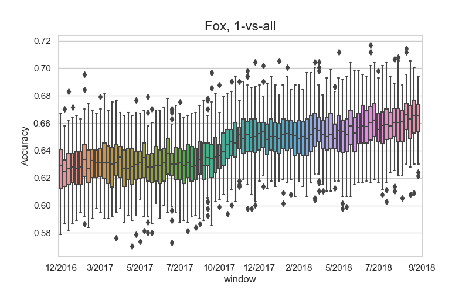

- so, BuzzFeed spins off into quizzes; HuffPo stops producing listicles / advice, moves into more down-the-middle political reporting; Fox spins off into tabloids.
- last big trend -- convergence of CNN, NYT, WaPo, and NPR -> DK. what's up here?
- can get at this by taking, eg, (NYT beginning -> DK end), and finding closest NYT end articles to this difference vector.
- in all cases -- everyone converging on covering Trump admin, which DK was apparently doing all along.
- for CNN, NYT, and WaPo, this comes at the expense of international coverage; for NPR, music / art coverage. so, convergence on domestic political coverage.

## Shifting headlines, shifting audience?

We've found, then, that the "content graph" and "audience graph," treated as synchronic systems, generally tend to align, though with some notable exceptions. And, from studying historical changes in accuracies across the full graph of outlets, we have identified pairs and cohorts of outlets that migrated into different linguistic configurations over time -- HuffPo / DK / Hill have converged; HuffPo is shifting away from BuzzFeed; Fox is moving away from almost everything else. The "content graph," then, is a dynamic system; the overall view we got in section XX is a kind of synchronic blending of a system that looks different, in subtle but significant ways, in fall of 2018 versus winter 2017.

But, this suggests one final question question. In section XX, we asked -- does the (synchronic) content graph align with the (synchronic) audience graph? Mostly, it seems that it does. But -- does this also hold for the *diachronic* content graph and *diachronic* audience graph? That is -- as outlets become more or less different, does this correlate with parallel changes in the composition of their audiences? For example, as Fox headlines move away from Breitbart headlines, do their audiences also become less similar? Or, as HuffPo moves towards The Hill, do the audiences converge? Though the question of causality here is complex, and beyond the scope of this project, by examining temporal correlations between these two systems we can start to block in context of a larger and more applied set of questions about the degree to which changes at the level of language can drive "depolarizing" changes at the level of audience.

Methodologically, this is fairly straightforward. In the same way we can unroll the headline graph over historical time, we can also model diachronic changes in audience similarity in the same way. Using the same set of temporal windows over the data, we simply calculate the audience correlations over each pair of outlets in each window. This gives a time-series trend for the correlation of each pair of outlets, which we can then directly compare to changes in the headline similarities.

The results are interestingly mixed. In some cases, movements in content / audience appear to be very tightly correlated. For example, for Fox and Bloomberg, they have moved in almost perfect lockstep over the last two years -- as the headlines have become less similar, the audience has also become less similar:

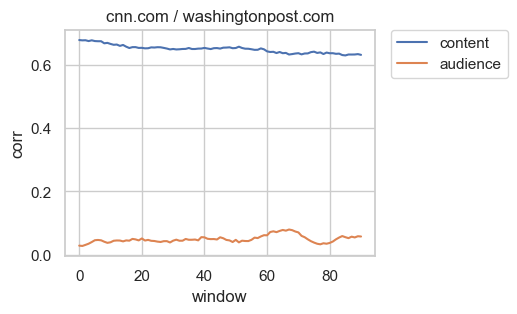

But, in other cases, there appears to be a strong *negative* correlation. For example, again with Fox -- headlines from Fox and Breitbart have become steadily less similar, but the audience correlation has consistently increased over this time:

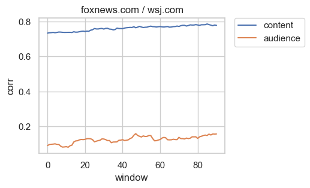

Indeed, these are actually the two strongest overall relationships -- the full set of 105 pairs distribute fairly evenly between these extremes, with about half positive and half negative:

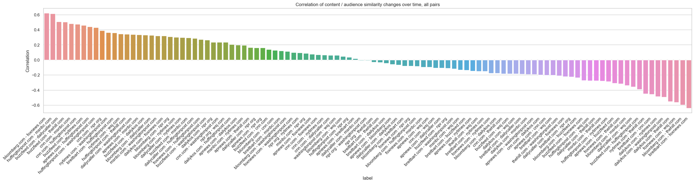

And, zooming in on a larger set of the strongest pairs in each direction:

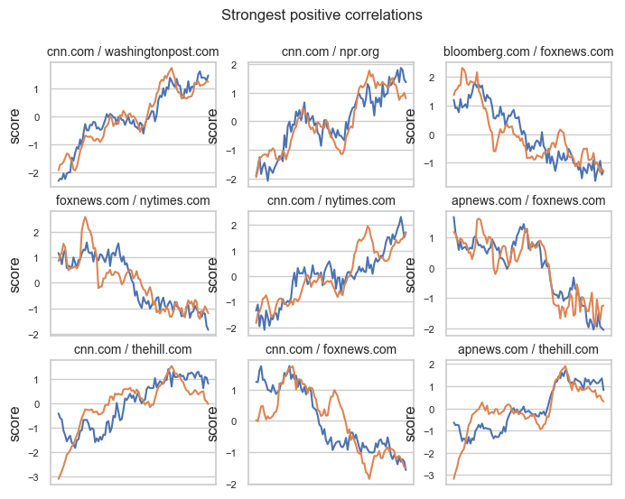

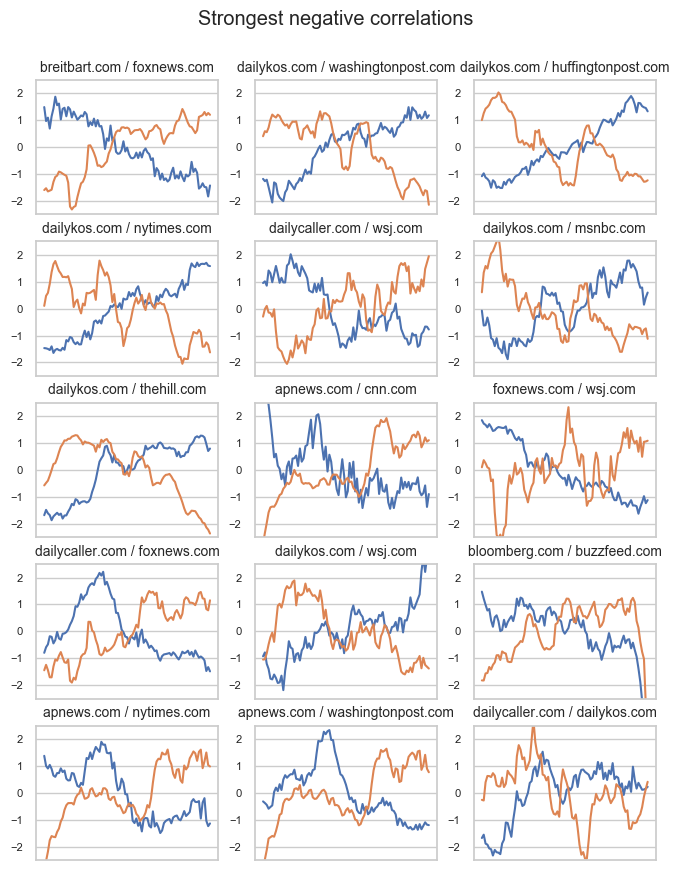

This is a bit mysterious, and in many ways it generates more questions that it answers. At a very speculative level, though -- maybe this implies that different combinations of news sources have different levels of "fungibility" or "substitutability" with each other? Which, in turn, could be related to whether the relationship between an outlet and (some part of) its audience is based on the content itself -- in a kind of transactional sense -- or on the outlet as a proxy for something more broad, and not just a source of information -- a political perspective, a community, a worldview, etc.

For example, with Fox and Bloomberg, we might guess that both outlets are producing some type of coverage (maybe financial news?) that has a kind of "elasticity" in the news ecosystem -- there's a cohort of readers want this type of coverage, but don't care very much where it comes from. So if both Fox and Bloomberg produce this content, this audience cohort is happy to read / share articles from either source. But, with Fox and Breibart -- it's not so much about the coverage that they actually produce, and more about what they represent, in some sense?
