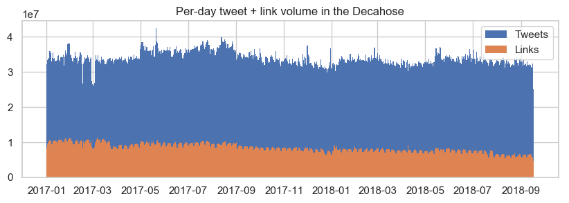
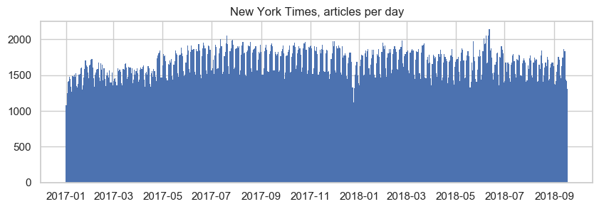
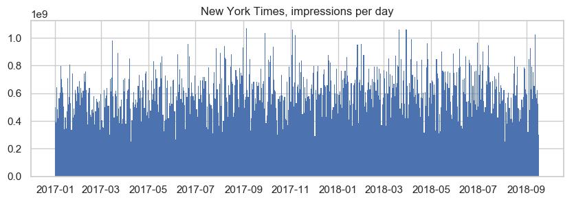
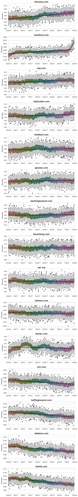
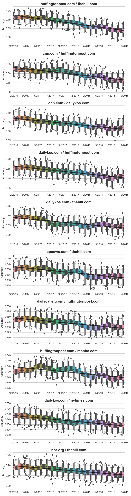
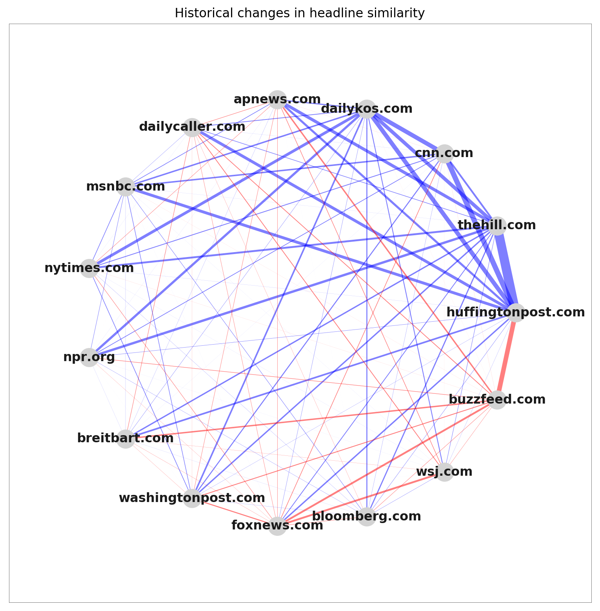

# Headlines as networked language
> A study of content and audience across 73 million news article links on Twitter

## Introduction

Imagine someone handed you the headline of a news article, but in complete isolation, totally stripped of context, and told only that it came from either The New York Times or Breitbart -- and asked you to guess which one. In some cases, this might be relatively easy. For example, if the headline is about some kind of fairly insider-baseball NY local politics issue -- de Blasio arguing with Cuomo, etc -- we might guess NYT with some confidence. Or, if the headline were some kind of very overtly right-leaning opinion piece, we might guess Breitbart. But, in other cases, this might be considerably harder. For example where does this come from:

XXX

There aren't any completely obvious "tells." In making a guess, we'd have to bring to bear a wide set of intuitions about what might be thought of as the "voice" of the outlet -- the range of topics, issues, stories that the outlet tends to cover; and, beyond what's being covered -- *how* it's being covered, the style, affect, intonation, attitude. Trying to guess the outlet, in other words, forces us to formalize a kind of mental model about exactly how the two outlets are similar and different.

It also, indirectly, gives a way to reason about the *degree* to which the two outlets are similar or different. Now, imagine that instead of just doing this once, we did it for 100 headlines, and counted up the number of correct guesses. Surely we'd do better than random -- but how much better? 60%, 70%? 95%? How differentiable, in a precise sense, are NYT and Breitbart? Taken alone, this number isn't very meaningful, without some kind of point of reference. To put this into context -- what if we then swapped out the outlets -- say, NYT and CNN, instead of NYT and Breitbart -- and repeated the experiment. We might guess that NYT / CNN are more similar, harder to tell apart -- but, how true is this, how much harder? Say we got 80 headlines right for NYT / BB -- would we get 70, 60, 55 right for NYT / CNN? In a very crude rough sense, we could start to reason, in a quantitative way, about the relative proximities between different pairs of outlets.

Beyond just two pairs -- what if we could model this systematically across a fairly wide swath of the media landscape -- 5, 10, 15 different major outlets? And, instead of just 100 headlines -- what if we could study this systematically, at the scale of tens or hundreds of thousands of headlines for each outlet?

Of course, this can't be done manually. This thesis explores this question, instead, as a supervised learning task -- to what degree can we train models to predict the outlet, given a headline? This is modeled over a corpus of 1M headlines from 15 major outlets, extracted from 70M links posted on Twitter by 8M users over the course of roughly 18 months. From this, we can model a complete set of proximities, at the level of headline, across all 105 unique combinations of the 15 outlets. Here, using a simple SVM over ngram count features -- 100 models are fit on 100 different random samples of headlines for each pair, to get a tight confidence interval:


Which, in a sense, can be interpreted as a fully-connected "content graph" over the 15 outlets -- a set of weighted edges between all pairs, where the edge of the weight represents the level of similarity at the level of headlines:


- once this graph is in hand, though, interesting question then becomes -- where does this *defy expectation*? where are outlets more or less similar, purely at a linguistic level, than might be expected?
- though of course, expection is underspecified, hard to pin down. expectation relative to what?
- very informally, just eyeballing the list -- some things make sense, eg BB/DC, NYT/NPR, etc. but others seem odd -- CNN/Fox as second most-similar pair? or, AP/Fox?
- why is this surprising? different politics. or, maybe in a more general sense -- different *audiences*, we'd think? we'd imagine that the people who read Fox to be different from the people who read CNN?
- is this actually true, though? this suggests an interesting point of comparison -- to what extent does the "content graph" -- modeled here as the confusability of headlines -- map onto the underlying "audience graph"?
- can imagine two graphs -- content graph (headlines above) and a parallel audience graph, a second set of pairwise distances between outlets that represent the level of overlap at level of audience.
- This question of the interaction between content and audience cuts to the core of recent discussions about media fragmentation / polarization -- which almost always involve the interplay between these two graphs, if only implicitly. eg broadly popularized notions of "filter bubbles" / "echo chambers," where the concern is that these two graphs are tightly connected in a self-reinforcing (and socially problematic) way -- media sources that are highly differentiated at the level of content allow people with different interests and ideological orientations to self-select into highly differentiated information ecosystems, which, in a vicious circle, then aggravates the underlying social and ideological fragmentation. Stark divisions at the level of content get mirrored by stark differences in audience, which in turn incentivize even more differentiated content, etc.
- eyeballing this list, though, suggests there might be places where this alignment between content and audience might break down, at least to some extent.
- are there outlets that "sound" similar to one another, but that have highly non-overlapping audiences? Or, zooming back to the complete ecosystem of media organizations, can we identify outlets that act as "mediators" or "bridges" between different subsets of audiences? For example -- are there outlets that produce content that "sounds like" content produced by left-leaning outlets, but that have relatively high audience overlap with right-leaning outlets -- that is, outlets that produce content that has the effect of exposing right-leaning readers to content that's more typical of left-leaning news feeds? Or vice versa?
- These incongruities, misalignments, places where the language graph doesn't map easily onto the underlying social graph -- do they exist at all? If so -- what do they look like? What kind of content does this? Looking beyond this study, which is fundamentally descriptive -- if we're interested in exploring the degree to which different topics, styles, idioms, and ways of speaking might have the effect of working against patterns of fragmentation in media consumption habits, these sites of mismatch could be of particular interest. They would represent, in a sense, naturally-occurring short-circuits between otherwise entrenched associations between particular audiences and particular types of content, places where audiences move (or get moved) out of their typical "lanes."
- So, a "headline graph," an "audience graph," and an uncertain relationship between them. What if we could build large-scale representations of both of these graphs, in a way that would make it possible to directly link them together and compare them in a systematic way?
- This thesis systematically explores this question by way of a corpus of 73,198,274 tweets harvested from the Decahose (a 10% sample of Twitter) posted by 8,118,326 unique users over an 18 month period, where each tweet contains a link to an article from one of 15 major news outlets -- The New York Times, The Washington Post, Fox News, CNN, Bloomberg, the Huffington Post, AP News, BuzzFeed, Breitbart, the Wall Street Journal, The Hill, The Daily Kos, The Daily Caller, NPR, and MSNBC.
- We start by systematically modeling the "headline graph," and then explore the structure of these purely linguistic relationships. This gives us a set of similarities between each pair of outlets, which we can then compare this matrix of similarities to the underlying "audience graph," derived from the links between news outlets and individual users that are inherent in every tweet that contains a link to an article. This comparison allows us to precisely quantify the degree to which similarity in audience correlates with similarity in audience, and to identify exceptions to this rule, places where content is "mismatched" with audience, and vice versa.
- Finally, as a last step, we explore the degree to which these similarities at the level of content and audience have changed over time. Instead of rolling up the entire 18-month window of data into a single, synchronic unit, we analyze the set of 73 million links as a chronological sequence, covering roughly the first two years of the Trump presidency. Are the linguistic similarities between outlets basically stable, or have there been significant changes over this period? Do outlets drift away from each other, towards each other, back and forth? How fixed or flexible are the major organizations in the media landscape, both in terms of the type of content that they produce and the audiences that read it? And, in the same way that we could explore the overall correlation (and lack thereof) between content and audience -- to what extent do changes in content correspond to changes in audience, when spooled out over historical time? If Huffington Post starts producing headlines that sound more like The Hill -- do the audiences also start to converge?

In summary, this thesis finds:

1. Modeled as a text classification task, headlines from 15 major US media sources highly differentiable, even after an aggressive cleaning process that strips out any kind of "paratext" in the headline that directly or indirectly reveals the source. (For example, "... -- CNN Video" or "AP Breaking News: ...") The strongest model is a bidirectional LSTM, which gets to 40% accuracy in a 15-label model, where random would be 7%. Though, standard non-neural baselines also perform very well -- SVM and logistic regression models over ngram count features are competitive at 35-36% accuracy (and beat the weaker neural models), suggesting that a majority of the differentiability among outlets comes from which words and phrases are being used -- roughly, what might be thought of as "topic" or "content" -- and less from the composition or sequencing of words, which can be modeled with more power by the recurrent models.

1. Pulling sentence embeddings out of the top layer of the LSTM, we can explore the structure of the linguistic space in terms of the high-dimensional representations learned by the model, both in terms of the relationships among different outlets are the internal structure of the headlines within the outlets themselves. This reveals significant differences in what might be thought of as the "shape" of different outlets in the high-dimensional space. Specifically, we focus on what we call the "diameter" of the embedding family for each outlet -- the average cosine distance between randomly sampled pairs of headlines -- which, we argue, roughly captures the degree to which outlets are narrowly focused (low diameter) or more broad and varied (high diameter). Second, we also explore the clustering structure of headlines within outlets, the degree to which content from an outlet can be cleanly decomposed into a set of categories, verticals, or "desks." On both metrics, we find significant variation, with BuzzFeed, Bloomberg, and Daily Kos registering the lowest "diameters" and smallest cluster counts (most focused), and CNN, The Washington Post, and Fox showing the highest diameters / largest cluster counts (most broad, varied, diverse).

1. Aggregating over the full set of individual articles in each outlet, we can use the classifiers to model a complete "content graph" among the 15 organizations, a fully-connected graph of pairwise similarity scores, which are extracted from the behavior of the classifiers in a collection of different ways -- pairwise accuracy scores, probability mass correlations in multi-label models, and confusion counts. With this content graph in hand, we then compare to the underlying "audience graph," derived from correlations in the users who tweet links from each pair of outlets. From these two graphs, for each outlet we can construct two normalized rankings of similarity with all other outlets, one based on headline similarity, and the other based on audience similarity. We then explore the correlation of these two rankings on a per-outlet level -- that is, the degree to which an outlets edge weights in the "content graph" are similar to its edge weights in the "audience graph." In general, we find that these two sets of weights tend to be positively correlated, often highly so -- in general, outlet A "sounds like" outlet B, it also has a high level of audience overlap. But, there is a wide range in the strength of this correlation, and there are two very strong exceptions -- The Hill and AP both have *negatively* correlated weights in the content / audience graphs. Though the specifics are different, in both cases this is broadly because AP and The Hill produce content that resembles, at a linguistic level, content produced by right-leaning outlets; but, the audiences overlap strongly with left-leaning outlets, suggesting that AP and The Hill act as what might be thought of as "one-way bridges" that expose left-leaning audiences to regions of the headline space that are typically focused on by right-leaning outlets. There do no appear to be outlets that perform this function in the opposite direction.

1. We then explore the evolution of these relationships over historical time -- instead of treating the corpora as monolithic bundles of data, the 2-year data window is broken into 100 temporal bins, and a 10-bin rolling window is moved across this space, producing 91 10-bin windows. In each of these windows, we train fully independent A-versus-B models on each unique pair of outlets, and then track changes in these accuracies over time. This reveals significant changes in the structure of the "content graph" in the last two years. First, a cohort of politically-focused outlets have become significantly more similar -- Huffington Post, The Hill, The Daily Kos, and CNN -- suggesting a tendency towards convergence in political coverage since a high-water mark of differentiability in the spring of 2017, in the first months of the Trump administration. Huffington Post in particular has shown the most dramatic shift, moving strongly in the direction of political reporting at the expense of a BuzzFeed-style "listicle" genre that was commonly produced in 2017. Second -- Fox has very consistently moved *away* from almost all other outlets, including other right-leaning outlets like Breitbart and The Daily Caller; it has become much more highly differentiated *individually*, compared to everything else. By examining headlines that typify the overall movement of Fox in the high-dimensional linguistic space modeled by the neural classifier, it appears that this shift is driven by a move in the direction of a highly sensationalized, tabloid style of headline, many of which involve murder or other violent crime.

1. Finally, we also unroll the audience graph over these temporal windows, and explore the degree to which changes in the content graph correlate with changes in the audience graph -- as two outlets produce increasingly similar content, do their audiences also become more overlapping? Overall, we find a positive correlation here, though the relationships for individual pairs of outlets are interestingly varied. In some cases, the content / audience similarities for a pair of outlets move in almost perfect lockstep, sometimes even at the scale of months or weeks -- for example, AP / Huffington Post, Huffington Post / MSNBC, Bloomberg / Fox. But, in other cases, content and audience appear to have an almost perfectly *negative* correlation. For instance, over the last two years, Breitbart and Fox have become very consistently less similar in terms of content, but consistently *more* similar in terms of audience. Or, Breitbart and CNN have had a fluctuating level of similarity at the level of content, and an almost perfectly inverse fluctuation of audience similarity -- when content is similar, audience is dissimilar, and vice versa. These differences suggest that the underlying causal relationships between changes in content and changes in audience are complex, and likely different for different combinations of media organizations.

## Headlines on Twitter

To explore this interaction between content and audience, we need what might be thought of as a "networked" corpus -- a collection of individual pieces of content that can be linked directly to specific patterns of engagement and distribution. With this goal in mind, this study built around a very particular data set -- posts on Twitter that contain links to news articles, which we extract from the Decahose, a 10% sample of all activity on Twitter. For example, if someone posts a tweet with a link to a New York Times article, Twitter identifies the link and provides structured information about it in the JSON payload that appears in the Decahose:

```json
"urls": [
    {
       "url": "https://t.co/MOZgWRzhRK",
       "expanded_url": "https://www.nytimes.com/2017/09/27/us/politics/navy-orders-safety-operational-standards.html",
       "display_url": "nytimes.com/2017/09/27/us/…",
       "indices": [66, 89]
    }
 ],
```

We can then parse the raw URL string and extract the registered domain -- here, `nytimes.com` -- which makes it possible to associated URLs with different media organizations.

Critically, though, our lab also has access to the "Enhanced URLs" add-on product available through Gnip, the vendor that distributes data from Twitter. The "Enhanced URLs" metadata provides two pieces of information that are essential to this study -- first, the "expanded" URL, which is formed by following redirects from the raw URL that appears on Twitter. This valuable here because a sizable percentage of links on Twitter are shortened by services like `bit.ly`, meaning that they have to be "unrolled" in order to identify out the real domain -- for example, `nytimes.com` instead of `bit.ly`. In theory, we could do this ourselves; but, especially when working with data that's more than a few weeks old, this can be difficult. Many shorteners like bit.ly automatically expire the links, meaning that, for example, if we tried to expand a link from spring of 2017, it would likely fail.

Second, and most important, "Enhanced URLs" also provides scraped copies of the [Open Graph](http://ogp.me/) `title` and `description` tags of the page that the link points to. At a product level, Twitter uses the title and description in the link "preview boxes" for the article that automatically get displayed with tweets that contain links.

```json
"gnip": {
  "urls": [
     {
        "url": "https://t.co/MOZgWRzhRK",
        "expanded_url": "https://www.nytimes.com/2017/09/27/us/politics/navy-orders-safety-operational-standards.html",
        "expanded_status": 200,
        "expanded_url_title": "Navy Returns to Compasses and Pencils to Help Avoid Collisions at Sea",
        "expanded_url_description": "A top officer issued new orders to sailors worldwide as the Navy scrambled to make priorities of safety and maintenance after two deadly collisions in recent months."
     }
  ]
},
```

In a sense, the headlines themselves aren't terribly hard to come by -- Twitter is just scraping them off the public web, and there's nothing to stop anyone from doing this independently. But, beyond just the convenience of it having them pre-scraped for tens of millions of pages, there are actually a number of interesting advantages to collecting this corpus "through" the Decahose, as it were, instead of trying to harvest it independently.

First, Twitter provides an automatic signal for the "footprint" of the article. In the most minimal sense, just the fact that the article appears in the 10% sample from the Decahose is evidence that it got some minimal level of circulation; and, we can also precisely measure the size of this circulation by counting the number of times it was tweeted, or, better, adding up the follower counts of all the users who tweeted the link -- the "impressions" count. This makes it possible to consistently model a sort of "effective footprint" of a media outlet, the body of content that is actually getting meaningful circulation.

Second -- historical archives of Twitter data make it possible to collect consistent data at the scale of years, without having to maintain labor-intensive scrapers.

And, last but not least -- headlines on Twitter are directly associated with unique user identifiers, which makes it possible to directly associate individual pieces of content at specific moments in time with specific audiences. This type of data would be almost impossible to assemble from the open web.

Of course, there are also some downsides to the filter provided by Twitter, which, in a number of well-documented ways, is idiosyncratic and non-representative of broader patterns of media consumption. There's a tradeoff -- from Twitter we get a very consistent and very "deep" sample of news production and consumption; but at the cost of it being not terribly "wide."

## 8 million users, 73 million links, 1 million headlines

What's the broader context for these headlines on Twitter? Over the course of the last two years, Cortico, a non-profit affiliated with the Laboratory for Social Machines, has archived a complete copy of the Decahose. In this study, we analyze data in a 625-day window running from January 1, 2017 through September 17, 2018. Over that period, the Decahose emitted 22,095,201,428 total tweets. Of these, 5,568,773,434 (25.2%) include at least one link.



Where do these links point to? As an first step, we can parse the raw URL strings into component parts -- protocol, subdomain, registered domain, path, etc -- and then count the total number of links to each registered domain; Here are the 100 most frequently-occurring domains from the Decahose:

[t100 domains]

A majority of these, of course, don't represent "news" sources in a meaningful sense. Though of course, this isn't always clear-cut -- for example, links to Facebook might often point to content from news organizations that has been shared on Facebook. But, bracketing this, and just operating at the level of individual media brands -- if we take the 2,000 domains with overall largest link counts and then manually annotate this list, we can pull out a "long list" of ~90 major media organizations. Of course, the selection criteria here are subjective; here, we took all outlets that produce general-interest or political news and meet a minimum standard of name recognition; but not specialized outlets that focus on topics other than politics -- ESPN, TechCrunch, etc. Here are these 90, ranked here by the total number of links:

[top 90, links]

The total number of links, though, is very different from the number of *unique articles* -- a single article might produce tens or hundreds of thousands of individual tweets linking to the same piece of content, each of which are counted separately here. One simple way to roll up the individual occurrences of the domains by article is just to group on the exact text of the URL. But, this is somewhat brittle, since it's not uncommon for links to get passed around with superfluous GET parameters added onto them (eg, trackers that flag the source of a click). This can cause the same "base" URL to appear in many different configurations, if just treated as a raw string, all of which in fact point to the same article.

Instead, we group links into articles by combining three pieces of information -- the registered domain, the "path" component of the URL, and the cleaned tokens in the Open Graph title, as provided by Gnip. (This cleaning process is somewhat intricate, detailed below.) The URL path is taken into consideration since there are times when the same outlet will produce multiple articles with identical titles. For example, if The New York Times produces an article every week called "Your Monday morning roundup" -- by including the URL path as part of the grouping key, we can correctly identify these as legitimately separate pieces of content.

Grouping links on these three pieces of information, we can count the number of unique articles (and, by extension, headlines) associated with each domain. Which, in this context, is the more salient number, since the headline is the basic unit of analysis. The largest outlets have produced many hundreds of thousands of individual articles in the last two years, though the volume falls off fairly quickly outside the top ~20:

[top 90, articles]

Beyond these rolled-up link and article counts, we can also easily get a high-level sense of how the footprint of different outlets on Twitter has evolved over the 2-year data window. Using the `postedTime` timestamps on each tweet, we can group links from an outlet by day, for instance, and look at the historical volume trend. For NYT:


Or, rollup up links by article, the total number of unique NYT articles that appeared by day:



Finally, digging deeper into the metadata provided by Twitter -- for each tweet, we also have information about the user account that posted the tweet, including the follower count of the user at the time the tweet was posted. This is very useful information, since follower counts vary significantly -- a link posted from an account with 1M followers will have vastly more reach than a link posted from an account with 100 followers. In a crude sense, we can use the follower count of the user account as a proxy for "impressions," the total number of times that the tweet was seen by individual twitter users. (Of course, this isn't literally true -- when a user posts a tweet, the percentage of her followers who actually see it is probably fairly low, since many of them won't be logged on, etc. But, if we assume that this percentage is roughly similar across the platform, the follower count can give a (relative) signal of the real-world "reach" of the tweet.)

Taking the total impressions produced by all tweets with links to The New York Times, and grouping by day:



From this, we can then easily tabulate the historical frequency trends for all 90 outlets in the initial cut:

[per-day imp, all 90]

Some of which, interestingly, show very significant changes over the 2-year data window. Modeling this as a linear trend:

[10 most increasing]

So big upticks for Hannity.com, TruePundit, GatewayPunt; all of which are (far) right-leaning outlets. The most decreasing:

[10 most decreasing]

Of course, we don't really care about the "performance" of the headlines per-se -- our focus here is on the structure or "shape" of relationships among outlets, in terms of the actual content of what's being published and the audiences who are distributing it. But, these overall volume trends have important methodological implications, especially for the historical questions that emerge in the second half of the project. For example, if we're interested in exploring changes in relative similarity between outlets over time, it's clear that we need to explicitly standardize for these changes in volume, to prevent them from getting artificially proxied by other measurements. (For example, if we use classification accuracy as a signal for similarity -- if there are 50% fewer articles from The Huffington Post in the summer of 2018 than in the spring of 2017, this will inherently drive down the performance of a classifier trained on the raw data, since the model will see fewer training examples for 2018 than for 2017; even though the actual coverage itself might not have changed at all, just the quantity.)

Last, before diving into the question of how to assemble meaningful representations of content and audience graphs from these data -- we can also start to block in some very rough brushstrokes for differences in the underlying structure of the audiences behind these links. For example, just operating on the raw set of XX million (user id, domain) pairs, we can trivially compute the ratio between the total number of links / impressions and the total number of unique users who have ever tweeted a link to the outlet -- in other words, the degree to which an outlet is driven by a small number of "power users," or a larger number of less active users. Under this metric, conservative outlets dominate the top of the list:

[unique users / link vol]

But, there's only so much we can learn by just counting links, articles, users, impressions; what we really want is a meaningful understanding of the relationships among the outlets -- how similar are the headlines? How similar are the audiences? Where they differ -- how, exactly?

## Modeling similarity via classification

From the Decahose, then, we can extract a set of unique article headlines that have appeared in the Decahose over a ~2-year period from a set of 90 major US media brands, aggregated from a complete set of 73 million individual links posted on Twitter.

Given just the raw headline strings pulled from the `og:title` tags -- how can we reason about the relative similarities and differences between the headlines from different outlets? For example, say we have 300k unique headlines from NYT, 200k from CNN, 50k from Daily Caller -- how similar or different, in a precise sense, is each pair of outlets? Or, considered as a group -- what does the overall matrix of similarities look like? What clusters with what? Which topics, styles, entities, textual features drive these similarities and differences? If we think of the full set of 1.1 million unique headlines as representing a kind of linguistically-instantiated landscape -- what's the shape of this space, what's the linguistic "topography" of headlines on Twitter?

There are various we could model this. Here, though, we follow Underwood et al. in framing the question as a *predictive* task -- we explore the structure of the data by studying the degree to which we can train models to learn accurate mappings between headlines and outlets. That is -- if we have headlines from outlets A and B, we can train a lexical classifier to predict whether a given headline was produced by A or B? If the model achieves a high accuracy on test data -- if it is able to learn significant structure across the two classes and perform well on unseen data -- then this can be interpreted as a signal that the two sets of headlines are highly "separable" or "distinctive," given the representational capability of the model. And, conversely, if the model achieves poor accuracy -- if it has a hard time telling the difference between A and B -- then we can interpret this as a signal that the headlines are relatively similar. At the extreme edges -- if the model achieves 100% accuracy, then we can interpret this as being the maximum possible "distance" between outlets -- they are completely differentiable. And, if the model achieves 50% accuracy, no better than random, then we can interpret this as the smallest possible distance between outlets, a distance of 0 -- they are effectively indistinguishable.

(To the model at least; with interpretive projects like this, where we're trying to model "meaning" in text, in some way, we always have to keep in mind that there's a mismatch between what a machine learning model sees in a piece of text and what a real person would see. Sometimes the model will fail to pick up on something that would be obvious to a real reader; other times the model will latch onto details that might seem insignificant to us. But, if we're willing to accept this quotient of interpretive slippage -- computation makes it possible to "read" these kinds of large corpora with a level of scale and comprehensiveness that would otherwise be impossible.)

There are various other ways we could go about this, but, there two big advantages to formulating the question as a predictive task. First, it provides a number of natural ways to extract a very simple and interpretable *metric* that captures relative differences in similarity. For example, when predicting whether a headline comes from AP News or BuzzFeed, the model might get to 85% accuracy; but just 60% accuracy when comparing Bloomberg and WSJ.

Second, in the context of modern neural architectures, the classification task provides a natural training objective for learning high-quality, corpus-specific *representations* of the headlines. If we train custom deep learning models to predict an outlet given a headline, it's easy to then extract the underlying sentence embeddings that are induced by the model -- high dimensional vectors that represent the "meaning" of the headline, as operationalized by the classifier.

These embeddings give a remarkable interpretive power -- they can be treated, essentially, as a set of coordinates that position each headline in a high dimensional space, and we can then study the "shape" of the linguistic landscape defined the headlines, both within individual outlets and among them. And, at a more pragmatic level -- the embeddings also make it possible to systematically find individual examples that are typical, in various ways, of salient changes that are observed at the level of corpus averages. For example -- if we identify some kind of smooth, gradual change in the similarity between two outlets over time, we can query the individual headline embeddings in various way to try to find examples that "mark" or "define" the conceptual essence of this movement. The embeddings open the door to a very rich mode of "distant reading," to borrow from Franco Moretti -- the ability to reason in nuanced ways about the meanings contained in very large corpora of text.

## Headline differentiability

We take classification, then, as a *modeling paradigm*; to understand the headlines, we explore the degree to which we train models that map from headline to outlet. Which, in turn, provides a natural way to precisely measure the similarity between outlets, as well as a training objective that we can use to induce high-quality representations of the headlines.

So -- how differentiable are headlines? Through a lens of statistical inference -- how "learnable" is the relationship between a news organization and the headlines it produces? Ideally, we could explore this question across the full set of 90 media organizations that were culled from the list of the 2,000 most frequently-appearing domains on Twitter. But, because of the fast falloff in the total number of articles associated with each outlet, it's not feasible to analyze all of them. Especially since, in this context, we generally have to downsample everything to the size of the *smallest* outlet -- eg, if we want to compare the accuracy of a model on headlines from outlet A vs outlet B, we have to make sure that the model sees exactly the same amount of "evidence" for each, or otherwise the comparison is unfair. So, if we have ~300,000 headlines from NYT, but only ~3,000 from Judicial Watch, we'd have to downsample NYT by two orders of magnitude -- which seems like a waste, and also starts to feel like something of an apples-to-oranges comparison.

Instead, we pull out a hand-picked set of 15 major outlets, which were selected in an effort to get broad coverage across the largest US media brands and also diversity at the level of political orientation (left-leaning, right-leaning, centrist) and business model (cable news networks, print-and-web newspapers, web-only publications): The New York Times, The Washington Post, Fox News, CNN, Bloomberg, the Huffington Post, AP News, BuzzFeed, Breitbart, the Wall Street Journal, The Hill, The Daily Kos, The Daily Caller, NPR, and MSNBC.

Second, after filtering on these outlets, we also just take articles that received at least 10,000 "impressions," as measured by the sum of the follower counts of the users who posted links to the article. (As mentioned before, this ensures a certain minimum "footprint" for the article, and protects from certain types of sample imbalance that could arise from automated activity on Twitter.) After filtering by domain and applying this minimum impressions threshold, this gives a working corpus of 1,081,790 unique articles, where the largest outlet in terms of volume is The Washington Post, with 122,197 articles, and smallest is MSNBC, with 18,808.

As a first step, we train a series of multiclass models, in which the classifier is presented with headlines drawn from all 15 outlets and trained to predict which outlet produced the headline. To ensure exact comparability across the different architectures, for these benchmarks we freeze off a single downsampled training corpus that is used for all training runs -- 18,808 headlines are sampled from each outlet at the start, and then each model is trained on this frozen sub-corpus of 282,120 headlines.

We compare seven models. First, two non-neural baselines, using standard implementations from the `sklearn` Python package:

- **Logistic regression** -- Standard logistic regression, under L2 regularization, on tfidf-scaled ngram count features (size 1-3). In the multiclass case, we use the `sag` solver.

- **Linear SVC** -- A standard SVM, fit on the same features.

Then, we explore five different neural architectures. All of these models share a common token embedding pipeline, and then implement different line encoders on top of the token embeddings. Tokens are encoded first with a CNN over individual characters -- characters are mapped to 15d embeddings, and then encoded with a CNN with six filter maps of widths 1-6, each with 25 units per character of width and with maxpooling over the feature maps, which produces a 525d embedding for each individual token. This character-level representation is then concatenated with a standard 300d pre-trained GloVe embedding for the token, where one is available, resulting in a composite 825d embedding for each token. then, these token sequences are handed to one of five different line encoders, with increasing levels of complexity:

- **CBOW** - Simply the unweighted, dimension-wise mean of all token embeddings in the headline.

- **CNN** - A standard CNN for sentence classification as described by Kim et al. Though, we use a larger set of filter widths (1-5), each with 500-unit feature maps.

- **LSTM** - a standard bidirectional LSTM, using a single 512-unit hidden layer for each direction. The top layers of the forward and backward pass are concatenated together to form a single 1024-unit embedding for the line.

- **LSTM + attention** - Standard attention over the LSTM states, using a separate, two-hidden-layer FFNN to produce scores over the states. As described by Banadhu et al, these weights are interpreted as a probability distribution, which is then use to produce a weighted linear combination across the states, which is then concatenated with the final LSTM output to form a combined 2048-unit encoding.

- **LSTM + CNN** - Similar to attention, but instead of using a linear combination over the states, the states are instead treated as higher-order token embeddings and passed through the same convolutional layers used in the standard CNN encoder. Like with the attention network, the output of the CNN is concatenated with the regular LSTM output.

All of these models are all trained under a standard cross-entropy loss, using the Adam optimizer with a learning rate of `1e-4` and a batch size of 50. The implementation is in Pytorch, and models are trained on a single NVIDIA V100 GPU, running on a `p3.2xlarge` node on EC2.

### Proprocessing, tokenization, cleaning

Before diving into a full comparison across all seven of the models, though -- as an initial smoke test, just to get a sense of the baseline difficulty of the task, if we apply a standard tokenization to the raw headline strings that come through the Decahose and then fit the vanilla logistic regression, we get a remarkable XX% accuracy in a 15-class model:

[LR f1, uncleaned]

Which, in a sense, is *too* good -- the model is getting almost perfect accuracy on some outlets. Which seems unlikely, and suggests that there is some kind of unambiguous lexical signal in the headlines that's making the task trivial, in some cases.

What's happening here? To get a sense of which features are doing the heavy lifting, we can skim off ngrams with strongest chisquare for each outlet:

[top 10 features, per domain]

Which clearly shows the problem -- many headlines include "paratext," of different types, that correlates very strongly with a particular outlet, but doesn't have any connection with the content or style of the headline in the sense that we care about. For example, in the most clear-cut case -- some outlets add "call signs" before or after the headline that literally just identify the outlet:

[AP Breaking, CNN Video, via @dailycaller]

Or, more indirect, but still often very high discriminating -- some outlets add prefixes or suffixes to headlines that mark the category or "vertical" that the article originates from. For example, The Washington Post often prefixes headlines with strings like "OPINION | ..." or "ANALYSIS | ..." Or, similarly, a number of outlets have independently branded "blogs" or "series" that publish headlines that always include the name of the series. For instance, for a period of time Bloomberg published a daily stock-tips column called "The Daily Prophet":

[opinion, daily prophet hls]

Here, the outlet isn't directly identified, but, if only WaPo uses these prefixes (or if WaPo uses them much more frequently than anyone else), and if they appear on hundreds or thousands of headlines, then the model is able to make a classification decision just on the basis of what is essentially a formatting detail. Of course -- the classifier can't be blamed for this. Its only objective is to minimize the cross-entropy loss over the output distribution. But from an interpretive standpoint, to the extent that we want to use the classifier as a modeling paradigm, as a means to the end of inducing intellectually useful representations of the content -- this is bad, since it essentially lets the model off the hook from having to produce a good representation of the "meaning" of the headline.

We're in the funny position, then, of essentially wanting to make the model *less accurate but more interesting* -- we need to snip out these "giveaway" features, and force the model to only operate on the substance of the headline.

It's worth noting, though, that beyond clear-cut cases like "CNN Video," there's also a longer tail of more subtle textual features that might be thought of as elements of "house style," for lack of a better phrase -- a set of stylistic "ticks" that tend to mark particular outlets, but (debatably) don't really contribute in a meaningful way to the substance of the headline. Fox, for example, produces a large number of headlines that include very short quotations -- often just a single word -- wrapped inside of quotation marks and inlined directly into the middle of an otherwise normal headline. Eg, things like:

[quote HLs]

(Which, incidentally, is exactly the kind of pattern that a strong, character-level neural model is very good at learning, which in turn can have a significant effect on the final representation produced by the encoder.)

Is this "meaningful"? arguably not really, since the quotation is very small, and deployed as a kind of functional part of an otherwise regular headline written by a reporter or editor at Fox. But, at the same time, a human reader might find meaning in this. For example -- an argument could be made that the presence of the quotes changes the "positioning" of the headline in a meaningful way -- by including the direct quote, the journalist somewhat disassociates herself from the phrasing of the quote; the quote holds the headline at arms length, in a sense; ownership is shifted away from the headline writer and towards the person being quoted.

Another hard case: a handful of outlets sometimes use a distinctive lexicon of slang words -- namely Breitbart, which often uses "dems" instead of "democrats" and "libs" instead of "liberals." Here, again, if only Breitbart does this, a strong model will identify these tokens as highly differentiating features, and perhaps cause it to focus on them at the expense of more general information about the content of the headline. But in this case, these words seem meaningful; "libs," especially, has an independent existence outside of Breitbart and carries a very particular set of (negative) connotations. In theory we could unroll it into "liberal"; but this feels fairly invasive, and would arguably irons out information that could be meaningful to a human reader.

So -- how to preprocess the headlines? For the purposes of this study, we decide to err in the direction of removing too much information instead of too little. The idea, essentially, is to pull out the longest unbroken "sentence" from the headline -- a sequence of words that don't contain any kind of non-standard separator character, like "|" or ":" -- and then aggressively remove differences at the level of punctuation, capitalization, for formatting. Specifically:

1. Standardize non-ASCII characters like curly quotes and em-dashes, to ensure consistent tokenization.

1. Break on any kind of "separator" characters that don't appear in vanilla English sentences -- headlines are only allowed to contain letters, numbers, quotes, `.,;`, `?!`, `$`, and spaces. As a special case, also break on the word "via," which is used by some outlets to identify the source ("... via @dailycaller").

1. Take the longest sequence of unbroken tokens.

1. Clean the tokens - downcase, strip punctuation. Keep `$`, but replace `[0-9]+` digits with a single `#` character, since different outlets have different conventions for how numbers are reported / formatted.

This produces a highly standardized representation of each headline that basically consists of a stream of ASCII lexemes. For example:

[example cleaned hls]

As a check that we're not missing anything -- we can train a fresh model on the cleaned data and look at the set of headlines where the model is extremely confident in the correct label. If there are any "giveaway" features that have slipped through the cleaning process, they should show up here -- circularly, we can use the model to audit the success of the process of making the task harder for the model. Here, we've trained an LSTM on the cleaned headlines, and then, for each headline in the test set, we take the *probability mass assigned to the correct class* by the model. So, if this is 1, then the model was positive (and correct) about which outlet produced the headline. Here's the overall distribution over these "p-true" values:

[ptrue]

So, the area of interest is the spike on the right-hand side, cases where the model is very confident in the right answer. We can simply skim off headlines from each outlet where the model assigns over 90% of the probability mass to the true class, and then examine these for each domain:

[UMAP of 90+, example lists]

So -- from BuzzFeed, lots of listicles; from Breitbart, lots of "israel," "hamas," and "cartel"; from Bloomberg, lots of "CEOs," "markets," "trading"; etc. The important point, though, is that all of these are *real*, in the sense that we don't see any kind of artificial text outside of the headline that is driving the classification decision -- it's simply the case, apparently, that only Bloomberg would ever produce a headline about "iron ore," and so on and so forth. These are the most extreme cases, in a sense, of the substantive differences that we want to model -- the place where "paratext" gives way to just text.

### (Cleaned) differentiability

Now that we've scrubbed out these "giveaway" features, which would otherwise give a distorted sense of the distinctiveness of the headlines -- let's return to the basic question of how "learnable" the relationship is between headlines and outlets.

As a first experiment, we train each of the seven architectures on the same class-balanced subset of headlines, breaking the corpus into 80/10/10% train/dev/test splits. For the logistic regression and SVC, the dev set is ignored, and the model is simply fit on the training split and evaluated on test. For the neural models, we evaluate the performance on the dev set after every 100,000 training pairs, and implement an early-stopping rule that stops the training run when the loss on the dev set fails to improve over a 5-step window. The models achieve these accuracies, over 15 classes:

[accs, all 7]

So, even after aggressively scrubbing out the paratext, the models are able to learn a large amount of structure across the 15 outlets -- a random baseline here would get 7%. The strongest model turns out to be the vanilla LSTM -- nothing is gained by the attention network or convolutions over the states. (Which isn't particularly surprising here, since the the headlines are relatively short -- about 8 words on average -- and these kinds of additions tend to help most with longer sequences.)

Also notable is the quite strong performance of the non-neural baselines, which are just 4 points off the strong neural models, and better than the weakest two neural architectures. (And, it's worth noting, they also fit two orders of magnitude faster, on CPUs, than it takes to train the neural models on a GPU.) This suggests that a majority of the learnable structure across the outlets is a function of which words and phrases are being used -- information that can be captured in the bag-of-words ngram features exposed to the logistic regression and SVC -- and that syntagmatic structure of the headlines -- the sequence of combination, which can be modeled by the recurrent neural models -- is comparatively less important. To borrow categories from Jakobson -- the salient differences are largely in the axis of "selection" -- which words and phrases are being included -- and less in the axis of "combination," the patterns with which they are strung together into left-to-right sequences.

Moving beyond the overall accuracy score -- we can also unroll the individual F1 scores for each of the outlets, which starts to give crude evidence that there could be interesting differences in the "structure" or "profile" of the content across the 15 outlets. Taking results from the LSTM -- the precision and recall scores vary considerably. For example, the model is able to correctly identify 71% of all BuzzFeed headlines; but just 13% of CNN headlines, and 23% of Fox:

```
                    precision    recall  f1-score   support

        apnews.com       0.36      0.51      0.42      1824
     bloomberg.com       0.47      0.59      0.52      1913
     breitbart.com       0.39      0.39      0.39      1894
      buzzfeed.com       0.69      0.71      0.70      1880
           cnn.com       0.25      0.13      0.17      1940
   dailycaller.com       0.38      0.22      0.28      1900
      dailykos.com       0.48      0.54      0.51      1853
       foxnews.com       0.33      0.23      0.27      1888
huffingtonpost.com       0.33      0.28      0.30      1830
         msnbc.com       0.36      0.57      0.44      1840
           npr.org       0.30      0.27      0.29      1823
       nytimes.com       0.34      0.30      0.32      1966
       thehill.com       0.31      0.45      0.37      1899
washingtonpost.com       0.36      0.26      0.30      1838
           wsj.com       0.34      0.35      0.34      1924

         micro avg       0.39      0.39      0.39     28212
         macro avg       0.38      0.39      0.38     28212
      weighted avg       0.38      0.39      0.37     28212
```

Why? What does this correspond to, in the underlying content? Before we tackle the question of *proximity* between outlets -- trying to assign precise measurements for the degree to which outlets are similar and different, which will open the door to the comparison with the underlying audience graph -- how to get a birds-eye view of what the content from different outlets actually consists of? If we imagine that the 18k headlines from each outlet constitute a kind of linguistic "footprint" or "signature" -- how can we characterize these footprints? What do they consist of, how are they organized, how do they differ from outlet to outlet? How to "read" 200k headlines, without actually reading 200k headlines?

Before we try to quantify the differences -- how to first just describe them?

## Mapping the "shape" of the headline space

Digging a bit deeper into the differences in "distinctiveness" that seem to rise to the surface in the F1 scores -- to get a better view of this, one very simple way to characterize the "shape" of each outlet is to look at the weights that the model assigns to the correct label for the headlines in each outlet -- just like we did before, when evaluating the effectiveness of the preprocessing steps. But this time, instead of looking at everything rolled together, we break out separate distributions for each outlet -- which, it turns out, are different in interesting ways.

For example, for CNN -- we just take all headlines from CNN in the test set and record the weight that the model assigned to the (correct) `cnn.com` label for each of these. Then, we can plot the distribution over these masses, which effectively gives a view of the degree to which the model "committed" to the correct label when presented with headlines from CNN. On the right side of the axis, near 1.0, the model threw all its weight behind the correct answer; On the left side, the model allocated most of the available weight to other (incorrect) outlets. So, in these histograms, weight on the right-hand side means that the outlet is highly "distinctive" and easy for the model to identify; weight on the left side means that the outlet is hard to pick out.

[ptrue for all]

Two different basic profiles pop out. Bloomberg, BuzzFeed, and Daily Kos all have a spike of very easily-identifiable headlines where the model put ~100% of its weight on the correct answer:

[ptrue for Bloomberg, BuzzFeed, DK]

With BuzzFeed as the huge outlier, where the model is completely positive a majority of the time. To get a sense of what these headlines actually are, we can query out the 10 headlines for each where the model gave the highest weight to the true label:

[top 10s]

Whereas, by contrast, for CNN -- the model almost never gives more than 0.5 weight to the true label. There are almost no headlines, in other words, that are *obviously* from CNN, in the eyes of the model.

This gives some texture to the raw precision and recall scores. But, beyond the performance of the model -- how can we get a birds-eye view of the representations learned by the model -- the content of the actual headlines themselves? One simple (if somewhat reductive) approach is to project the high-dimensional embeddings down to 2 dimensions, which can be plotted out visually. Under the hood, the raw sentence embeddings produced by the model are 512-dimension vectors. Here, we use UMAP to transform these into a 2-dimensional embedding, in a way that tries to preserve the relative proximities among the headlines.

[UMAP with labels]

With everything together, this is a bit hard to make sense of. Foregrounding each outlet individually, we can start to pick out what seem to be coherent "regions" in the projected space:

[fg/bg, multiples]

Of course, UMAP a very significant reduction, useful mainly as a kind of "intuition pump," not so much a fine-grained analytical tool. But, at a high level, this suggests that there could be significant differences in the basic "shape" of the embedding space across the different outlets. For example, compare BuzzFeed -- which looks very focused, tightly-packed -- to CNN -- which looks much more scattered and evenly diffused. Or, compare NPR, which, in this projection, seems to have ~2 salient "clusters," to Fox, which has perhaps has 3-4.

There seem to be fairly large differences, in other words, in what might be thought of as the "breadth" or "diameter" of the embeddings in different outlets -- the degree to which the headlines tend to concentrate in a particular region of the linguistic space, or scatter across a larger and more diverse set of topics and styles.

How to be more precise about this? One simple way to measure this is just to look at the *distribution over pairwise cosine distances* for each outlet. At an intuitive level -- if we randomly select two headlines from CNN -- how far apart would we expect them to be? And, how does this compare to the typical distance for The New York Times, Breitbart, BuzzFeed, etc? Here, we randomly sample (with replacement) 1 million pairs from each outlet, and then build up the distributions over the distances:

[pwd densities]

Or, broken out vertically by outlet:

[pwd violinplots]

We can see differences, then, along two axes. First, the modal ("center") value of these distributions varies significantly across the 15 outlets -- smallest for BuzzFeed, at ~0.3, and largest for CNN, at just shy of 0.9. Other very "narrow" or "focused" outlets include Bloomberg and the Daily Kos, which seem fairly intuitive (Bloomberg focuses on business and financial reporting; Daily Kos on left-leaning political coverage); But also, more surprising, AP which is the fourth most-focused outlet. (the reasons for this become clear below, when digging into the internal geometry of the embeddings for each outlet -- essentially, AP stories broadly cluster into two groups, (international) sports coverage and domestic political coverage.)

Meanwhile, at the other end of the spectrum, along with CNN, Fox, The Washington Post, and NPR are the "widest" or "broadest" outlets, where the interpretation is fairly straighforward -- these outlest produce more wide-ranging and diverse headlines; they have less of a "lane," and, at different times, produce content that resembles a number of other outlets.

Another related (though also somewhat different) way of thinking about this is to say that different outlets have different numbers of "clusters." Looking at the per-outlet UMAPs, again -- we might say that BuzzFeed has 1 cluster; Breitbart has 2-3, depending on how you squint at it; CNN is just scattered all over the place.

Can we formalize this? Clustering, especially in high dimensions, is kind of a dark art, and it's hard to really produce a definitive result; so all of this should be taken with a grain of salt. But, as an experiment -- here, we do a basic agglomerative cluster over the embeddings based on pairwise cosine distances, using an "average" linkage rule when deciding whether to join groups. The one open-ended hyperparameter here is the cluster merging threshold -- the cosine distance at which, if two (groups of) embeddings are farther apart than this value, they get broken out as flat clusters in the final result. For this value, we simply use the modal value of the complete distribution over pairwise distances, across all outlets; here, XX, approximated via kernel density estimation:

[full pwd dist, mode]

These clusters, then, can give a kind of triangulated view onto internal structure of the content produced by each outlet. For example, with BuzzFeed, almost everything -- 93%, to be exact -- gets put into a single cluster:

[buzzfeed dendrogram]

Whereas, NPR appears to break into two primary clusters:

[NPR dendrogram]

And, CNN has a large number of roughly equally-sized groups:

[CNN dendrogram]

Dipping down to the level of actual headlines -- what are these clusters, actually?

- Breitbart -- american politics, middle east / migrant crisis, op-eds
- The Hill -- capitol hill; trump admin; non-DC news; financial news
- BuzzFeed -- all listicles

## Modeling the headline graph

So, from digging into the embeddings produced by the neural models, we can get a high-level conceptual "map" of the types of headlines produced by the 15 outlets. But, if the ultimate goal here is to explore the degree to which this structure at the level of language / style / content corresponds (or doesn't) to the underlying audience graph, we need to explicitly model *proximity* or *similarity* -- which outlets are most similar, which are most dissimilar? Or, more precisely -- given a pair of outlets, how can we assign a score that represents the similarity of the headlines from those two outlets, in a way that allows us to compare across the full set of 120 unique pairs of outlets?

Just eyeballing things on the UMAP projection -- some outlets clearly seem to occupy roughly similar regions of the reduced 2d space. For example, Bloomberg and WSJ -- both of which generate a lot of business and financial coverage -- both occupy a significant amount of space in the bottom left of the UMAP projection, around (-6,-4):

[WSJ/Bloomberg, UMAP]

Though again, the UMAP is a massively reduced representation of the underlying embeddings that throws away a large portion of the structure induced by the classifier. How to add precision to this? How to boil out a single "score" from the classifiers to measure similarity?

Maybe the simplest and most natural way to model similarity, in a predictive setting, is just to look at the confusion matrix -- that is, for each permutation of outlets A and B, the number of headlines from A that the model incorrectly assigns to B. The higher this number, the more "confusable" the two outlets. Using test-set predictions from strong neural model from before:

[CM]

Since the class sizes are exactly balanced across the 15 outlets (each has exactly XX headlines in the test set), these counts are directly comparable. So, here, the two most confusable / similar outlets are X and Y; and the two least confusable / different outlets are A and B. (Important to note that the confusion counts are *asymmetric* -- eg, the model might misclassify 50 headlines from A as belonging to B, but only 10 headlines from B as belonging to A. So, in building up the set of similarities among the outlets, we need to keep track of the full set of ordered permutations of all pairs.)

This can also be directly interpreted as a graph -- just treat the confusion matrix as an adjacency matrix, and the confusion counts as weights on directed edges. For example, just rendering the outlets in a circular layout, where the ordering in the circle is arbitrary, we can get a quick sense of what's similar to what, and how different subsets of outlets cluster together into cohorts. (Thicker edges correspond to high confusion counts.)

[CM radial graph]

But, this is just one way to do this among many others. For example, instead of counting literal misclassification -- places where the model actually makes an incorrect prediction -- a somewhat more relaxed version of this would be to look at correlations in the assignments of probability mass by the model. For example, if we're comparing WSJ and Bloomberg, we would take the ordered list of probability masses assigned to WSJ for all headlines:

(hl1_pWSJ, hl2_pWSJ, hl3_pWSJ, ...)

And the the probability masses assigned to Bloomberg for the same headlines, keeping order constant:

(hl1_pBb, hl2_pBb, hl3_pBb, ...)

And then just calculate the level or correlation between these two sets of weights -- that is, when the model puts more weight on WSJ, does it also tend to put more weight on Bloomberg? Just taking the Pearson correlation:

[radial graph, pr corr]

Or also, also plausible, the Spearman or Kendall-Tau:

[radial graphs, sp / kt]

Which, at first glance, look broadly similar to the confusion counts. But, how true is this? We can't directly compare the two types scores, since the units are fundamentally different -- probability masses vs raw counts. But, to get around this, we can simply normalize them -- subtract out the mean, scale to unit variance -- and then directly compare these adjusted scores. Here, sorting by the scaled confusion counts, we can see that they generally agree. (To be precise, we can then take take the spearman correlation over these rankings, which is XX):

[CM vs pcorr, grouped bars]

Though, the correlation also isn't perfect -- eg, for X and Y, high confusion count, but comparatively low probability mass correlation; and by a fairly large margin, which is a bit troubling.

Why the difference? Is one more "true" or "real"? This is debatable, but probably the least wrong thing is to say that they operationalize different types of similarity. For example, thinking about the classifier graphically, as a decision boundary in a 2-dimensional space -- the high confusion counts mean that there are a large number of headlines (relative to other pairs) that sit very close to (and just on the wrong side of) this boundary. But, this doesn't tell us anything about the rest of the headlines. For example, it could be that a large majority of headlines from both outlets are very far from the decision boundary -- the outlets are generally very distinctive -- but that there is a particular subset of headlines, maybe about one particular topic, that happen to be very difficult for the model to tell apart. In which case, the probability correlation might seem like a better metric -- it might capture the fact that, overall, the outlets focus on significantly different types of coverage, and not get swayed as much by the minority of headlines that look very similar.

But, in other cases, the probability correlation might seem misleading. For example, it's conceivable that there could be a pair of outlets could have a very high level of linear correlation in assigned probability mass in the context of a multiclass model -- when A seems more likely, so does B, in general -- but that, on a head-to-head basis, the model almost never actually confuses them for each other.

The point being -- for almost any metric, we can imagine both ideal and pathalogical cases, situations where that particular formulation of similarity seems either very good or very bad. "Similarity" is fundamentally complex, especially in a case like this where the things being compared are actually large, heterogeneous aggregations over individual headlines.

Yet another approach to this -- so far, we've been training models under a multiclass objective -- the model is handed a headline, and makes a prediction across all 15 outlets. But, we could also formulate this as a large battery of completely independent, A-vs-B comparisons -- NYT vs WSJ, NYT vs. Bloomberg, NYT vs. Breitbart, and all other 117 unique combinations that can be formed from the 15 outlets. As long as the training samples are size-balanced across all pairs, so that they always see exactly the same number of headlines from each outlet -- we can directly compare the classification accuracies from these binary models. Because of resource constraints, it's not feasible to re-train the strongest neural models on pairwise samples (which are very slow without GPUs, and we don't currently have access to massively parallel GPU compute). But, the non-neural baselines, which are only a few percentage points off the neural models in the multi-class benchmark, can be fit very efficiently on standard CPUs, which makes it possible to parallelize these models across thousands or even millions of separate comparisons using commodity cloud hardware.

For example, using the linear SVC, the stronger of the two non-neural baselines -- we can take all 120 unique pairwise combinations from the 15 outlets, and, for each pair, fit 100 models on randomly sampled headlines for that pair. For example, for the first comparison -- say, NYT vs. WSJ -- we would sample 18k headlines from NYT, 18k from WSJ, break these 36k headlines on an 80/20 train-test split, fit a model, and evaluate the accuracy on the test set. And then, do this 99 more times for NYT vs. WSJ, each time sampling a new random subset of 18k/18k headlines. For all 120 pairs, this gives a total of 12,000 independent model fits, all of which are totally independent of each other, and can be easily parallelized -- here, using Spark, on a 320-core cluster on AWS, which can run this in about an hour. We can then use these 12,000 accuracy scores to form very tight confidence interval over the pairwise accuracies for each comparison:

[SVC ab acc, stripplot]

These per-pair scores can simply be averaged, to get a set of 120 scores, which can then be scaled to zero-mean-unit-variance and plugged in with the previously developed scores:

[grouped bars]

(With the classification accuracies, to make them comparable with the confusion counts and mass correlations, we simply flip the signs on the scaled scores, since a high accuracy corresponds to low similarity.)

Which, we can see, are broadly converging. By taking a battery of different similarity metrics, we can triangulate across a wide range of different modeling decisions and be sure that the final results are durable, regardless of which of these different measuring tapes we use.

So, what does the full set of available metrics look like? There's a kind of combinatorial explosion of possibilities, but, for the purposes of this analysis, we use:

- Confusion counts and probability correlations (Pearson, Spearman, Kendall-Tau) for the three major neural architectures -- LSTM, CNN, and CBOW.
- Confusion counts and classification accuracies from pairwise SVC and logistic models.

Which gives a total of 16 different representations of headline similarity for each pair of outlets. Then, joining all of these together and applying standard scaling, we can represent the similarity between each pair of outlets as a collection over these X independently calculated scores:

[grouped bars, all pairs and metrics]

And, averaging over the metrics, and converting into a literal graph -- here, for visual clarity, collapsing the bidirectional edges into a single undirected edge, averaging over the two scores:

[radial graph, averaged metrics]

So -- WSJ / Bloomberg take the cake for the single strongest link, followed by HuffPo / Buzzfeed, Daily Caller / Breitbart, MSNBC / The Hill, and NYT / NPR.

Under the hood -- what's actually going on with these? Many of them are intuitive -- for example, Daily Caller and Breitbart -- but others seem to somewhat work against expectations. For example, something like AP / Fox, which is the 6th strongest similarity out of all 120, when averaging over the scores. What's driving this similarity? What kinds of headlines, in particular, sit at the overlap of Fox and AP?

- UMAP of confusion hls - AP/Fox, BF/HP, DC/BB, MSNBC/Hill
- sample pairs, take cosine, umap over very low d pairs?

Meanwhile, at the other extreme -- out of idle curiosity, can we find *any* meaningful overlap between AP and BuzzFeed?

[AP / buzzfeed]

## Modeling the audience graph

So, from the classifiers -- a fully connected graph out news outlets, where the edge weights represent the degree to which headlines from each pair of outlets are similar or different. To return to original question -- how does this graph compare to the underlying audience graph, the social graph of users on Twitter who distribute the content? For example, to WSJ and Bloomberg also have the highest correlation at the level of audience, from among all the pairs of outlets?

Measuring similarity between the outlets at the level of the headlines was relatively complex. But, in many ways, measuring the audience similarity is more straightforward, especially in the context of social media platform like from Twitter, where every individual tweet is associated with a stable user id. From these, we can trivially assemble the set of unique users who has ever tweeted a link to a `nytimes.com` URL, a `wsj.com URL`, aa `breitbart.com` URL, etc.

And, unlike with the headlines, where we had to do quite a lot of work before we could say that a headline from outlet A is "confusable" for a headline from B -- with the social graph on Twitter, users have literal multiple-membership relationships with the different outlets, baked natively into the raw data. A single user can be unambiguously associated with more than one outlet -- by tweeting a link, following an account, etc -- whereas, with the headlines, a single headline only ever belongs to a single outlet, and we needed to infer similarity from scratch via the classifiers.

Again, there are various ways to do this, but we stick with something simple -- we simply calculate correlations in link counts at the level of individual users. So, for example, if user A has tweeted 10 links to NYT, 8 to NPR, and 3 to HuffPo, we'd represent this with a vector like:

[vector]

And, if user B has tweeted 50 links to Breitbart, 40 to Daily Caller, and 8 to AP, we'd have:

[vector]

These count vectors can be assembled for all 8M users who have ever tweeted at least one link to any of the 15 analysis domains. Then, from these, we can calculate correlations between the counts for all unique pairs of domains. Thinking of it as a huge actor / count matrix, just take correlations over all pairs of columns, each of which represents one of the outlets. Here, like before, we tabulate the Pearson, Spearman, and Kendall-Tau correlations for each pair of outlets. Here, sorting by the Kendall-Tau correlation:

[KT, SP, PR on log-counts, grouped bars]

Overall these paint a fairly consistent picture, with Breitbart and Daily Caller as the most highly audience-correlated outlets under all three metrics. Though, there are places where the Pearson correlation diverges significantly from the Spearman and Kendall-Tau -- especially with CNN / WSJ, where the Pearson correlation is extremely high, but Spearman and Kendall-Tau are middling. This is a function of the fact that Spearman and Kendall-Tau are based on the rank-ordering of the counts, whereas Pearson operates on the actual counts; and, here, there's clearly a small set of users (or even just a single user) that have posted an *extremely* large number of links from both CNN and WSJ, which has the effect of cranking up the overall Person correlation.

Indeed, looking more closely at the number of links posted by each user, we can see that this distribution is highly skewed -- out of 8.1 million users, 5.5 million (68%) have only posted a single link. And, a handful of users have posted a *massive* number of links -- 23 users have over 10,000 links. (These are likely organizational accounts or bots.)

[link count hist]

To make sure that these two extremes -- "undersampled" accounts that only appear a handful of times, and "oversampled" accounts that are incredibly prolific -- aren't skewing the correlations in problematic ways, we can calculate a second set of correlations for each pair of outlets, but this time just considering users who appear between 10 and 100 times in the dataset. Here, the same set of 3 correlation metrics:

[filtered user corrs]

Like with the headlines, the idea here is to pull out a "grid" of measurements using different techniques and hyperparameters, to be sure that we don't over-interpret a noisy or idiosyncratic result from a single type of measurement. Here, all six scores for each outlet pair:

[graouped bars, all corrs]

And, baking this off into a literal graph, with the edge weights based on the modal score for each pair:

[radial graph]

## Headlines vs. audience

At this point, we've got all the raw ingredients in place to start to explore the question of how similarities at the level of content correspond (or don't correspond) to similarities at the level of audience. To recap -- we've induced two sets of weights over the 15 outlets, one representing similarity at the level of headlines, and the other representing correlations in the set of users who tweet the content:

[hl graph, user graph]

Zooming down to the level of an individual outlet, for example, The New York Times -- we can represent the full linguistic "signature" of NYT as a set of pairwise scores with all other outlets, where each score is actually a family of individual metrics that represent different ways of modeling the linguistic similarity. So, for example, for the LSTM Kendall-Tau probability correlations (lstm_pcorr_kt), we get 14 values, each representing the linguistic similarity between NYT and one of the other outlets. These 14 scores are then normalized to zero-mean and unit-variance, which makes it possible to compare across measurements with different units. So, here, we can see that NYT is most similar to NPR, when averaged across all metrics, and least similar to The Hill:

[nyt hl sim]

Meanwhile, parallel to this -- for the headline graph, we get a second set of pairwise similarities at the level of audience. So, the NYT audience correlates most closely with The Washington Post, and least closely with Breitbart:

[nyt user sim]

With these two sets of similarities in place, we can now simply ask -- to what extent do these two sets of weights correlate with each other? For example, when NYT is similar to NPR in terms of the content of headlines -- is it also similar at the level of audience, is there also a high level of correlation between the set of users who tweet links to NYT and users who tweet links to NPR?

To make the comparison clearer, we can stack the two sets of weights on top of each other. Here, the headline similarity metrics for each (NYT, other) pair are rolled together into the blue bars, and the audience similarities are averaged into the orange bar. Then, we sort by headline similarity:

[NYT CA]

Which makes it possible to see the overall level of alignment between the two sets of weights. Generally, the correlation between headlines and audience is fairly tight; though, we can see a couple of places where this breaks down. Namely, NYT has very low headline overlap with The Hill -- in fact, the *lowest* out of all 14 of the other outlets -- but a relatively high overlap at the level of audience. Also notable is the fairly large disconnect with NPR -- NYT is closer-than-average to NPR for both content and audience, but by a significantly larger margin for audience than for content -- NYT headlines "sound" very similar to NPR headlines; but the audience correlation is just a bit above average for the NYT.

So, for NYT -- overall, an alignment between content and audience, though with a couple of wrinkles. How can we quantify this? Under the hood, for each combination of `(NYT, other outlet)`, we've got 16 different headline similarity scores and 6 different audience similarity scores. From these, we can take each unique pairing of headline metric and audience metric and simply calculate the correlation of these scores, across each of the other 14 outlets. This gives, then a *distribution* over correlations that represent the degree to which the NYT headline graph matches up with the NYT audience graph:

[NYT corr dist]

So, a modal value of ~0.4, though with some meaningful variation. (This is where all of the different measurements of similarity come in handy -- by aggregating over all of them, we can get a much more densely-sampled view on these relationships.) We can then do this for each of the 15 outlets, and compare these distributions over correlations, which surfaces some very significant differences:

[15 outlets boxenplot]

So -- Bloomberg, Breitbart, and WSJ occupy very similar "locations" in the headline and audience graphs -- when Bloomberg "sounds like" another outlet, it generally also has a very high level of audience overlap with the outlet. To get a sense of what this looks like -- here are the broken-out content / audience similarities for these three:

[Bloomberg, BB, WSJ]

Meanwhile, at the other end of the spectrum -- AP, The Hill, and Huffington Post have significantly "misaligned" headline / audience graphs -- there are (many) places, in other words, where they produce headlines that sound very similar to another outlet, but the audience overlap between the two is low; or vice versa. Here are the broken-out similarities:

[AP, Hill, HuffPo]

So, what's actually going on with these? Though the specifics are different, one interpretation is to say -- in each case, there is a high level of headline overlap with right-leaning outlets, but a high level of audience overlap with left-leaning outlets. For example, with AP -- the headlines sound most similar to Fox, by a large margin, but the audience overlap with Fox is very low; and, the highest audience overlaps are with WaPo, The Hill, and NYT. Likewise, with The Hill -- the headlines sound (comparatively) similar to The Daily Caller and Breitbart, but the higher audience overlaps are with WaPo, HuffPo, and CNN.

Meanwhile, with HuffPo, the misalignment plays out a bit differently. Here, again, the discrepancy is with right-leaning outlets -- low audience correlation with The Daily Caller, Fox, and Breitbart, but higher headline similarity. But, it's not really that HuffPo sounds significantly similar to these outlets, relative to the whole field, but that -- it sounds much *less dissimilar* to them than we might expect, given the extreme negative correlations in audience. The audience overlap between HuffPo and Daily Caller / Fox / Breitbart is very low; but headline similarity is sort of middling.

Stepping back -- with these 15 outlets, it seems that when content and audience misalign, the discrepancies represent a kind of one-way short circuit in the underlying audience graph -- outlets with generally left-leaning audiences are producing headlines that sound more typical of headlines produced by right-leaning outlets. Or -- AP and The Hill are exposing left-leaning readers to issues, stories, topics, or styles that are generally more typical of right-leaning news feeds. But, this seems to only happen in one direction, from left to right; there don't appear to be outlets that perform this bridging function in the other direction.

## Headlines as a temporal process

To recap progress so far -- first, we modeled a set of relationships among news outlets in terms of the similarity of the headlines that they produce, and found strongest similarities between Bloomberg / Wall Street Journal, AP / Fox, Daily Caller / Breitbart, and NYT / NPR. Then, we extracted a parallel audience graph from correlations in user sharing patterns among outlets, and compared the positions of each outlet inside of these two graphs, which makes it possible to quantify the degree to which an outlet's content and audience correspond. Overall this correlation is positive and fairly strong; though some outlets have sites of "mismatch" between the headlines they produce and the audience that shares the content -- particularly AP and Hill, which appear to expose left-leaning audiences to regions of the language / headline space that are more typically exposed to audiences of right-leaning outlets.

So far, we've been treating everything as completely synchronic data -- we're rolling up the ~18-month data window into a single vertical slice. This is useful as a starting point, to get an baseline representation of the content / audience proximities.

But, what could be learned from studying these proximities as historical processes -- from adding back in the `postedTime` timestamps on the original tweets? This opens the door to an intriguing set of questions. Instead of just modeling the overall structure of the content/audience relations among outlets -- could we track the evolution or "drift" of these relations over time? How stable are they? Do they change at all? And if they do -- how? Are there pairs (or groups) of outlets that have become significantly more or less similar over time, at the level of the headlines that the produce? Would it be possible to identify high-level patterns of convergence or divergence in the news media -- subsets of outlets that have drifted, over time, into higher or lower levels of "shared attention"?

This suggests one final question. In the same way that we explored the synchronic relationship between content and audience, could we also explore the degree to which there is a diachronic relationship between content and audience? That is -- if the headlines from two news organizations become more or less similar over time, do their audiences also tend to converge or diverge in parallel?

In short -- we find that there have been significant changes in the structures of both the content and audience graphs over the course of the last two years. And, that the correlation between these changes is highly variable -- sometimes, content and audience move in extremely close lockstep, with higher similarity of headlines corresponding to higher audience similarity, even at the level of months / weeks. But, in other cases, a rise or fall in content similarity doesn't correlate significantly with a change in audience; and in a number of other cases, content and audience are highly negatively correlated -- as content becomes more similar, audience becomes less similar; and vice versa.

First, though -- how to model changes in the headline graph over time? One approach would be to simply take the outputs from models trained on synchronic data and introduce timestamps post-hoc during analysis. For example, we could take test-set predictions from the LSTM -- which is trained simultaneously on all data from across the full window of data -- and look at changes in the structure of the predictions according to the timestamps on the underlying tweets.

But, there could be a number of pitfalls with this, both at fairly pragmatic levels of corpus composition, and possibly also at more a fundamental, information-theoretic level. First -- as we saw at the beginning with the historical volume trends, some outlets have undergone significant changes in the raw quantity of content that they have produced over the time window in question. For example, counting individual articles, HuffPo produced about X% as much content in summer of 2018 than in spring of 2017. In the synchronic context, where we're rolling up outlets into monolithic bundles of data, this doesn't matter -- our interest is in modeling the "complete" or "aggregate" linguistic footprint of the outlet over the whole data window, so we just merge everything together and then downsample the headlines from each outlet to a fixed size to a fair comparison across all outlets.

But, in a diachronic context, these underlying changes in volume over time become highly important. In the same way that we need to equalize the headline counts across outlets before fitting classifiers in order to make the similarity scores fully comparable, these changes in volume will fundamental affect classification accuracy, which, in turn, could appear to be changes in the similarity of content, when really they just proxy changes in volume.

In an extreme case -- imagine that outlet A produced 100k articles in 2017, but then just 20k articles in 2018. This gives a classifier far more "evidence" about the headlines from 2017 than 2018, and so, where the goal is simply to reduce the overall training loss, the model will, by default, learn a function that is more tailored to 2017 data than 2018 data, simply because there is more 2017 data in the training corpus. Then, if we compare the accuracy of the model over time, it might be that the model is significantly less accurate on headlines from 2017, which, all else held constant, we could interpret at meaning that the outlet had become less distinctive or differentiated in 2017; but, really, it just was producing less content. (which is also noteworthy, but in a different way.)

One approach would be to control for this explicitly in the training data -- eg, split the data into a set of N buckets, and downsample inside of each window to ensure that every `(outlet, bucket)` count is identical. This would address the issue of per-outlet changes in volume over time, but other potential problems lurk (though these become somewhat undertheorized).

For example, Ted Underwood notes that topic models, when fit on corpora that span across long time periods, can produce misleading "banding" effects at the edges when the individual documents are analyzed as a chronological series. For instance, here, to get a signal for the "speed" at which a corpus of novels is changing over time, at each point on the X-axis the cosine distance is taken between the topic distributions for all texts in the previous two years paired with all texts in the next two years; the higher this value, the larger the "displacement," in the topic space, at that point in time.


From this plot, it appears that the corpus changes very quickly at first, and then the rate levels off and starts to fall. But, Underwood notes, if you re-fit the model on data from different time spans that partially overlap -- for example, if you add or remove 25 years of data to the start of the corpus -- it turns out that this arc-shaped pattern crops up again and again, in a way that contradicts the results from the other slices of data. Clearly, this is some kind of modeling artifact -- all of these can't be true:

 

Underwood doesn't pin down a definitive cause for this. But, broadly, the interpretation is that this is largely similar to the problems that arise from changes in volume over time, though in a more subtle and fundamental way -- the topic model is optimizing around the "middle" of the historical window in the data, where, by definition, the majority of the data lies. If we imagine there to be a kind of underlying process of historical change that takes place across the window of data, then the model has more information about the "state" of this process in the middle than at the edges, where the left- or right-hand side is missing; and so the model, when fit on the complete data set, tends to optimize over data in the middle of the window.

The point being, though -- there are various methodological pitfalls associated with training models on synchronic data, and then unroll the learned representations over historical time post-hoc -- there's a risk that what might look like meaningful historical change is really just an artifact of how the model is solving some kind of optimization problem.

How can we avoid this? An easy route, which we take here, is just to train a very large battery of completely independent models on different historical slices of the data. The downside to this, of course, is that this become much more computationally expensive than just training a single model on all of the data at once. But, like before with the A-vs-B comparisons between individual pairs of outlets, if we forgo the neural models and fall back to the non-neural baselines, these training runs can be easily parallelized on cheap commodity hardware, which makes it feasible to train a very large number of independent comparisons.

Which particular model and similarity metric should we use for these comparisons? The linear SVC is particularly attractive in that (a) it's the strongest non-neural baseline, just 3.5% off the LSTM, and (b) it fits very fast, making it feasible to train hundreds of thousands or even millions of individual models. But -- how "trustworthy" are the similarity scores produced by the SVC? Conveniently, building on the large grid of similarity scores explored in section XX, we can quantify this by simply taking the mean squared error between the accuracy scores produced by the SVC and the mean value for all metrics, and then compare this to the equivalent error for all metrics. Sorting from lowest to highest error, we find that the SVC pairwise accuracy is close to the top of the list -- the similarity measured by the SVC is generally very close to the average score derived from all metrics. This gives confidence that we can use the SVC as an accurate (and, importantly, highly efficient) representation of similarity.

So, using the SVC classification accuracy as a canonical signal for similarity -- how to measure historical changes in proximity across the 15 outlets? If we had an indefinite amount of data, we could simply split the data into a large number of non-overlapping buckets, and then fit models on data from each bucket independently. But, in this case, we're limited by the size of the dataset from the lowest-volume outlet, which defines the size of the data samples we pull from each outlet, since these always need to be held constant to ensure that the similarity scores are comparable. (Here, again, this is MSNBC, with 18k headlines in total.) If we split this over, say, 100 buckets, this falls to just ~180 headlines per bucket, which is very small. We could just split over fewer buckets -- say, 10 -- which would make it possible to train on 1800 headlines per outlet per bucket. This is better, but, 10 buckets also gives a much more blocky, discretized view of the historical interval, which, depending on where the bin boundaries happen to fall, might somewhat obscure interesting trends.

To get a somewhat continuous approach, while still maintaining a decent quantity of data in each time slice, we take this approach -- first, split the data into 100 equally-sized bins, and then slide a 10-bin rolling window across these bins. So, the first window would include bins 1-10; the second, bins 2-11; the third, bins 3-12; and so on. This gives a total of 91 partially-overlapping windows across the data, each individually covering 10% of the total temporal interval.

As initial smoke test -- considering all outlets, has the overall "differentiability" across the 15 outlets changed over time? Here, we fit all-versus-all multiclass models on 100 random size-balanced samples across each of the 91 windows. In each window, we randomly sample 18k headlines from each outlet, split this sample of 270k headlines into standard 80/20 train-test splits, fit a SVC classifier on the training data, and then evaluate accuracy on the test set. And then repeat this sampling process 100 times for each window, giving a total of 9,100 all-vs-all accuracy scores:


Where, again, high classification accuracy can be interpreted as low similarity (the outlets are easier to tell apart) and low accuracy can be interpreted as high similarity (outlets are more difficult to distinguish).

So, there seems to be some trend, though the error bands are fairly large here -- an early high-water mark of differentiability in the winter and spring of 2017 (immediately following Trump's inauguration), and then a fairly consistent falloff over the course of the next 18 months, and then a sudden spike in the summer and fall of 2018. But, this is a somewhat constrained view, since it's hard to make sense of what might be driving the change. When the accuracy suddenly spikes at the end of the window -- is that because all of the outlets are simultaneously becoming more differentiated from each other? Or, are these changes driven just by a smaller subset of outlets that become more distinguishable to the model, but which has the effect of pushing up the overall accuracy score?

To get a clearer view of this, broken out by individual outlets -- we can do the same thing again, but this time training "one-vs-all" models for each outlet in each window. So, for example, for the New York Times in window 10 -- we first sample 18k random headlines from all outlets, like before; but then, holding out the 18k headlines from the New York Times -- the "foregrounded" outlet -- we randomly sample 18k headlines from across all of the other 14 outlets. This gives two sets of 18k headlines -- the "foreground" set, for the New York Times, and the "background" set, evenly sampled from everything else. We can then fit a regular binary model on these two splits, which will give a measurement for the degree to which that individual outlet is distinguishable with respect to all others at that particular moment in time. Like before, this is repeated on 100 random samples for each outlet in each window, giving a total of 136,500 accuracy scores, which can then be grouped by outlet. Here, sorted by the slope of a linear fit, sorted from most increasing to most decreasing:



Now, the shape of things starts to come into closer focus -- the sudden rise in accuracy at the end that was visible in the all-vs-all accuracies is clearly driven almost entirely by BuzzFeed, which becomes rapidly and dramatically more distinctive at the very end of the data window, the accuracy jumping by almost 10% in just a couple of months. Fox, meanwhile, has the strongest overall linear trend, becoming consistently more differentiated over the 18-month window, maybe with something of a phase shift at the end of 2017. Meanwhile, at the other end of the spectrum, four outlets show consistent falloffs in differentiability -- The Hill, The Daily Kos, Huffington Post, and CNN.

But -- falloffs relative to what? These trends make it possible to pick out the outlets that are driving the overall trend, but it's not clear how the individual changes relate to each other. For example, when The Hill falls from 72% to 68% accuracy, it's becoming more "confusable" with some combination of other outlets. But, which outlets? With everything else rolled into a single "other" category, it's hard to make sense of why this is happening. What we need, again, is to model the complete matrix of relationships among all outlets -- but here, the relationships represent the degree to which every outlet has become more or less similar over time, not just the overall similarity.

To get at this -- in the same way that we could train a battery of individual A-vs-B models to get pairwise similarity scores when modeling the structure of the (synchronic) content graph, we can do the same thing again, but here broken out across each of the 91 temporal windows. For each of the 120 unique pairs over the 15 outlets, and in each of 91 windows, we sample 18k headlines from outlet A, 18k for outlet B, and then fit a binary model; and then repeat this 100 times, to get a distribution over 100 sampled classification accuracies for each pair of outlets in each window -- a total of 955,500 model fits.

With this, we can break out a historical similarity trend for each individual pair. Again, sorting by the slope of a standard linear fit, here are the 10 pairs with the strongest increases in accuracy, pairs that have moved away from each other most significantly over the last 2 years:


Most of these pairs include either BuzzFeed or Fox, paired with a number of different outlets, suggesting that these two outlets are becoming consistently more differentiated from a fairly wide range of other sources -- they drifting off into increasingly isolated, individually distinctive linguistic spaces. Meanwhile, in the other direction -- here are the 10 pairs with the strongest linear decreases in classification accuracy -- outlets that *converged* most significantly over time:



Here, again, we can spot a handful of outlets that crop up in a number of different pairs -- Huffington Post (in particular, present in each of the top three), The Daily Kos, and The Hill.

Moving beyond just the 10 strongest trends in each direction -- from the full set of 120 pairwise relationships, we can assemble the fully connected graph for all 15 outlets. Here, we treat the slopes of the regression fits as signed edge weights between the outlets. The width of the edge represents the absolute magnitude of the slope -- the degree to which the relationship between the pair has changed over time -- and the color represents the direction -- blue for negative slopes, where outlets have become more similar over time (lower classification accuracies), and red for positive slopes, where outlets have become more dissimilar (higher classification accuracies).



From this, a number of clear trends start to fall out. First, there seems to be a core group of four outlets that have undergone a significant convergence over the last two years -- Huffington Post, The Hill, Daily Kos, CNN. (All left-of-center, politically-oriented outlets.) And, to a lesser extent, AP, The Washington Post, The New York Times and NPR have all become more confusable with some combination of these four, though in a somewhat more patchy and inconsistent way (Daily Kos, in particular, has become more confusable with WaPo, NYT, and NPR). Meanwhile, BuzzFeed and Fox have become more differentiated from *almost every single other outlet*. (And, notably, Fox has diverged significantly from WSJ, second only to the movement away from BuzzFeed.) Finally, of all outlets, Huffington Post has maybe the most mixed and extreme pattern of movements -- it diverges strongly  from BuzzFeed and converges with CNN, DK, and The Hill; but it also converges with the (right-leaning) Daily Caller.

This makes it easier to reason about the full structure of all 120 pairwise accuracy changes, but, there's still one piece of information missing here. We're being somewhat imprecise, really, when we say that outlets are "converging" or "diverging," which implies that both are moving towards or away from each other. When really, the edges here are *undirected* -- all they tell us is that, for example, The Huffington Post and The Hill are harder for the classifier to tell apart in fall of 2018 than in spring of 2017. But, this doesn't us anything about the directionality of the change -- has Huffington Post changed to sound more like The Hill, or vice versa? Or, a bit of both? In theory, any combination is possible.

- we can make educated guesses about this from the structure of the undirected graph. eg, if Fox becomes easier to differentiate from all other outlets, seems unlikely that each of these other outlets would have individually shifted away from Fox, more likely that Fox is actively drifting off into a more isolated linguistic space.
- how to check this?
- this makes it possible to infer direction on the changes:
- [radial graph, directed]
- so, dipping down to the level of actual headlines, what's actually going on here? what's the substance of these shifts?
- Fox - move towards sensational, tabloid-esque, crime and (white) identity politics stories
- HuffPo / DK / Hill - convergence of political reporting (?)
- HuffPo / BuzzFeed - HuffPo abandons listicle / "guide" articles, moves towards political reporting; BuzzFeed massive shift towards listicles.

## Shifting headlines, shifting audience?

So now, one final question -- as content becomes more or less similar, does audience follow suit? For example, over the course of the last two years, as headlines from the Huffington Post and The Hill have become more similar -- have the audiences also become more similar? Or, as HuffPo has moved away from BuzzFeed -- have the audiences become less similar?

In the same way we can unroll the headline graph over historical time, we can also model diachronic changes in audience similarity in the same way. Using the same set of temporal windows over the data, we simply calculate the audience correlations over each pair of outlets in each window. This gives a time-series trend for the correlation of each pair of outlets, which we can then directly compare to changes in the headline similarities.

The results are interestingly mixed. Sometimes, content and audience have a strong positive correlation. Eg, Bloomberg / Fox, or HuffPo / MSNBC:

[corrs]

But, other times, they have a very strong negative correlation, and move in almost exactly inverse patterns -- high headline similarity, low audience similarity; and vice versa.

[corrs]
